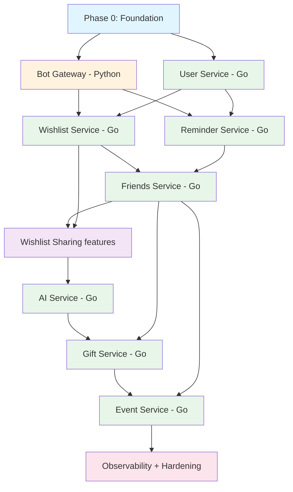
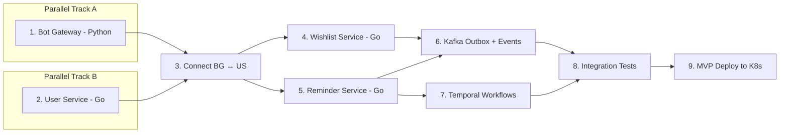

# iWontForget — Development Order

> **What is this?** A single-page guide showing **what to build, in what order, and why**.  
> For detailed architecture see [ROADMAP.md](ROADMAP.md). For per-service specs see [services/](services/).

---

## Global Dependency Graph



---

## Phase 0: Foundation

> **Goal:** Everything you need before writing the first line of service code.

### Build Order

```
Step 0.1  Monorepo scaffold
Step 0.2  Proto definitions + Buf codegen (Go + Python stubs)
Step 0.3  Shared Go libraries (logging, config, gRPC interceptors, Kafka helpers)
Step 0.4  Python project setup for Bot Gateway (pyproject.toml, deps)
Step 0.5  Docker Compose (PostgreSQL, Kafka, Redis, Temporal)
Step 0.6  Makefile / Taskfile
Step 0.7  GitHub Actions CI (lint + test + build for Go and Python)
Step 0.8  K8s manifests skeleton + ArgoCD
```

### What You Learn

- Polyglot monorepo structure (Go workspace + Python project)
- Protobuf / gRPC code generation with Buf
- Docker Compose for local infra
- Basic CI/CD with GitHub Actions

### Definition of Done

- [ ] `buf generate` produces Go and Python stubs
- [ ] `docker compose up` starts PG, Kafka, Redis, Temporal
- [ ] `make lint` runs golangci-lint (Go) + ruff/mypy (Python)
- [ ] `make test` runs `go test` + `pytest` (both pass with 0 tests)
- [ ] CI pipeline green on push

---

## Phase 1: MVP — Core Bot + Wishlist + Reminders

> **Goal:** A single user can add wishes, set reminders, and get notifications via Telegram.

### Build Order



### Step-by-Step

| # | What | Service | Key Tech | Depends On |
|---|------|---------|----------|------------|
| 1 | **Bot Gateway scaffold** — `/start` command, webhook/longpoll, basic message handling | Bot Gateway (Python) | aiogram 3.x, grpcio | Phase 0 |
| 2 | **User Service** — registration, settings, timezone, gRPC API | User Service (Go) | Go, gRPC, PostgreSQL | Phase 0 |
| 3 | **Connect Bot ↔ User** — `/start` calls User Service, session management in Redis | Bot Gateway | grpcio client, redis-py, aiogram FSM | Steps 1-2 |
| 4 | **Wishlist Service** — CRUD for wishes, categories, tags, priorities | Wishlist Service (Go) | Go, gRPC, PostgreSQL | Step 3 |
| 5 | **Reminder Service** — create/list/update reminders, Temporal workflow registration | Reminder Service (Go) | Go, gRPC, PostgreSQL, Temporal SDK | Step 3 |
| 6 | **Kafka integration** — Transactional Outbox in Wishlist + Reminder, event publishing | Wishlist + Reminder | Kafka, Outbox pattern | Steps 4-5 |
| 7 | **Temporal workflows** — `ReminderWorkflow`, `RecurringReminderWorkflow`, `SendNotification` activity calling Bot Gateway gRPC | Reminder Service | Temporal, gRPC | Steps 5, 3 |
| 8 | **Integration tests** — Testcontainers for PG, Kafka, Redis; gRPC contract tests | All services | Testcontainers, pytest, go test | Steps 4-7 |
| 9 | **MVP deploy** — deploy all 4 services to K8s, set Telegram webhook | All | K8s, Helm, ArgoCD | Step 8 |

### Bot Commands After Phase 1

`/start`, `/help`, `/wish`, `/wishes`, `/remind`, `/reminders`, `/today`, `/settings`

### Definition of Done

- [ ] User can `/start` and register
- [ ] User can add, list, edit, delete wishes
- [ ] User can set one-time and recurring reminders
- [ ] Reminders fire via Temporal → Bot Gateway gRPC → Telegram message
- [ ] Snooze/complete/cancel via inline keyboard callbacks
- [ ] All events published to Kafka via Transactional Outbox
- [ ] Integration tests pass with Testcontainers
- [ ] Running on K8s with 2 replicas per service

---

## Phase 2: Friends & Gift Ideas

> **Goal:** User can maintain friend profiles with birthdays and save gift ideas.

### Build Order

| # | What | Service | Depends On |
|---|------|---------|------------|
| 1 | **Friends Service** — friend CRUD, interests, birthdays, gift ideas, notes | Friends Service (Go) | Phase 1 |
| 2 | **Birthday workflow** — `BirthdayCheckWorkflow` daily cron in Temporal | Friends Service | Step 1 |
| 3 | **Bot commands** — `/friend add`, `/friends`, `/birthdays`, free-text gift idea saving | Bot Gateway | Steps 1-2 |
| 4 | **Kafka events** — `friend.events` topic, outbox relay | Friends Service | Step 1 |

### Bot Commands After Phase 2

All Phase 1 + `/friend`, `/friends`, `/birthdays`

### Definition of Done

- [ ] User can add friends with name, birthday, interests
- [ ] User can save gift ideas per friend
- [ ] Daily birthday check sends reminders (7 days, 1 day, on the day)
- [ ] Free-text: "Лёха хочет клавиатуру" → saves gift idea for Лёха

---

## Phase 3: Wishlist Sharing & Gift Booking

> **Goal:** Users can share wishlists publicly and others can book gifts.

### Build Order

| # | What | Service | Depends On |
|---|------|---------|------------|
| 1 | **Wishlist visibility** — public/private per wish, share link generation | Wishlist Service | Phase 2 |
| 2 | **Gift booking** — another user books a gift, hidden from owner | Wishlist Service | Step 1 |
| 3 | **Deep links** — `t.me/bot?start=wishlist_<code>` handling | Bot Gateway | Step 1 |
| 4 | **Inline mode** — share wishlist in Telegram chats | Bot Gateway | Step 1 |
| 5 | **Booking notifications** — Temporal workflows for booking confirmation, post-event reminders | Wishlist + Reminder | Steps 2-3 |

### Definition of Done

- [ ] User can mark wishes as public and generate a share link
- [ ] Another user can open the link and book a gift
- [ ] Booked gifts are hidden from the wishlist owner
- [ ] Inline mode lets users share wishlists in group chats

---

## Phase 4: AI Integration

> **Goal:** Bot understands natural language and gives smart gift recommendations.

### Build Order

| # | What | Service | Depends On |
|---|------|---------|------------|
| 1 | **AI Service scaffold** — gRPC API, config, Redis cache connection | AI Service (Go) | Phase 3 |
| 2 | **Rule-based classifier** — regex patterns for common intents (wish, reminder, gift idea, query) | AI Service | Step 1 |
| 3 | **LLM fallback** — YandexGPT/OpenAI integration for complex messages | AI Service | Step 2 |
| 4 | **Entity extraction** — datetime, person, price, category parsing | AI Service | Step 2 |
| 5 | **Bot Gateway integration** — free-text messages routed through AI Service | Bot Gateway | Steps 2-4 |
| 6 | **Gift recommendations** — LLM-powered suggestions using friend context | AI Service | Step 3 |

### Bot Improvements After Phase 4

- Free-text wish: "Хочу наушники до 10к" → auto-categorized wish with price
- Free-text reminder: "Напомни завтра в 12 позвонить" → parsed reminder
- Gift suggestions: "Что подарить Маше?" → AI-powered recommendations

### Definition of Done

- [ ] 90%+ accuracy on common intents via rule-based classifier
- [ ] LLM fallback handles edge cases
- [ ] Gift recommendations use friend interests + wishlist context
- [ ] Redis caching reduces LLM API calls by 40%+

---

## Phase 5: Group Gifts

> **Goal:** Multiple users coordinate gifts together with voting and budget tracking.

### Build Order

| # | What | Service | Depends On |
|---|------|---------|------------|
| 1 | **Gift Service scaffold** — group CRUD, participant management, gRPC API | Gift Service (Go) | Phase 4 |
| 2 | **Temporal Saga** — `GiftGroupWorkflow` for full lifecycle (create → vote → collect → buy → deliver) | Gift Service | Step 1 |
| 3 | **Voting system** — propose ideas, vote with inline keyboards, deadline timers | Gift Service + Bot Gateway | Step 2 |
| 4 | **Budget tracking** — contribution tracking, payment reminders | Gift Service | Step 2 |
| 5 | **Share links** — invite participants via deep link | Bot Gateway | Step 1 |
| 6 | **Kafka events** — `gift.events` topic | Gift Service | Step 1 |

### Definition of Done

- [ ] User can create a group gift and invite participants
- [ ] Participants can propose and vote on gift ideas
- [ ] Budget is tracked with contribution reminders
- [ ] Full saga lifecycle works end-to-end via Temporal

---

## Phase 6: Events & Meetups

> **Goal:** Users create events, bot manages reminders and info for all participants.

### Build Order

| # | What | Service | Depends On |
|---|------|---------|------------|
| 1 | **Event Service scaffold** — event CRUD, participants, RSVP, gRPC API | Event Service (Go) | Phase 5 |
| 2 | **Multi-stage reminders** — `EventReminderWorkflow` (1 week, 1 day, morning, 1 hour before) | Event Service | Step 1 |
| 3 | **Task management** — assign tasks to participants, task reminders | Event Service | Step 1 |
| 4 | **FAQ system** — participants ask bot about event details | Event Service + Bot Gateway | Step 1 |
| 5 | **Shopping list** — collaborative shopping list for events | Event Service | Step 3 |
| 6 | **RSVP callbacks** — inline keyboard for yes/no/maybe | Bot Gateway | Step 1 |

### Definition of Done

- [ ] User can create an event with date, time, place
- [ ] Participants receive multi-stage reminders
- [ ] Tasks can be assigned and tracked
- [ ] Participants can ask the bot "where is the party?" and get answers

---

## Phase 7: Observability & Production Hardening

> **Goal:** Production-ready system with full observability and resilience.

### Build Order

| # | What | Scope | Depends On |
|---|------|-------|------------|
| 1 | **OpenTelemetry instrumentation** — traces across all services | All services | Phase 6 |
| 2 | **Prometheus metrics** — per-service dashboards | All services | Step 1 |
| 3 | **Grafana dashboards** — request latency, error rates, Kafka lag, Temporal stats | Infrastructure | Step 2 |
| 4 | **Jaeger tracing** — distributed trace visualization | Infrastructure | Step 1 |
| 5 | **Loki log aggregation** — centralized structured logs | Infrastructure | Step 1 |
| 6 | **Alerting** — PagerDuty/Telegram alerts for SLO violations | Infrastructure | Steps 2-3 |
| 7 | **Load testing** — k6 scripts for all critical paths | All services | Step 2 |
| 8 | **Chaos engineering** — pod kill, network partition, DB failover | Infrastructure | Step 7 |
| 9 | **Circuit breakers + graceful degradation** — resilience patterns | All services | Step 7 |

### Definition of Done

- [ ] Every request is traced end-to-end across services
- [ ] Dashboards show real-time health of all services
- [ ] Alerts fire within 5 minutes of SLO violation
- [ ] System survives pod kills and network partitions gracefully

---

## Phase 8: Advanced Features (Backlog)

> **Goal:** Nice-to-have features, no fixed order.

| Feature | Complexity | Dependencies |
|---------|-----------|--------------|
| Voice message transcription (Whisper API) | Medium | AI Service |
| Calendar integration (Yandex/Google Calendar) | Medium | Reminder Service |
| Marketplace link parsing + price tracking | High | Wishlist Service, AI Service |
| Budget management for gifts | Medium | Gift Service |
| Money collection (payment integration) | High | Gift Service |
| Telegram Web Mini-App for complex UIs | High | Bot Gateway |
| Elasticsearch for full-text search | Medium | All services |
| Service mesh (Istio/Linkerd) | High | Infrastructure |
| Multi-language support (i18n) | Medium | Bot Gateway, AI Service |
| Import birthdays from contacts/social networks | Medium | Friends Service |

---

## Summary: Service Build Order

```
Phase 0 ─── Foundation (monorepo, proto, Docker Compose, CI/CD)
              │
Phase 1 ─┬── Bot Gateway (Python/aiogram)     ← Telegram interface
          ├── User Service (Go)                ← Registration, settings
          ├── Wishlist Service (Go)            ← Wishes CRUD
          └── Reminder Service (Go)            ← Reminders + Temporal
              │
Phase 2 ──── Friends Service (Go)              ← Friend profiles, birthdays
              │
Phase 3 ──── Wishlist Sharing (features)       ← Public wishlists, booking
              │
Phase 4 ──── AI Service (Go)                   ← NLP, recommendations
              │
Phase 5 ──── Gift Service (Go)                 ← Group gifts, voting
              │
Phase 6 ──── Event Service (Go)                ← Events, multi-user coordination
              │
Phase 7 ──── Observability + Hardening         ← Monitoring, tracing, resilience
              │
Phase 8 ──── Advanced Features                 ← Voice, calendar, payments...
```

### Key Principle

Each phase produces a **working, deployable product** that adds real value. You can stop after any phase and have a useful bot:

| After Phase | What the bot can do |
|-------------|-------------------|
| **1** | Personal wishlist + reminders with Telegram notifications |
| **2** | + Friend profiles with birthday reminders |
| **3** | + Share wishlists, others can book gifts |
| **4** | + Natural language understanding, smart gift suggestions |
| **5** | + Coordinate group gifts with friends |
| **6** | + Plan events with participants, tasks, reminders |
| **7** | + Production-grade monitoring and resilience |
