# iWontForget — Roadmap & Architecture

> **Telegram-based personal assistant** for wishlists, reminders, gift planning and event coordination.

---

## Table of Contents

1. [Technology Stack](#1-technology-stack)
2. [Microservices Architecture](#2-microservices-architecture)
3. [Service Decomposition](#3-service-decomposition)
4. [Kafka Topology & Data Guarantees](#4-kafka-topology--data-guarantees)
5. [Temporal Workflows](#5-temporal-workflows)
6. [Kubernetes Deployment & Load Balancing](#6-kubernetes-deployment--load-balancing)
7. [CI/CD Pipeline](#7-cicd-pipeline)
8. [Database Strategy](#8-database-strategy)
9. [AI/NLP Module](#9-ainlp-module)
10. [Phased Roadmap](#10-phased-roadmap)
11. [Repository Structure](#11-repository-structure)

---

## 1. Technology Stack

### Core

| Layer | Technology | Why |
|-------|-----------|-----|
| **Backend Language** | Go 1.23+ | High performance, great concurrency, strong ecosystem for microservices |
| **Frontend Language** | Python 3.12+ (aiogram 3.x) | Bot Gateway — Telegram interface, rich async ecosystem, rapid bot development |
| **Inter-service communication** | gRPC + Protobuf | Type-safe contracts, code generation, streaming support, low latency |
| **API Gateway / Bot interface** | Python + aiogram 3.x | Async Telegram Bot API framework, acts as the frontend layer |
| **Message Broker** | Apache Kafka 3.x | Durable event streaming, exactly-once semantics, replay capability |
| **Workflow Engine** | Temporal.io | Durable workflows for reminders, cron schedules, saga patterns |
| **Primary Database** | PostgreSQL 16 | ACID, JSONB for flexible fields, full-text search |
| **Cache** | Redis 7 | Session cache, rate limiting, pub/sub for real-time notifications |
| **Search** | PostgreSQL FTS initially, Elasticsearch later | Full-text search over wishlists, notes, friends |
| **AI/NLP** | OpenAI API / YandexGPT + custom classifiers | Intent classification, entity extraction, gift recommendations |
| **Container Runtime** | Docker | Containerized services |
| **Orchestration** | Kubernetes (k8s) | Production-grade orchestration, auto-scaling, self-healing |
| **Service Mesh** | Istio or Linkerd (post-MVP) | mTLS, observability, traffic management |
| **CI/CD** | GitHub Actions + ArgoCD | Automated testing, building, deployment |
| **Observability** | Prometheus + Grafana + Jaeger + Loki | Metrics, tracing, logging |
| **Schema Registry** | Confluent Schema Registry | Protobuf schema evolution for Kafka |

### Learning-Oriented Additions

| Technology | Purpose | Learning Value |
|-----------|---------|---------------|
| **gRPC reflection + grpcurl** | Service debugging | Understanding gRPC internals |
| **Kafka Connect** | CDC from PostgreSQL | Learning change data capture patterns |
| **Temporal UI** | Workflow visualization | Understanding durable execution |
| **OpenTelemetry** | Distributed tracing | End-to-end request tracing across services |
| **Buf** | Protobuf linting & breaking change detection | API governance |
| **golangci-lint** | Static analysis for Go services | Code quality enforcement |
| **Ruff + mypy** | Python linting + type checking for Bot Gateway | Python code quality |
| **Testcontainers** | Integration testing with real dependencies | Production-like testing |
| **k6 or Vegeta** | Load testing | Performance engineering |

---

## 2. Microservices Architecture

### High-Level Architecture

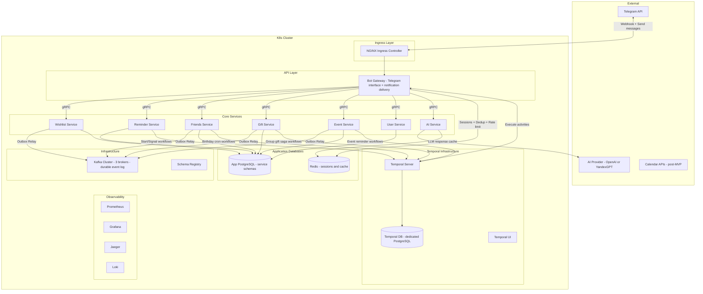

> **Key architectural decisions visible on this diagram:**
>
> 1. **Temporal has its own dedicated PostgreSQL** — completely isolated from application data. Temporal's internal state (workflow history, task queues, visibility) is write-heavy and has different access patterns than application data. Sharing a DB would create contention and make it impossible to scale/maintain independently.
>
> 2. **No separate Notification Service** — Temporal workflows execute activities that call Bot Gateway's internal `SendNotification` gRPC endpoint directly. Bot Gateway already owns the Telegram connection, so it handles delivery, rate limiting (Telegram limits: 30 msg/sec globally, 1 msg/sec per chat), deduplication, and retries. This eliminates an unnecessary Kafka→Notification hop for time-sensitive notifications.
>
> 3. **Kafka is the durable event log** — used exclusively for recording domain events (wish created, gift booked, etc.) so that **no user data is ever lost**. Kafka is NOT used as a notification delivery pipe. Services write to Kafka via the Transactional Outbox pattern, ensuring atomicity between DB writes and event publishing.

### Redis Usage Map

Redis is used by **two services** for different purposes. Here's exactly when and why each service touches Redis:

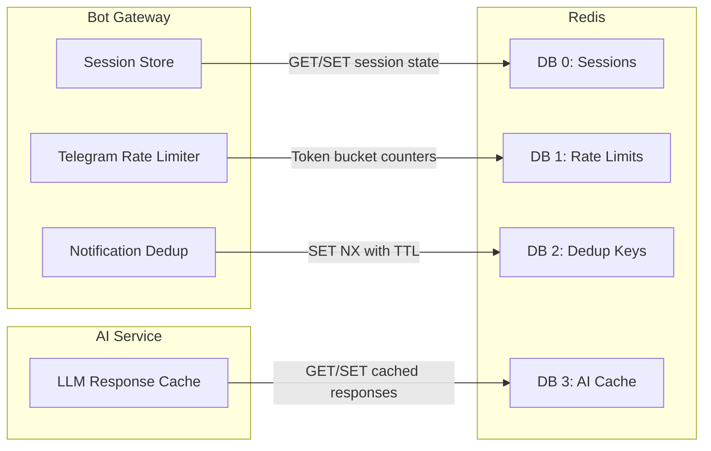

| Service | Redis DB | Key Pattern | Data | TTL | Purpose |
|---------|----------|-------------|------|-----|---------|
| **Bot Gateway** | DB 0 | `session:{user_id}` | Conversation state JSON | 30 min | Track multi-step dialogs (e.g., adding a wish step-by-step) |
| **Bot Gateway** | DB 1 | `ratelimit:global` | Counter | 1 sec | Global Telegram rate limit: 30 msg/sec |
| **Bot Gateway** | DB 1 | `ratelimit:chat:{chat_id}` | Counter | 1 sec | Per-chat Telegram rate limit: 1 msg/sec |
| **Bot Gateway** | DB 2 | `dedup:{user_id}:{type}:{entity_id}` | `1` | 1 hour | Prevent duplicate notifications (e.g., same reminder sent twice) |
| **AI Service** | DB 3 | `ai:classify:{hash}` | Classification result JSON | 24 hours | Cache LLM intent classification to reduce API calls and cost |
| **AI Service** | DB 3 | `ai:recommend:{friend_id}:{budget}` | Recommendations JSON | 1 hour | Cache gift recommendations per friend |

**When Redis is accessed in the request flow:**

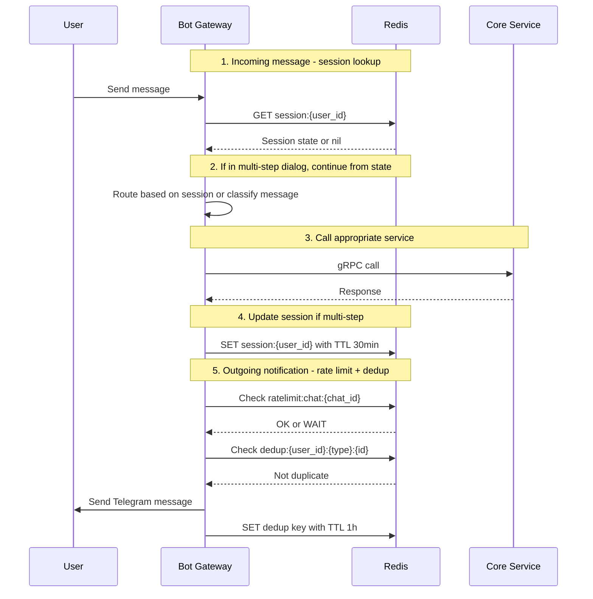

> **Why not PostgreSQL for sessions?** Sessions are ephemeral (30 min TTL), high-frequency (every message), and don't need ACID guarantees. Redis gives sub-millisecond reads vs. ~1ms for PostgreSQL. For rate limiting, Redis atomic `INCR` with `EXPIRE` is the standard pattern — doing this in PostgreSQL would be unnecessarily heavy.

### Service Communication Matrix

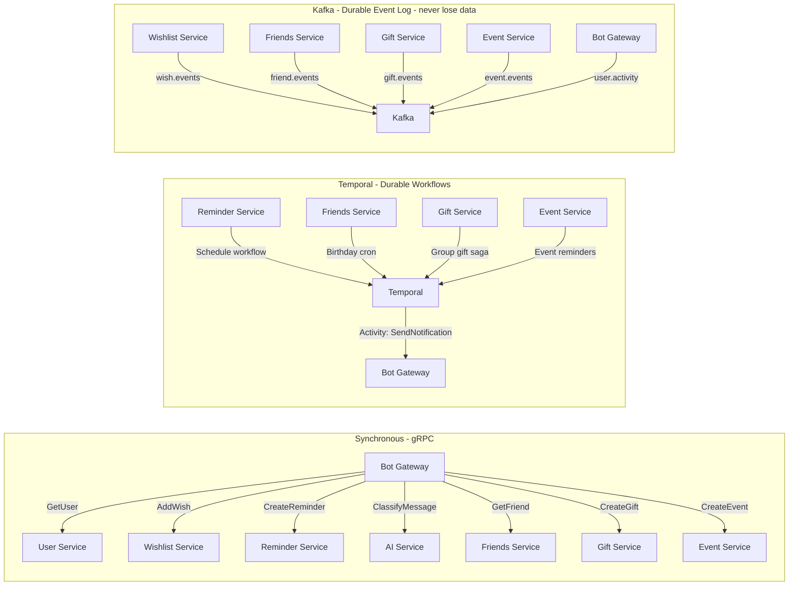

### Why No Separate Notification Service?

In the original design, Notification Service consumed Kafka events and sent Telegram messages. This created an unnecessary indirection:

```
Service → Kafka → Notification Service → Telegram
```

**Problems with this approach:**
1. **Added latency** for time-sensitive notifications (reminders, event alerts)
2. **Kafka is not a notification queue** — it's a durable event log for data safety
3. **Duplicate Telegram connection** — both Bot Gateway and Notification Service would need Telegram Bot API access
4. **Complex callback routing** — when user clicks "Snooze" on a reminder, the callback goes to Bot Gateway anyway, which then needs to signal Temporal

**Better approach (current):**
```
Temporal workflow timer fires → Activity calls Bot Gateway gRPC → Bot Gateway sends Telegram message
```

Bot Gateway already handles:
- Telegram API connection and rate limiting
- User session state in Redis
- Callback query routing
- Message formatting and keyboard rendering

Adding a `NotificationActivity` that calls Bot Gateway's internal `SendNotification` RPC is cleaner and more direct. Temporal provides all the durability guarantees (retry, timeout, heartbeat) that a notification queue would.

> **Critique of this decision:** The tradeoff is that Bot Gateway becomes slightly more loaded — it handles both incoming user messages AND outgoing notifications. For this project's scale (personal assistant, not millions of users), this is fine. If scale becomes an issue, Bot Gateway can be split into `bot-ingress` (user messages) and `bot-egress` (outgoing notifications) later, both behind the same Telegram token.


---

## 3. Service Decomposition

### 3.1. Bot Gateway Service

**Responsibility:** Telegram Bot API interface, message routing, session management, **notification delivery**.

- Receives updates from Telegram via webhook
- Manages conversation state in Redis
- Routes parsed intents to appropriate services via gRPC
- Renders responses back to Telegram
- Handles inline keyboards, callbacks, deep links
- **Sends outgoing notifications** triggered by Temporal workflow activities
- **Rate limiting** for Telegram API (30 msg/sec globally, 1 msg/sec per chat)
- **Deduplication** of notifications via Redis
- **Retry logic** for failed Telegram deliveries

**gRPC clients to:** User, Wishlist, Reminder, Friends, Gift, Event, AI services.

**gRPC server exposes (internal):**
```protobuf
service NotificationGateway {
  rpc SendNotification(SendNotificationRequest) returns (SendNotificationResponse);
  rpc SendNotificationBatch(SendBatchRequest) returns (SendBatchResponse);
}
```

This endpoint is called by Temporal activities — NOT by other services directly. Temporal provides durability, retries, and timeout guarantees for notification delivery.

**Publishes to Kafka:** `user.activity` topic for analytics.

---

### 3.2. User Service

**Responsibility:** User registration, authentication, settings, friend connections.

- Telegram user ID mapping
- User preferences and notification settings
- Timezone management
- Friend graph management

**Database:** `users`, `user_settings`, `user_connections`

**Proto definition highlights:**
```protobuf
service UserService {
  rpc GetOrCreateUser(TelegramUser) returns (User);
  rpc UpdateSettings(UpdateSettingsRequest) returns (User);
  rpc GetUserByShareCode(ShareCodeRequest) returns (User);
}
```

---

### 3.3. Wishlist Service

**Responsibility:** CRUD for wishes, wishlists, sharing, booking.

- Personal wish management
- Wishlist creation with visibility settings
- Share link generation
- Gift booking by other users (hidden from owner)
- Category and tag management

**Database:** `wishes`, `wishlists`, `wishlist_shares`, `wish_bookings`

**Publishes to Kafka:**
- `wish.created` — new wish added
- `wish.updated` — wish modified
- `wish.booked` — someone booked a gift from wishlist
- `wish.fulfilled` — wish marked as done

**Proto definition highlights:**
```protobuf
service WishlistService {
  rpc AddWish(AddWishRequest) returns (Wish);
  rpc ListWishes(ListWishesRequest) returns (WishList);
  rpc UpdateWish(UpdateWishRequest) returns (Wish);
  rpc DeleteWish(DeleteWishRequest) returns (Empty);
  rpc ShareWishlist(ShareRequest) returns (ShareLink);
  rpc BookWish(BookWishRequest) returns (BookingResult);
  rpc GetPublicWishlist(PublicWishlistRequest) returns (WishList);
}
```

---

### 3.4. Reminder Service

**Responsibility:** Reminder CRUD, scheduling via Temporal, recurring reminders.

- One-time reminders
- Recurring reminders (cron expressions)
- Snooze / reschedule / complete
- Natural language time parsing (delegated to AI Service)

**Database:** `reminders`

**Temporal Workflows:**
- `ReminderWorkflow` — waits until trigger time, then executes `SendNotification` activity (calls Bot Gateway)
- `RecurringReminderWorkflow` — cron-scheduled, fires repeatedly, each iteration calls `SendNotification` activity

**Publishes to Kafka (via Outbox):**
- `reminder.triggered` — durable record that reminder fired (for audit/analytics, NOT for notification delivery)
- `reminder.snoozed` — user snoozed (audit trail)
- `reminder.completed` — user marked done (audit trail)

> **Important:** Notifications are sent by Temporal activities calling Bot Gateway directly. Kafka events here are purely for the **durable event log** — ensuring we never lose the fact that a reminder was triggered, even if something crashes.

---

### 3.5. Friends Service

**Responsibility:** Friend profiles, interests, preferences, gift ideas.

- Friend profile CRUD
- Birthday tracking
- Interest and preference storage
- Gift idea storage per friend
- Gift history per friend
- Notes from conversations

**Database:** `friends`, `friend_interests`, `friend_gift_ideas`, `friend_gift_history`, `friend_notes`

**Publishes to Kafka:**
- `friend.birthday_upcoming` — triggered by Temporal cron, N days before birthday

---

### 3.6. Gift Service

**Responsibility:** Gift coordination, group gifts, voting, booking.

- Individual gift planning
- Group gift creation
- Participant management
- Idea proposals and voting
- Budget tracking
- Status management (idea → planned → purchased → gifted → reviewed)

**Database:** `gifts`, `gift_groups`, `gift_participants`, `gift_votes`, `gift_contributions`

**Publishes to Kafka:**
- `gift.booked` — gift reserved
- `gift.purchased` — gift bought
- `gift.gifted` — gift delivered
- `gift.group_created` — new group gift started

---

### 3.7. Event Service

**Responsibility:** Event creation, participant management, reminders, task lists.

- Event CRUD
- Participant invitations and RSVP
- Event schedule / agenda
- Task and shopping lists
- FAQ for participants
- Multi-stage reminders

**Database:** `events`, `event_participants`, `event_tasks`, `event_shopping_list`, `event_faq`

**Publishes to Kafka:**
- `event.created`
- `event.updated`
- `event.reminder` — triggered by Temporal

---

### 3.8. Notification Delivery (via Temporal + Bot Gateway)

> **There is no separate Notification Service.** Notifications are delivered by Temporal workflow activities that call Bot Gateway's `SendNotification` gRPC endpoint.

**How it works:**

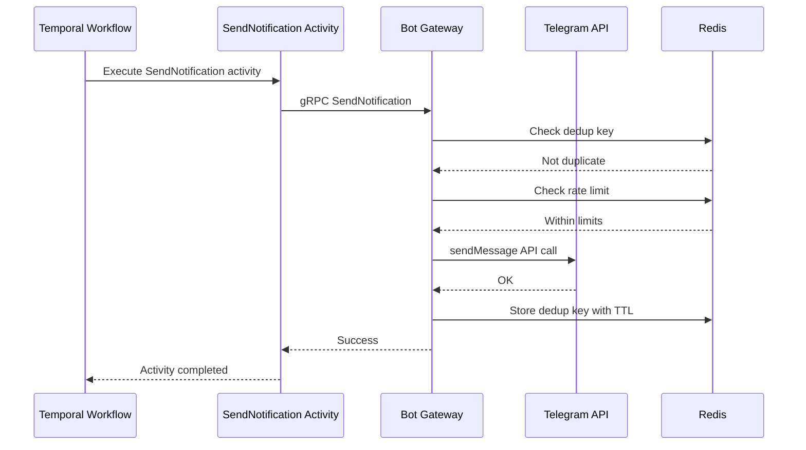

**Notification concerns handled by Bot Gateway:**
- **Rate limiting:** Token bucket in Redis (30 msg/sec global, 1 msg/sec per chat)
- **Deduplication:** Redis SET with TTL keyed by `(user_id, notification_type, entity_id)`
- **Retries:** Temporal activity retry policy (exponential backoff, max 5 attempts)
- **User preferences:** Bot Gateway checks user notification settings before sending

**Temporal activity retry policy:**
```go
activityOpts := workflow.ActivityOptions{
    StartToCloseTimeout: 30 * time.Second,
    RetryPolicy: &temporal.RetryPolicy{
        InitialInterval:    1 * time.Second,
        BackoffCoefficient: 2.0,
        MaximumInterval:    30 * time.Second,
        MaximumAttempts:    5,
    },
}
```

**Why this is better than a Kafka-consuming Notification Service:**
1. **Lower latency** — no Kafka consumer lag for time-sensitive reminders
2. **Built-in durability** — Temporal guarantees activity completion or failure handling
3. **Simpler architecture** — one less service to deploy, monitor, and maintain
4. **No duplicate Telegram connection** — Bot Gateway already owns the Telegram API
5. **Natural callback routing** — user responses (snooze, complete) go to Bot Gateway, which signals Temporal directly

---

### 3.9. AI Service

**Responsibility:** NLP, intent classification, entity extraction, recommendations.

- Message classification (wish / reminder / gift idea / event / note)
- Date/time extraction from natural language
- Gift recommendations based on friend profile
- Category suggestion
- Voice message transcription (post-MVP)

**gRPC API:**
```protobuf
service AIService {
  rpc ClassifyMessage(ClassifyRequest) returns (ClassifyResponse);
  rpc ExtractEntities(ExtractRequest) returns (Entities);
  rpc RecommendGifts(RecommendRequest) returns (GiftRecommendations);
  rpc TranscribeVoice(VoiceRequest) returns (TextResponse);
}
```

---

## 4. Kafka Topology & Data Guarantees

### Kafka's Role: Durable Event Log

> **Kafka is NOT used for notification delivery.** Kafka's sole purpose in this architecture is to serve as a **durable, replayable event log** so that no user data is ever lost.

Every meaningful domain event (wish created, reminder triggered, gift booked) is written to Kafka via the Transactional Outbox pattern. This gives us:

1. **Data durability** — even if a service crashes, the event is already in Kafka with configurable retention (30-90 days)
2. **Replay capability** — if we need to rebuild a read model, reprocess analytics, or debug an issue, we can replay events from any offset
3. **Decoupled consumers** — analytics, AI training, audit logging can consume events independently without affecting the producing service
4. **Audit trail** — complete history of what happened and when

**What Kafka is NOT used for:**
- ❌ Notification delivery (handled by Temporal → Bot Gateway)
- ❌ Request/response communication (handled by gRPC)
- ❌ Real-time user-facing features (handled by Telegram API directly)

### Topics

| Topic | Partitions | Retention | Producers | Consumers | Purpose |
|-------|-----------|-----------|-----------|-----------|---------|
| `wish.events` | 6 | 30d | Wishlist Service | Analytics, AI | Wish lifecycle: created, updated, booked, fulfilled |
| `reminder.events` | 6 | 30d | Reminder Service | Analytics, Audit | Reminder lifecycle: triggered, snoozed, completed |
| `friend.events` | 3 | 30d | Friends Service | Analytics, AI | Friend profile changes, birthday events |
| `gift.events` | 6 | 30d | Gift Service | Analytics, Audit | Gift lifecycle: booked, purchased, gifted |
| `event.events` | 3 | 30d | Event Service | Analytics, Audit | Event lifecycle: created, updated, completed |
| `user.activity` | 6 | 90d | Bot Gateway | Analytics, AI | User interaction logs for recommendations |
| `events.dlq` | 3 | 90d | Outbox Relays | Ops/Manual | Dead letter queue for failed publishes |

### Data Guarantee Techniques

#### 1. Transactional Outbox Pattern

To avoid losing data between DB writes and Kafka publishes:

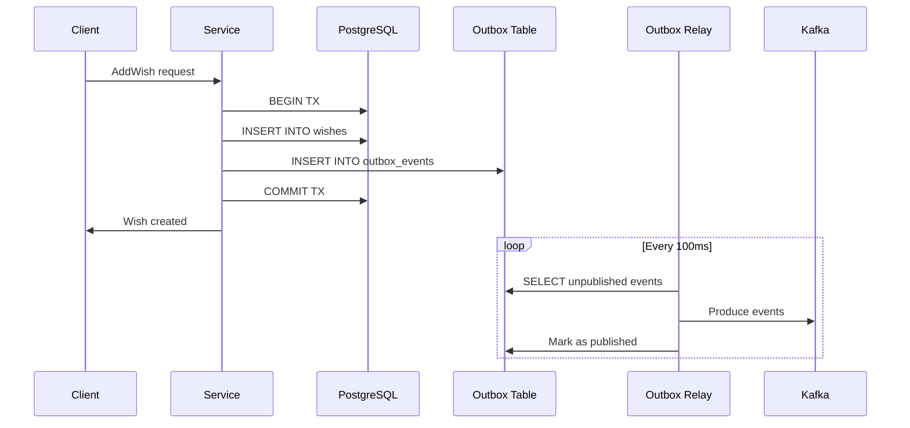

Each service has an `outbox_events` table:
```sql
CREATE TABLE outbox_events (
    id          BIGSERIAL PRIMARY KEY,
    topic       TEXT NOT NULL,
    key         TEXT NOT NULL,
    payload     JSONB NOT NULL,
    created_at  TIMESTAMPTZ DEFAULT NOW(),
    published   BOOLEAN DEFAULT FALSE,
    published_at TIMESTAMPTZ
);
```

#### 2. Idempotent Consumers

Every Kafka consumer implements idempotency:
- Store `(topic, partition, offset)` or `event_id` in a processed events table
- Check before processing
- Use database transactions for exactly-once processing

#### 3. Consumer Group Management

- Each service has its own consumer group
- Manual offset commit after successful processing
- DLQ for failed messages after N retries

#### 4. Kafka Producer Configuration

```go
// Reliable producer config
config := sarama.NewConfig()
config.Producer.RequiredAcks = sarama.WaitForAll  // All ISR must acknowledge
config.Producer.Retry.Max = 5
config.Producer.Return.Successes = true
config.Producer.Idempotent = true                  // Exactly-once semantics
config.Net.MaxOpenRequests = 1                     // Required for idempotent
```

#### 5. Dead Letter Queue

Failed messages after max retries go to `*.dlq` topics for manual investigation.

---

## 5. Temporal Workflows

### 5.1. Reminder Workflow

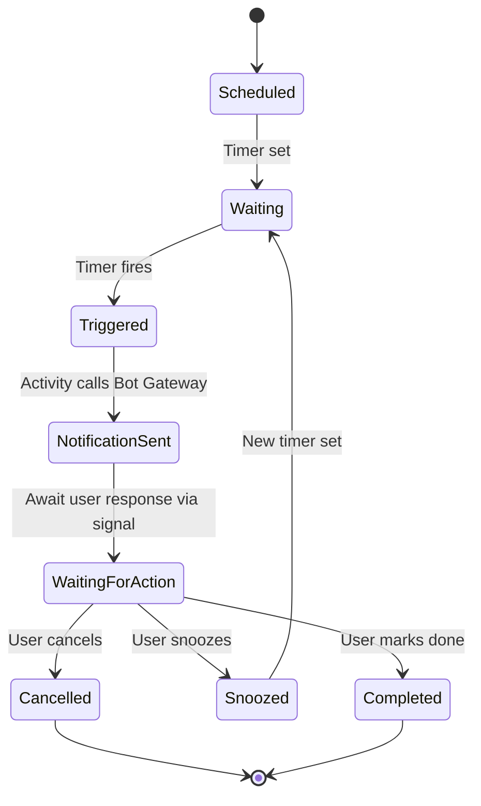

```go
// Simplified Temporal workflow
func ReminderWorkflow(ctx workflow.Context, reminder Reminder) error {
    // Sleep until trigger time
    duration := reminder.TriggerAt.Sub(workflow.Now(ctx))
    if err := workflow.Sleep(ctx, duration); err != nil {
        return err
    }

    // Send notification via activity (calls Bot Gateway's SendNotification gRPC)
    if err := workflow.ExecuteActivity(ctx, SendReminderNotification, reminder).Get(ctx, nil); err != nil {
        return err
    }

    // Wait for user action with timeout
    var action UserAction
    selector := workflow.NewSelector(ctx)
    ch := workflow.GetSignalChannel(ctx, "user_action")

    selector.AddReceive(ch, func(c workflow.ReceiveChannel, more bool) {
        c.Receive(ctx, &action)
    })

    timerCtx, cancel := workflow.WithCancel(ctx)
    selector.AddFuture(workflow.NewTimer(timerCtx, 24*time.Hour), func(f workflow.Future) {
        // Auto-complete after 24h
        action = UserAction{Type: "auto_complete"}
    })

    selector.Select(ctx)
    cancel()

    switch action.Type {
    case "snooze":
        return workflow.ExecuteChildWorkflow(ctx, ReminderWorkflow, reminder.WithNewTime(action.SnoozeUntil)).Get(ctx, nil)
    case "complete", "auto_complete":
        return workflow.ExecuteActivity(ctx, MarkReminderComplete, reminder).Get(ctx, nil)
    case "cancel":
        return workflow.ExecuteActivity(ctx, CancelReminder, reminder).Get(ctx, nil)
    }
    return nil
}
```

### 5.2. Recurring Reminder Workflow

Uses Temporal's built-in cron schedule:

```go
// Started with cron schedule
opts := client.StartWorkflowOptions{
    ID:           fmt.Sprintf("recurring-reminder-%d", reminder.ID),
    TaskQueue:    "reminders",
    CronSchedule: reminder.CronExpression, // e.g., "0 9 * * MON" for every Monday 9am
}
```

### 5.3. Birthday Check Workflow

Runs daily, checks upcoming birthdays:

```go
// Cron: every day at 08:00
func BirthdayCheckWorkflow(ctx workflow.Context) error {
    var friends []FriendBirthday
    err := workflow.ExecuteActivity(ctx, GetUpcomingBirthdays, 14).Get(ctx, &friends) // 14 days ahead
    if err != nil {
        return err
    }
    for _, f := range friends {
        workflow.ExecuteActivity(ctx, PublishBirthdayReminder, f)
    }
    return nil
}
```

### 5.4. Event Reminder Workflow

Multi-stage reminders for events:

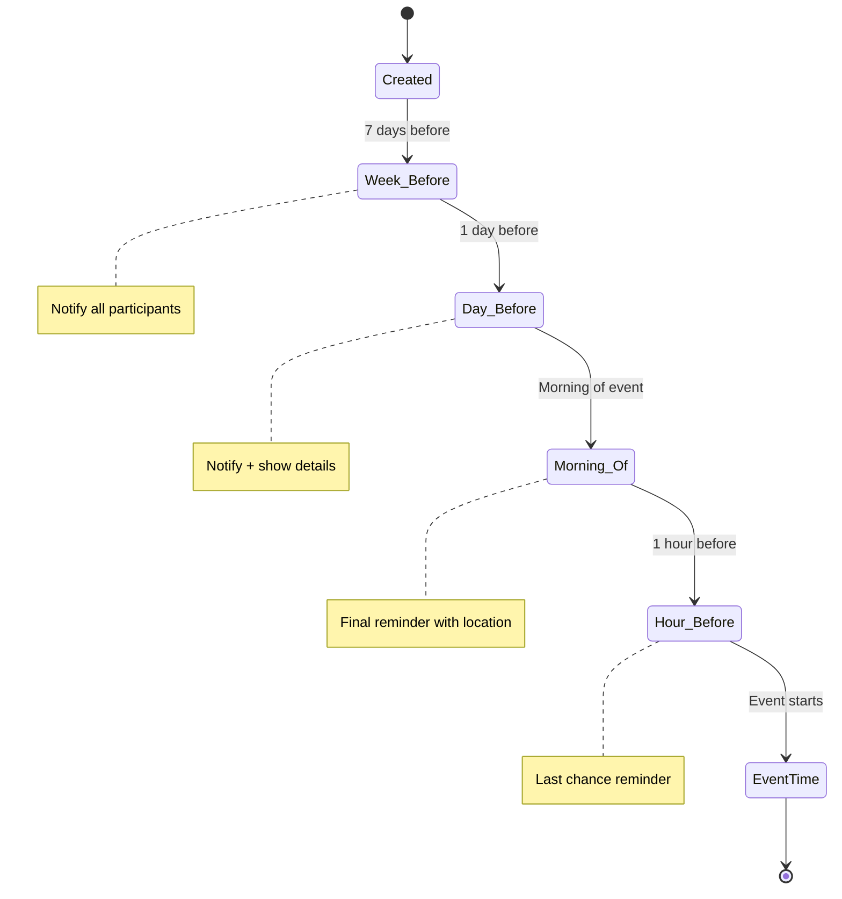

### 5.5. Gift Group Coordination Workflow

Saga pattern for group gift lifecycle:

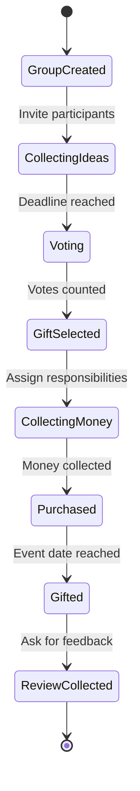

---

## 6. Kubernetes Deployment & Load Balancing

### Cluster Architecture

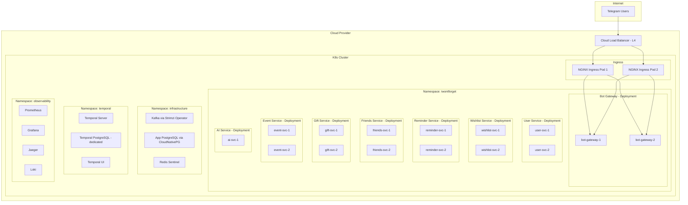

### Load Balancing Strategy

| Layer | Balancer | Strategy |
|-------|---------|----------|
| **L4 (TCP)** | Cloud LB (e.g., Yandex ALB) | Round-robin to Ingress pods |
| **L7 (HTTP/gRPC)** | NGINX Ingress Controller | Path-based routing, TLS termination |
| **Service-to-Service** | Kubernetes Service (ClusterIP) | kube-proxy iptables / IPVS round-robin |
| **gRPC** | Client-side LB via `dns:///` resolver | Round-robin with health checking |
| **Kafka** | Partition-based | Consumer group rebalancing |

### Key Kubernetes Resources per Service

```yaml
# Example: wishlist-service
apiVersion: apps/v1
kind: Deployment
metadata:
  name: wishlist-service
  namespace: iwontforget
spec:
  replicas: 2
  strategy:
    type: RollingUpdate
    rollingUpdate:
      maxSurge: 1
      maxUnavailable: 0
  template:
    spec:
      containers:
      - name: wishlist-service
        resources:
          requests:
            cpu: 100m
            memory: 128Mi
          limits:
            cpu: 500m
            memory: 512Mi
        livenessProbe:
          grpc:
            port: 50051
          initialDelaySeconds: 5
        readinessProbe:
          grpc:
            port: 50051
          initialDelaySeconds: 3
        env:
        - name: DB_DSN
          valueFrom:
            secretKeyRef:
              name: wishlist-db-credentials
              key: dsn
---
apiVersion: v1
kind: Service
metadata:
  name: wishlist-service
spec:
  type: ClusterIP
  ports:
  - port: 50051
    targetPort: 50051
    protocol: TCP
    name: grpc
---
apiVersion: autoscaling/v2
kind: HorizontalPodAutoscaler
metadata:
  name: wishlist-service
spec:
  scaleTargetRef:
    apiVersion: apps/v1
    kind: Deployment
    name: wishlist-service
  minReplicas: 2
  maxReplicas: 5
  metrics:
  - type: Resource
    resource:
      name: cpu
      target:
        type: Utilization
        averageUtilization: 70
---
apiVersion: policy/v1
kind: PodDisruptionBudget
metadata:
  name: wishlist-service
spec:
  minAvailable: 1
  selector:
    matchLabels:
      app: wishlist-service
```

### Infrastructure Operators

| Component | Operator | Purpose |
|-----------|---------|---------|
| **Kafka** | Strimzi | Kafka cluster lifecycle, topic management |
| **App PostgreSQL** | CloudNativePG | HA PostgreSQL for application services, automated backups, failover |
| **Temporal PostgreSQL** | CloudNativePG (separate instance) | **Dedicated** HA PostgreSQL for Temporal server — isolated from app data |
| **Redis** | Redis Operator (Spotahome) | Redis Sentinel for HA |
| **Temporal** | Helm chart | Temporal server + UI deployment, configured to use its own PG |
| **Cert Manager** | cert-manager | TLS certificate automation |

> **Why Temporal needs its own database:** Temporal's internal storage (workflow history, task queues, visibility store) is extremely write-heavy with different access patterns than application data. Sharing a PostgreSQL instance would cause: (1) resource contention under load, (2) inability to tune PostgreSQL settings independently (e.g., `work_mem`, `max_connections`), (3) coupled failure domains — a Temporal DB issue shouldn't take down application services and vice versa, (4) different backup/restore requirements.

---

## 7. CI/CD Pipeline

### Pipeline Architecture

```mermaid
graph LR
    subgraph Developer
        CODE[Push to GitHub]
    end

    subgraph GitHub Actions
        LINT[Lint + Buf Check]
        UNIT[Unit Tests]
        INT[Integration Tests - Testcontainers]
        BUILD[Build Docker Images]
        SCAN[Security Scan - Trivy]
        PUSH[Push to Container Registry]
        HELM[Helm Chart Lint]
    end

    subgraph ArgoCD
        SYNC[Sync to K8s]
        HEALTH[Health Check]
        ROLLBACK[Auto Rollback on Failure]
    end

    subgraph Environments
        DEV[Dev Namespace]
        STAGING[Staging Namespace]
        PROD[Production Namespace]
    end

    CODE --> LINT
    LINT --> UNIT
    UNIT --> INT
    INT --> BUILD
    BUILD --> SCAN
    SCAN --> PUSH
    PUSH --> HELM
    HELM --> SYNC
    SYNC --> DEV
    DEV -->|Manual Approval| STAGING
    STAGING -->|Manual Approval| PROD
    SYNC --> HEALTH
    HEALTH -->|Failure| ROLLBACK
```

### Test Strategy

| Test Type | Tool | Scope | When |
|-----------|------|-------|------|
| **Unit Tests (Go)** | Go `testing` + `testify` | Business logic, handlers (Go services) | Every push |
| **Unit Tests (Python)** | `pytest` + `pytest-asyncio` | Bot Gateway handlers, middleware | Every push |
| **Integration Tests (Go)** | Testcontainers-go | DB queries, Kafka produce/consume, gRPC calls | Every push |
| **Integration Tests (Python)** | `pytest` + Testcontainers | Bot Gateway gRPC client, Redis, Telegram mocks | Every push |
| **Contract Tests** | Buf breaking change detection | Protobuf API compatibility | Every push |
| **E2E Tests** | Custom test suite | Full user scenarios via Telegram mock | Pre-deploy to staging |
| **Load Tests** | k6 or Vegeta | Performance under load | Weekly / pre-release |
| **Security Scan** | Trivy + gosec (Go) + bandit (Python) | Vulnerabilities, code security | Every push |
| **Lint (Go)** | golangci-lint + buf lint | Go code quality, proto quality | Every push |
| **Lint (Python)** | Ruff + mypy | Python code quality, type checking | Every push |

### GitHub Actions Workflow (simplified)

```yaml
name: CI
on:
  push:
    branches: [main, develop]
  pull_request:
    branches: [main]

jobs:
  lint:
    runs-on: ubuntu-latest
    steps:
      - uses: actions/checkout@v4
      - uses: actions/setup-go@v5
        with:
          go-version: '1.23'
      - uses: actions/setup-python@v5
        with:
          python-version: '3.12'
      - uses: golangci/golangci-lint-action@v6
      - uses: bufbuild/buf-setup-action@v1
      - run: buf lint
      - run: buf breaking --against '.git#branch=main'
      # Python linting (Bot Gateway)
      - run: pip install ruff mypy
      - run: ruff check services/bot-gateway/
      - run: mypy services/bot-gateway/

  test:
    needs: lint
    runs-on: ubuntu-latest
    steps:
      - uses: actions/checkout@v4
      - uses: actions/setup-go@v5
      - uses: actions/setup-python@v5
        with:
          python-version: '3.12'
      # Go tests (backend services)
      - run: go test ./... -race -coverprofile=coverage.out
      - run: go test ./... -tags=integration -race
      # Python tests (Bot Gateway)
      - run: cd services/bot-gateway && pip install -e ".[dev]" && pytest

  build:
    needs: test
    runs-on: ubuntu-latest
    strategy:
      matrix:
        service:
          - bot-gateway
          - user-service
          - wishlist-service
          - reminder-service
          - friends-service
          - gift-service
          - event-service
          - ai-service
    steps:
      - uses: actions/checkout@v4
      - uses: docker/build-push-action@v5
        with:
          context: ./services/${{ matrix.service }}
          push: true
          tags: registry/iwontforget/${{ matrix.service }}:${{ github.sha }}

  deploy-dev:
    needs: build
    if: github.ref == 'refs/heads/develop'
    runs-on: ubuntu-latest
    steps:
      - run: |
          # Update image tags in Helm values
          # ArgoCD auto-syncs from Git
```

---

## 8. Database Strategy

### Two PostgreSQL Clusters

The system uses **two separate PostgreSQL instances**:

1. **App PostgreSQL** — application service data (logical schema per service)
2. **Temporal PostgreSQL** — Temporal server internal state (completely isolated)

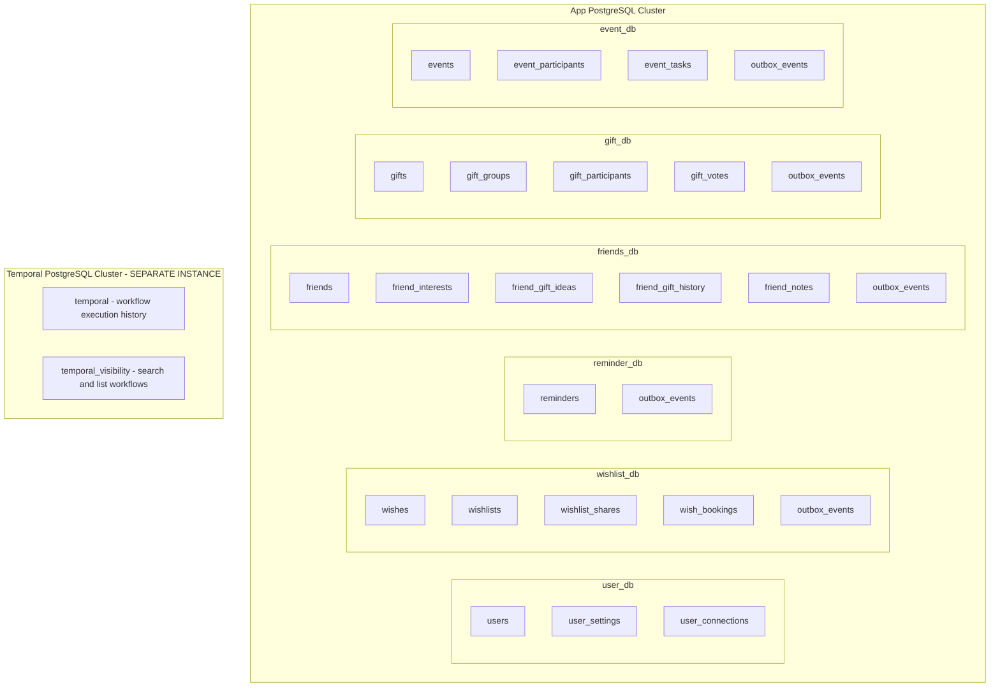

> **App PostgreSQL** uses logical schema separation per service (shared cluster for MVP, can be split later). Each service has its own schema and cannot access other services' tables.
>
> **Temporal PostgreSQL** is a completely separate PostgreSQL instance managed by its own CloudNativePG cluster. Temporal auto-creates its schemas (`temporal` and `temporal_visibility`) on startup. This DB has different tuning: higher `work_mem`, more connections, aggressive vacuuming for the write-heavy workflow history tables.

### Migration Strategy

- **Tool:** golang-migrate or goose
- **Approach:** Each service manages its own migrations
- **CI check:** Migrations are validated in CI before deployment

---

## 9. AI/NLP Module

### Intent Classification Pipeline

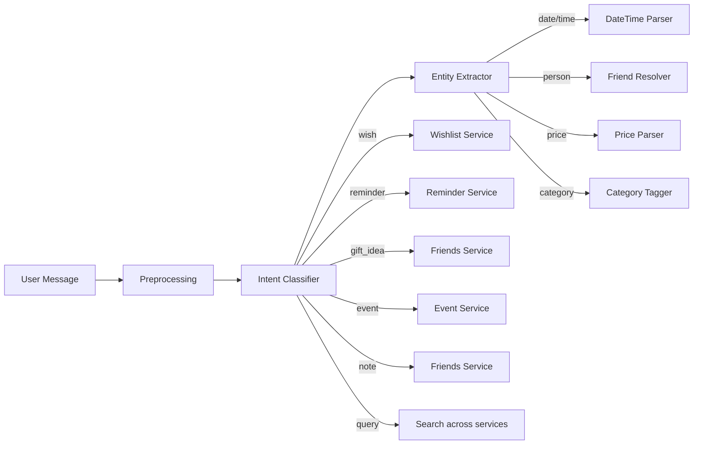

### MVP AI Strategy

For MVP, use a **hybrid approach**:

1. **Rule-based classifier** for common patterns:
   - Keywords: хочу, купить, напомни, подарить, создай событие
   - Regex for dates: завтра, через N дней, каждый понедельник
   - Price patterns: до 5000, ~3к, 10000р

2. **LLM fallback** for ambiguous messages:
   - Send to OpenAI/YandexGPT with structured prompt
   - Return classified intent + extracted entities
   - Cache common patterns to reduce API calls

3. **Post-MVP**: Fine-tuned local model for classification to reduce latency and cost.

### Gift Recommendation Engine

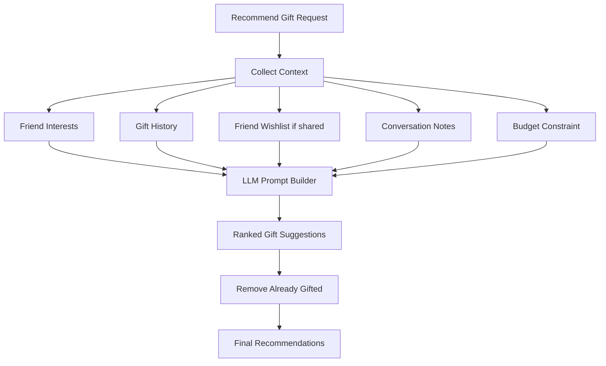

---

## 10. Phased Roadmap

### Phase 0: Foundation

**Goal:** Project scaffolding, infrastructure setup, CI/CD pipeline.

**Deliverables:**
- Monorepo structure with Go workspace + Python project for Bot Gateway
- Protobuf definitions and code generation with Buf (Go + Python stubs)
- Shared Go libraries: logging, config, gRPC interceptors, Kafka helpers
- Python project setup for Bot Gateway (`pyproject.toml`, aiogram 3.x, grpcio, aioredis)
- Docker Compose for local development (PostgreSQL, Kafka, Redis, Temporal)
- Makefile / Taskfile for common operations
- GitHub Actions CI pipeline (lint, test, build — both Go and Python)
- Kubernetes manifests / Helm charts skeleton
- ArgoCD setup for GitOps deployment

**Key learning:** Polyglot monorepo structure, Go project layout, Python async project layout, Protobuf/gRPC code generation for multiple languages, Docker Compose, basic K8s manifests.

---

### Phase 1: Core Bot + Wishlist + Reminders — MVP

**Goal:** A single user can add wishes, set reminders, and get notifications via Telegram.

**Services to build:**
- **Bot Gateway** (Python / aiogram 3.x) — Telegram webhook, message routing, inline keyboards, **notification delivery via Temporal activities**
- **User Service** — Registration, settings, timezone
- **Wishlist Service** — CRUD for wishes, categories, tags, priorities
- **Reminder Service** — One-time and recurring reminders via Temporal

**Kafka topics (durable event log):** `wish.events`, `reminder.events`

**Temporal workflows:** `ReminderWorkflow`, `RecurringReminderWorkflow`

**Temporal activities:** `SendNotification` (calls Bot Gateway gRPC)

**Database schemas:** users, wishes, reminders, outbox_events

**Tests:**
- Unit tests for all business logic
- Integration tests with Testcontainers (PostgreSQL, Kafka)
- gRPC contract tests

**Bot commands:**
- `/start` — registration
- `/wish` — add a wish
- `/wishes` — list wishes
- `/remind` — set a reminder
- `/reminders` — list upcoming reminders
- `/today` — what is planned for today
- Free-text input with basic rule-based classification

**Key learning:** Telegram Bot API, gRPC service-to-service, Kafka producer/consumer with Transactional Outbox, Temporal workflows and activities, Testcontainers.

---

### Phase 2: Friends & Gift Ideas

**Goal:** User can maintain friend profiles and save gift ideas per friend.

**Services to build:**
- **Friends Service** — Friend profiles, interests, birthdays, gift ideas, notes

**New Temporal workflows:**
- `BirthdayCheckWorkflow` — daily cron, checks upcoming birthdays

**New Kafka topics:** `friend.events`

**Bot commands:**
- `/friend add` — add a friend
- `/friend <name>` — view friend profile
- `/friends` — list friends
- `/birthdays` — upcoming birthdays
- Free-text: Лёха хочет клавиатуру → saves gift idea for Лёха

**Key learning:** Complex domain modeling, cron workflows in Temporal, cross-service data flow.

---

### Phase 3: Wishlist Sharing & Gift Booking

**Goal:** Users can share wishlists and others can book gifts from them.

**New features in Wishlist Service:**
- Public/private visibility per wish
- Share link generation (deep link to bot)
- Gift booking by another user
- Hide booked gifts from wishlist owner (surprise mode)

**New features in Bot Gateway:**
- Deep link handling: `t.me/bot?start=wishlist_<code>`
- Inline mode for sharing wishlists in chats

**New Temporal workflows for notifications:**
- Wishlist booking notification workflow — notify the booker (not owner) about booking confirmation
- Post-event gift notification workflow — after event date, notify about gift status and prompt wishlist update

**Key learning:** Telegram deep links, inline mode, access control patterns, eventual consistency.

---

### Phase 4: AI Integration

**Goal:** Bot understands natural language and provides smart recommendations.

**New service:**
- **AI Service** — Intent classification, entity extraction, gift recommendations

**Integration points:**
- Bot Gateway sends unclassified messages to AI Service
- AI Service returns structured intent + entities
- Gift recommendation endpoint uses friend context

**Implementation:**
1. Rule-based classifier for common patterns
2. OpenAI/YandexGPT API for complex messages
3. Prompt engineering for gift recommendations
4. Response caching in Redis

**Bot improvements:**
- Free-text wish creation: Хочу наушники до 10к → auto-categorized wish
- Free-text reminders: Напомни завтра в 12 позвонить → parsed reminder
- Gift suggestions: Что подарить Маше? → AI-powered recommendations

**Key learning:** LLM integration, prompt engineering, hybrid AI systems, caching strategies.

---

### Phase 5: Group Gifts

**Goal:** Multiple users can coordinate gifts together.

**New service:**
- **Gift Service** — Group gift creation, participants, voting, budget tracking

**New Temporal workflows:**
- `GiftGroupWorkflow` — saga for group gift lifecycle
- Voting deadline timers
- Payment collection reminders

**New Kafka topics:** `gift.events`

**Bot features:**
- Create group gift
- Invite participants via share link
- Propose and vote on ideas
- Track who is contributing what
- Post-event feedback

**Key learning:** Saga pattern in Temporal, multi-user coordination, voting systems, complex state machines.

---

### Phase 6: Events & Meetups

**Goal:** Users can create events and the bot manages reminders and info for all participants.

**New service:**
- **Event Service** — Event CRUD, participants, tasks, shopping lists, FAQ

**New Temporal workflows:**
- `EventReminderWorkflow` — multi-stage reminders (1 week, 1 day, morning, 1 hour)
- `EventTaskReminderWorkflow` — remind assignees about their tasks

**Bot features:**
- Create event with date, time, place
- Invite participants
- Participants can ask bot about event details
- Task assignment and tracking
- Shopping list management
- Automatic reminders at configured intervals

**Key learning:** Complex multi-user workflows, event-driven architecture at scale, participant management.

---

### Phase 7: Observability & Production Hardening

**Goal:** Production-ready system with full observability.

**Deliverables:**
- OpenTelemetry instrumentation across all services
- Prometheus metrics: request latency, error rates, Kafka lag, Temporal workflow stats
- Grafana dashboards per service
- Jaeger distributed tracing
- Loki log aggregation
- Alerting rules (PagerDuty/Telegram alerts)
- Load testing with k6
- Chaos engineering experiments
- Rate limiting and circuit breakers
- Graceful degradation patterns

**Key learning:** Distributed tracing, SRE practices, performance tuning, chaos engineering.

---

### Phase 8: Advanced Features (Post-MVP Backlog)

- Voice message transcription (Whisper API)
- Calendar integration (Yandex Calendar, Google Calendar)
- Marketplace link parsing (price tracking)
- Budget management for gifts
- Money collection (integration with payment systems)
- Web mini-app in Telegram for complex UIs
- Elasticsearch for full-text search
- Service mesh (Istio/Linkerd)
- Multi-language support
- Import birthdays from contacts/social networks

---

### Roadmap Timeline Visualization

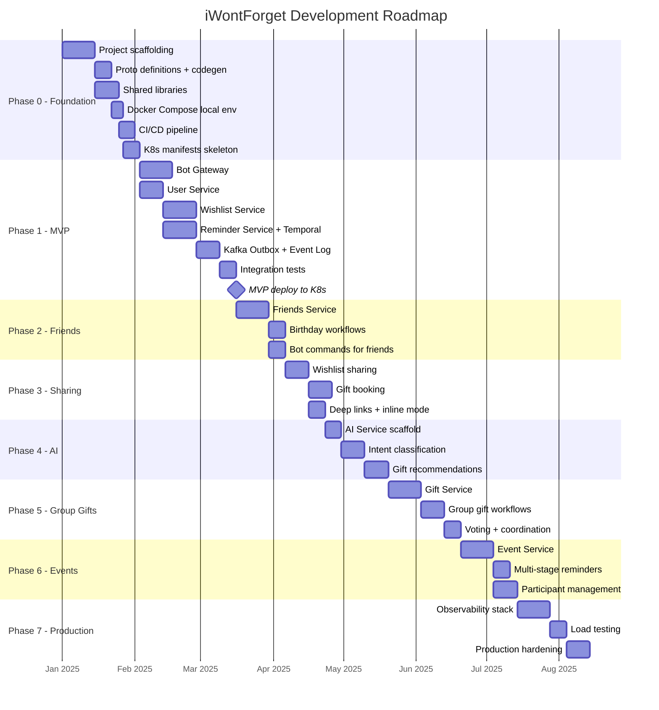

---

## 11. Repository Structure

```
iWontForget/
├── .github/
│   └── workflows/
│       ├── ci.yml                    # Lint, test, build
│       ├── deploy-dev.yml            # Deploy to dev
│       └── deploy-prod.yml           # Deploy to prod
│
├── proto/                            # Protobuf definitions (shared)
│   ├── buf.yaml
│   ├── buf.gen.yaml
│   ├── user/v1/
│   │   └── user.proto
│   ├── wishlist/v1/
│   │   └── wishlist.proto
│   ├── reminder/v1/
│   │   └── reminder.proto
│   ├── friends/v1/
│   │   └── friends.proto
│   ├── gift/v1/
│   │   └── gift.proto
│   ├── event/v1/
│   │   └── event.proto
│   ├── ai/v1/
│   │   └── ai.proto
│   └── gateway/v1/
│       └── gateway.proto              # SendNotification RPC (called by Temporal activities)
│
├── pkg/                              # Shared Go libraries
│   ├── logger/                       # Structured logging (slog)
│   ├── config/                       # Config loading (env, yaml)
│   ├── grpcutil/                     # gRPC interceptors, health check
│   ├── kafkautil/                    # Kafka producer/consumer helpers
│   ├── outbox/                       # Transactional outbox implementation
│   ├── temporal/                     # Temporal client helpers
│   ├── testutil/                     # Test helpers, fixtures
│   └── middleware/                   # Common middleware
│
├── services/
│   ├── bot-gateway/                  # ⚡ Python service (aiogram 3.x)
│   │   ├── bot_gateway/
│   │   │   ├── __init__.py
│   │   │   ├── __main__.py           # Entry point
│   │   │   ├── handlers/             # Telegram update handlers (commands, messages, callbacks)
│   │   │   ├── router/               # Intent-based message routing
│   │   │   ├── keyboards/            # Inline keyboard builders
│   │   │   ├── session/              # Conversation state (Redis via aioredis)
│   │   │   ├── notification/         # gRPC server for Temporal activities (grpcio)
│   │   │   ├── ratelimit/            # Telegram rate limiter (Redis-backed)
│   │   │   ├── dedup/                # Notification deduplication (Redis)
│   │   │   └── grpc_clients/         # gRPC clients to Go backend services (grpcio)
│   │   ├── tests/
│   │   ├── Dockerfile
│   │   └── pyproject.toml            # Python project config (dependencies, ruff, mypy)
│   │
│   ├── user-service/
│   │   ├── cmd/
│   │   │   └── main.go
│   │   ├── internal/
│   │   │   ├── server/               # gRPC server implementation
│   │   │   ├── service/              # Business logic
│   │   │   ├── repository/           # PostgreSQL queries
│   │   │   └── model/                # Domain models
│   │   ├── migrations/
│   │   ├── Dockerfile
│   │   └── go.mod
│   │
│   ├── wishlist-service/
│   │   ├── cmd/
│   │   │   └── main.go
│   │   ├── internal/
│   │   │   ├── server/
│   │   │   ├── service/
│   │   │   ├── repository/
│   │   │   ├── model/
│   │   │   └── outbox/               # Outbox relay worker
│   │   ├── migrations/
│   │   ├── Dockerfile
│   │   └── go.mod
│   │
│   ├── reminder-service/
│   │   ├── cmd/
│   │   │   └── main.go
│   │   ├── internal/
│   │   │   ├── server/
│   │   │   ├── service/
│   │   │   ├── repository/
│   │   │   ├── model/
│   │   │   └── workflow/             # Temporal workflow definitions
│   │   ├── migrations/
│   │   ├── Dockerfile
│   │   └── go.mod
│   │
│   ├── friends-service/
│   │   ├── cmd/
│   │   │   └── main.go
│   │   ├── internal/
│   │   │   ├── server/
│   │   │   ├── service/
│   │   │   ├── repository/
│   │   │   └── model/
│   │   ├── migrations/
│   │   ├── Dockerfile
│   │   └── go.mod
│   │
│   ├── gift-service/
│   │   ├── cmd/
│   │   │   └── main.go
│   │   ├── internal/
│   │   │   ├── server/
│   │   │   ├── service/
│   │   │   ├── repository/
│   │   │   ├── model/
│   │   │   └── workflow/             # Group gift saga workflows
│   │   ├── migrations/
│   │   ├── Dockerfile
│   │   └── go.mod
│   │
│   ├── event-service/
│   │   ├── cmd/
│   │   │   └── main.go
│   │   ├── internal/
│   │   │   ├── server/
│   │   │   ├── service/
│   │   │   ├── repository/
│   │   │   ├── model/
│   │   │   └── workflow/             # Event reminder workflows
│   │   ├── migrations/
│   │   ├── Dockerfile
│   │   └── go.mod
│   │
│   └── ai-service/
│       ├── cmd/
│       │   └── main.go
│       ├── internal/
│       │   ├── server/
│       │   ├── classifier/           # Intent classification
│       │   ├── extractor/            # Entity extraction
│       │   ├── recommender/          # Gift recommendations
│       │   └── llm/                  # LLM client (OpenAI/YandexGPT)
│       ├── Dockerfile
│       └── go.mod
│
├── deploy/
│   ├── docker-compose.yml            # Local development
│   ├── docker-compose.infra.yml      # Infrastructure only
│   ├── helm/
│   │   ├── Chart.yaml
│   │   ├── values.yaml
│   │   ├── values-dev.yaml
│   │   ├── values-staging.yaml
│   │   ├── values-prod.yaml
│   │   └── templates/
│   │       ├── bot-gateway/
│   │       ├── user-service/
│   │       ├── wishlist-service/
│   │       ├── reminder-service/
│   │       ├── friends-service/
│   │       ├── gift-service/
│   │       ├── event-service/
│   │       ├── ai-service/
│   │       └── _helpers.tpl
│   └── argocd/
│       ├── application-dev.yaml
│       ├── application-staging.yaml
│       └── application-prod.yaml
│
├── scripts/
│   ├── generate-proto.sh
│   ├── migrate.sh
│   ├── seed-data.sh
│   └── load-test.sh
│
├── docs/
│   ├── architecture.md
│   ├── api-reference.md
│   ├── kafka-topics.md
│   ├── temporal-workflows.md
│   └── runbook.md
│
├── go.work                           # Go workspace (excludes bot-gateway — it's Python)
├── go.work.sum
├── Makefile
├── Taskfile.yml
├── buf.work.yaml                     # Buf workspace (generates Go + Python stubs)
├── .golangci.yml                     # Go linting only (Python uses Ruff)
├── .gitignore
└── README.md
```

---

## Appendix A: Key Design Decisions

### Why Kafka over RabbitMQ?

| Criteria | Kafka | RabbitMQ |
|----------|-------|----------|
| **Durability** | Messages persisted to disk, configurable retention | Messages deleted after consumption |
| **Replay** | Can replay from any offset | Cannot replay consumed messages |
| **Throughput** | Very high | Moderate |
| **Consumer groups** | Built-in, parallel consumption | Requires manual setup |
| **Learning value** | Industry standard for event streaming | Simpler but less versatile |
| **Data safety** | Exactly-once semantics available | At-most-once or at-least-once |

**Decision:** Kafka — because the core requirement is **not losing data** (wishes, reminders, gift bookings). Kafka's durability, replay capability, and exactly-once semantics make it the right choice.

### Why Temporal over plain cron?

| Criteria | Temporal | Cron + DB polling |
|----------|---------|-------------------|
| **Durability** | Workflow state survives crashes | Must handle failures manually |
| **Visibility** | Built-in UI for workflow inspection | Custom monitoring needed |
| **Complex flows** | Sagas, signals, timers, child workflows | Manual state machine |
| **Scalability** | Distributed workers | Single point of failure |
| **Learning value** | Modern workflow orchestration | Basic scheduling |

**Decision:** Temporal — reminders need to survive service restarts, support snooze/reschedule, and handle complex multi-step flows like group gifts.

### Why gRPC over REST?

| Criteria | gRPC | REST |
|----------|------|------|
| **Type safety** | Protobuf contracts, code generation | OpenAPI/Swagger, manual validation |
| **Performance** | Binary protocol, HTTP/2, streaming | JSON over HTTP/1.1 |
| **Code generation** | Automatic client/server stubs | Manual or codegen tools |
| **Streaming** | Bidirectional streaming | WebSockets or SSE |
| **Learning value** | Industry standard for microservices | Already well-known |

**Decision:** gRPC for inter-service communication. The Bot Gateway translates Telegram HTTP to gRPC calls internally.

### Why Monorepo?

- Shared protobuf definitions (generate stubs for both Go and Python)
- Shared Go libraries for backend services
- Polyglot support: Go workspace for backend + Python project for Bot Gateway
- Atomic changes across services (including cross-language proto changes)
- Single CI/CD pipeline (with language-specific lint/test steps)
- Better for a learning project (everything in one place, easy to see how languages interact)

---

## Appendix B: Data Flow Examples

### Adding a Wish (End-to-End)

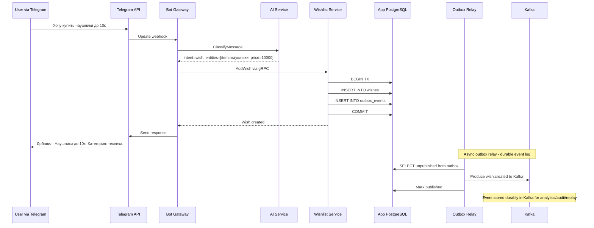

### Reminder Trigger Flow

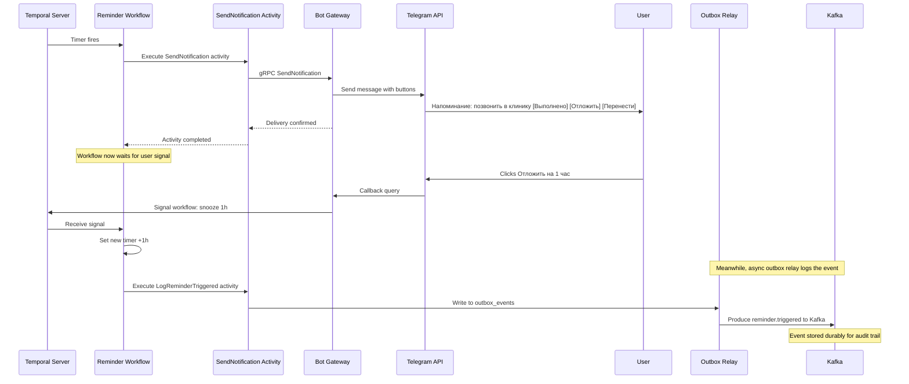

---

## Appendix C: Security Considerations

- **Telegram Bot Token** stored in K8s Secret, never in code
- **Database credentials** via K8s Secrets + external secret operator
- **gRPC** with mTLS between services (via service mesh post-MVP)
- **User data encryption** at rest (PostgreSQL TDE or application-level)
- **Rate limiting** on Bot Gateway to prevent abuse
- **Input validation** on all gRPC handlers
- **Audit logging** for sensitive operations (wishlist sharing, gift booking)
- **GDPR-like data handling**: user can request data export and deletion
