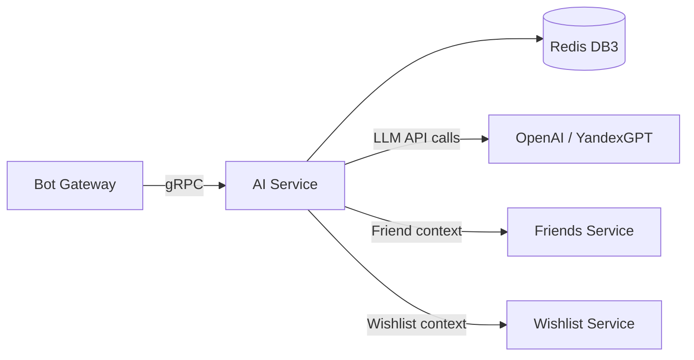
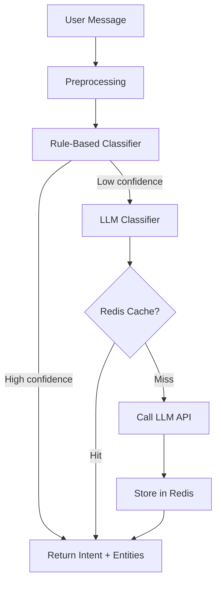
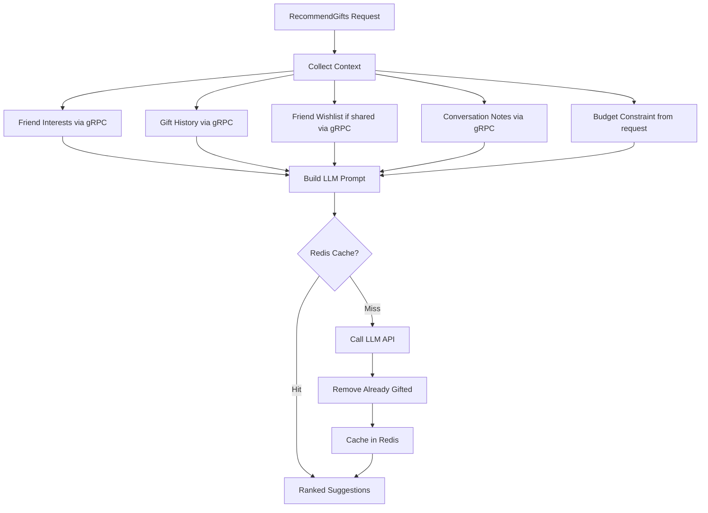
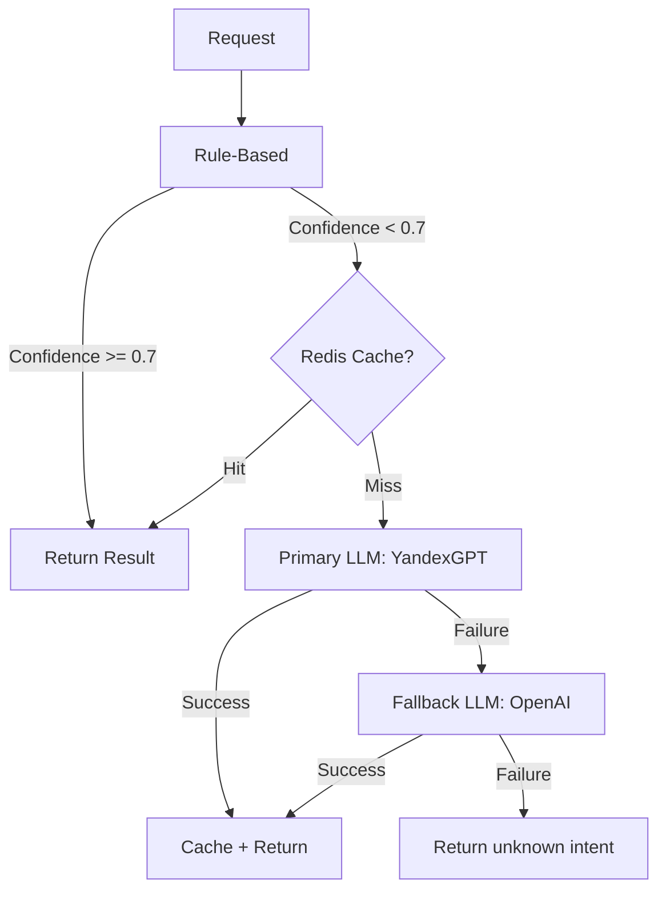
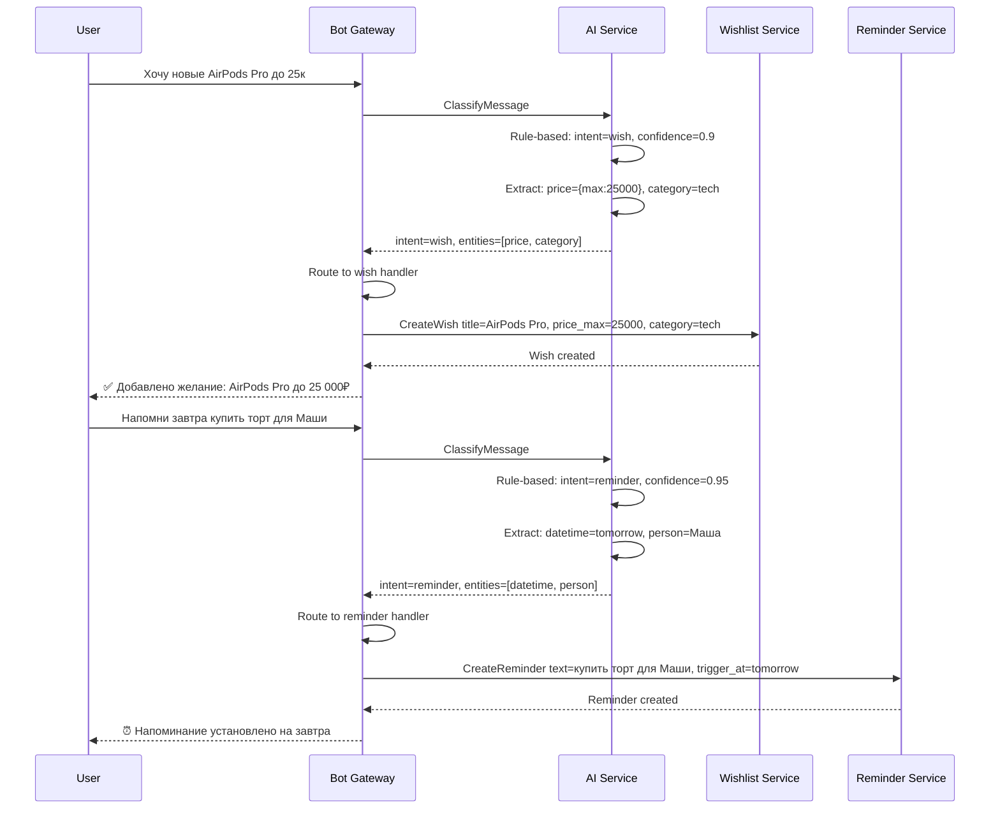

# AI Service — Detailed Design

> **Phase:** 4  
> **Responsibility:** Intent classification, entity extraction, gift recommendations, voice transcription  
> **Port:** 50051 (gRPC)

---

## 1. Overview

AI Service is the intelligence layer of iWontForget. It classifies free-text messages into intents (wish, reminder, gift idea, event, note, query), extracts structured entities (dates, people, prices, categories), and provides gift recommendations based on friend profiles. It uses a **hybrid approach**: rule-based classifiers for common patterns with LLM fallback for ambiguous messages. Redis caches LLM responses to reduce cost and latency.



---

## 2. Responsibilities

### Phase 4 (AI Integration)
- **Intent classification:** Determine what the user wants from a free-text message
- **Entity extraction:** Pull structured data from natural language (dates, names, prices)
- **Gift recommendations:** Suggest gifts based on friend profile, interests, history, budget
- **Response caching:** Cache LLM responses in Redis to reduce API calls and cost

### Phase 8 (Advanced)
- **Voice transcription:** Convert voice messages to text (Whisper API)
- **Semantic FAQ matching:** Embed event FAQ entries for similarity search
- **Smart categorization:** Auto-tag wishes and gift ideas
- **Conversation context:** Multi-turn understanding for complex requests

### What AI Service Does NOT Do
- Does not store any persistent data (stateless service)
- Does not have its own PostgreSQL schema
- Does not publish to Kafka (no domain events)
- Does not run Temporal workflows

---

## 3. Intent Classification Pipeline



### 3.1. Preprocessing

```go
func Preprocess(text string) ProcessedMessage {
    return ProcessedMessage{
        Original:   text,
        Normalized: strings.ToLower(strings.TrimSpace(text)),
        Tokens:     tokenize(text),
        Language:   detectLanguage(text),  // "ru" or "en"
    }
}
```

Steps:
1. Trim whitespace, normalize Unicode
2. Lowercase for matching
3. Tokenize into words
4. Detect language (Russian vs English)

### 3.2. Rule-Based Classifier

Fast, deterministic classification for common patterns. Returns intent with confidence score.

```go
type ClassificationResult struct {
    Intent     string   // "wish", "reminder", "gift_idea", "event", "note", "query", "unknown"
    Confidence float64  // 0.0 - 1.0
    Entities   []Entity
}

var intentPatterns = map[string][]PatternRule{
    "wish": {
        {Pattern: `(?i)(хочу|мечтаю|хотел[аи]?\s+бы|wish|want)\s+`, Weight: 0.9},
        {Pattern: `(?i)(нравится|понравил[аось]+)\s+`, Weight: 0.7},
        {Pattern: `(?i)(присмотрел[аи]?|приглянул[аось]+)\s+`, Weight: 0.8},
    },
    "reminder": {
        {Pattern: `(?i)(напомни|напоминание|remind|reminder)\s+`, Weight: 0.95},
        {Pattern: `(?i)(не забыть|нужно|надо)\s+`, Weight: 0.6},
        {Pattern: `(?i)(через\s+\d+|завтра|послезавтра|в\s+\d{1,2}:\d{2})`, Weight: 0.7},
    },
    "gift_idea": {
        {Pattern: `(?i)(подарить|подарок|gift)\s+`, Weight: 0.9},
        {Pattern: `(?i)(для\s+\w+\s+(купить|подарить|взять))`, Weight: 0.85},
        {Pattern: `(?i)(идея\s+подарка|что\s+подарить)`, Weight: 0.95},
    },
    "event": {
        {Pattern: `(?i)(событие|мероприятие|встреча|event|party|вечеринка)\s+`, Weight: 0.85},
        {Pattern: `(?i)(создай?\s+(событие|встречу|мероприятие))`, Weight: 0.95},
        {Pattern: `(?i)(собираемся|идём|пойдём)\s+`, Weight: 0.6},
    },
    "note": {
        {Pattern: `(?i)(запомни|запиши|заметка|note)\s+`, Weight: 0.85},
        {Pattern: `(?i)(\w+\s+(любит|не любит|предпочитает|носит размер))`, Weight: 0.8},
    },
    "query": {
        {Pattern: `(?i)(покажи|список|найди|search|show|list)\s+`, Weight: 0.85},
        {Pattern: `(?i)(что\s+у\s+меня|мои\s+(желания|напоминания|подарки))`, Weight: 0.9},
    },
}

func ClassifyByRules(msg ProcessedMessage) ClassificationResult {
    bestIntent := "unknown"
    bestConfidence := 0.0
    var entities []Entity

    for intent, patterns := range intentPatterns {
        for _, rule := range patterns {
            if matched, _ := regexp.MatchString(rule.Pattern, msg.Original); matched {
                if rule.Weight > bestConfidence {
                    bestIntent = intent
                    bestConfidence = rule.Weight
                }
            }
        }
    }

    // Extract entities regardless of intent
    entities = ExtractEntities(msg)

    return ClassificationResult{
        Intent:     bestIntent,
        Confidence: bestConfidence,
        Entities:   entities,
    }
}
```

### 3.3. LLM Fallback Classifier

When rule-based confidence is below threshold (0.7), fall back to LLM:

```go
const classifyPrompt = `You are a message classifier for a personal assistant bot.
Classify the following message into exactly one intent:
- wish: user wants something for themselves
- reminder: user wants to be reminded about something
- gift_idea: user has a gift idea for someone
- event: user wants to create or discuss an event/meetup
- note: user wants to save information about a person
- query: user wants to search or list existing data

Also extract entities:
- datetime: any date/time references
- person: any person names mentioned
- price: any price/budget mentioned
- category: any category (tech, clothes, books, etc.)

Message: "%s"

Respond in JSON:
{"intent": "...", "confidence": 0.0-1.0, "entities": [{"type": "...", "value": "...", "raw": "..."}]}`

func ClassifyByLLM(ctx context.Context, msg ProcessedMessage) (ClassificationResult, error) {
    // Check Redis cache first
    cacheKey := buildCacheKey(msg.Normalized)
    if cached, err := redis.Get(ctx, cacheKey); err == nil {
        return parseCachedResult(cached)
    }

    // Call LLM API
    prompt := fmt.Sprintf(classifyPrompt, msg.Original)
    response, err := llmClient.Complete(ctx, prompt)
    if err != nil {
        return ClassificationResult{}, fmt.Errorf("LLM classification failed: %w", err)
    }

    result := parseLLMResponse(response)

    // Cache result in Redis (TTL 24h)
    redis.Set(ctx, cacheKey, serializeResult(result), 24*time.Hour)

    return result, nil
}
```

---

## 4. Entity Extraction

### 4.1. Date/Time Extraction

Parses Russian and English natural language date/time expressions into structured timestamps.

```go
type DateTimeEntity struct {
    Value    time.Time
    Raw      string    // Original text: "завтра в 15:00"
    IsExact  bool      // true if specific time given, false if just date
    Relative bool      // true if "через 2 дня", false if "15 марта"
}

var datePatterns = []DatePattern{
    // Relative dates
    {Pattern: `(?i)сегодня`, Resolver: func(now time.Time) time.Time { return now }},
    {Pattern: `(?i)завтра`, Resolver: func(now time.Time) time.Time { return now.AddDate(0, 0, 1) }},
    {Pattern: `(?i)послезавтра`, Resolver: func(now time.Time) time.Time { return now.AddDate(0, 0, 2) }},
    {Pattern: `(?i)через\s+(\d+)\s+(минут|час|дн|недел|месяц)`, Resolver: resolveRelative},

    // Absolute dates
    {Pattern: `(\d{1,2})\s+(января|февраля|марта|апреля|мая|июня|июля|августа|сентября|октября|ноября|декабря)`, Resolver: resolveAbsoluteRu},
    {Pattern: `(\d{1,2})\.(\d{1,2})\.?(\d{2,4})?`, Resolver: resolveDotDate},

    // Time patterns
    {Pattern: `(?i)в\s+(\d{1,2}):(\d{2})`, Resolver: resolveTime},
    {Pattern: `(?i)(утром|днём|вечером|ночью)`, Resolver: resolveTimeOfDay},

    // Recurring
    {Pattern: `(?i)каждый\s+(понедельник|вторник|среду|четверг|пятницу|субботу|воскресенье)`, Resolver: resolveWeekday},
    {Pattern: `(?i)каждый\s+день`, Resolver: resolveDaily},
}
```

### 4.2. Person Extraction

```go
type PersonEntity struct {
    Name string  // Extracted name: "Маша", "мама"
    Raw  string  // Original context: "подарить Маше"
}

var personPatterns = []string{
    `(?i)(для|подарить|подарок)\s+([А-ЯЁ][а-яё]+[еу]?)`,  // Dative case
    `(?i)([А-ЯЁ][а-яё]+)\s+(любит|хочет|носит|предпочитает)`,
    `(?i)(мам[аеу]|пап[аеу]|бабушк[аеу]|дедушк[аеу]|сестр[аеу]|брат[аеу]?)`,
    `(?i)(муж[у]?|жен[аеу]|парн[юя]|девушк[аеу])`,
}
```

### 4.3. Price Extraction

```go
type PriceEntity struct {
    Min      int    // Minimum price in smallest unit
    Max      int    // Maximum price (same as Min if exact)
    Currency string // "RUB" default
    Raw      string // "до 5000", "~3к", "10000р"
}

var pricePatterns = []string{
    `(\d+)\s*(?:руб|₽|р\b)`,           // 5000р, 5000 руб
    `(\d+)\s*к\b`,                       // 3к = 3000
    `до\s+(\d+)`,                        // до 5000
    `от\s+(\d+)\s+до\s+(\d+)`,          // от 1000 до 5000
    `~\s*(\d+)`,                         // ~3000
    `(\d+)\s*-\s*(\d+)`,                // 1000-5000
}
```

### 4.4. Category Extraction

```go
var categoryKeywords = map[string][]string{
    "tech":       {"телефон", "ноутбук", "наушники", "гаджет", "электроник", "phone", "laptop"},
    "clothes":    {"одежда", "футболк", "куртк", "обувь", "кроссовк", "размер"},
    "books":      {"книг", "роман", "автор", "читать", "book"},
    "home":       {"дом", "кухн", "декор", "мебел", "интерьер"},
    "beauty":     {"косметик", "парфюм", "крем", "уход"},
    "food":       {"еда", "кофе", "чай", "шоколад", "вино", "ресторан"},
    "experience": {"сертификат", "мастер-класс", "квест", "путешеств", "билет"},
    "sport":      {"спорт", "фитнес", "йога", "велосипед", "тренажёр"},
    "games":      {"игр", "настолк", "приставк", "steam", "playstation"},
    "other":      {},
}
```

---

## 5. Gift Recommendation Engine



### Recommendation Prompt

```go
const recommendPrompt = `You are a gift recommendation assistant.

Based on the following information about a person, suggest 5 gift ideas.

Person: %s
Interests: %s
Past gifts (avoid repeating): %s
Their wishlist items: %s
Notes about them: %s
Budget: %s
Occasion: %s

For each suggestion provide:
1. Gift name
2. Why it fits this person
3. Estimated price range
4. Where to buy (online store suggestion)

Respond in JSON array format:
[{"name": "...", "reason": "...", "price_min": 0, "price_max": 0, "where_to_buy": "..."}]`
```

### Context Collection

```go
func (s *AIService) RecommendGifts(ctx context.Context, req *RecommendRequest) (*GiftRecommendations, error) {
    // 1. Fetch friend profile from Friends Service
    profile, err := s.friendsClient.GetFriendProfile(ctx, &GetFriendProfileRequest{
        FriendId: req.FriendId,
        UserId:   req.UserId,
    })
    if err != nil {
        return nil, fmt.Errorf("failed to get friend profile: %w", err)
    }

    // 2. Fetch gift history from Friends Service
    history, err := s.friendsClient.ListGiftHistory(ctx, &ListGiftHistoryRequest{
        FriendId: req.FriendId,
        UserId:   req.UserId,
    })

    // 3. Fetch friend's wishlist if shared (from Wishlist Service)
    var wishlistItems []*Wish
    if profile.TelegramId != 0 {
        wishlist, _ := s.wishlistClient.ListPublicWishes(ctx, &ListPublicWishesRequest{
            UserId: profile.TelegramId,
        })
        if wishlist != nil {
            wishlistItems = wishlist.Wishes
        }
    }

    // 4. Check Redis cache
    cacheKey := buildRecommendCacheKey(req)
    if cached, err := s.redis.Get(ctx, cacheKey); err == nil {
        return parseCachedRecommendations(cached)
    }

    // 5. Build prompt and call LLM
    prompt := buildRecommendPrompt(profile, history, wishlistItems, req)
    response, err := s.llmClient.Complete(ctx, prompt)
    if err != nil {
        return nil, fmt.Errorf("LLM recommendation failed: %w", err)
    }

    // 6. Parse, deduplicate against history, cache
    recommendations := parseRecommendations(response)
    recommendations = deduplicateAgainstHistory(recommendations, history)

    s.redis.Set(ctx, cacheKey, serializeRecommendations(recommendations), 6*time.Hour)

    return recommendations, nil
}
```

---

## 6. gRPC API

```protobuf
syntax = "proto3";
package iwontforget.ai.v1;

service AIService {
  // Classify a user message into an intent
  rpc ClassifyMessage(ClassifyRequest) returns (ClassifyResponse);

  // Extract structured entities from text
  rpc ExtractEntities(ExtractRequest) returns (ExtractResponse);

  // Get gift recommendations for a friend
  rpc RecommendGifts(RecommendRequest) returns (GiftRecommendations);

  // Transcribe a voice message to text (Phase 8)
  rpc TranscribeVoice(VoiceRequest) returns (TextResponse);

  // Match a question against FAQ entries (Phase 8)
  rpc MatchFAQ(MatchFAQRequest) returns (MatchFAQResponse);
}

// ─── Classification ───

message ClassifyRequest {
  string text = 1;
  int64 user_id = 2;           // For personalization context
  optional string language = 3; // "ru" or "en", auto-detected if empty
}

message ClassifyResponse {
  string intent = 1;            // "wish", "reminder", "gift_idea", "event", "note", "query", "unknown"
  double confidence = 2;        // 0.0 - 1.0
  string classifier = 3;        // "rules" or "llm" — which classifier was used
  repeated Entity entities = 4;
}

// ─── Entity Extraction ───

message ExtractRequest {
  string text = 1;
  optional string timezone = 2;  // For date resolution, e.g., "Europe/Moscow"
}

message ExtractResponse {
  repeated Entity entities = 1;
}

message Entity {
  string type = 1;       // "datetime", "person", "price", "category"
  string value = 2;      // Structured value: "2024-03-15T15:00:00Z", "Маша", "5000", "tech"
  string raw = 3;        // Original text span: "завтра в 15:00", "для Маши", "до 5к"
  double confidence = 4; // Extraction confidence
  // Type-specific fields
  optional DateTimeValue datetime = 5;
  optional PriceValue price = 6;
}

message DateTimeValue {
  string timestamp = 1;    // ISO-8601
  bool is_exact = 2;       // Has specific time?
  bool is_relative = 3;    // "через 2 дня" vs "15 марта"
  optional string cron = 4; // For recurring: "0 9 * * 1" (every Monday 9am)
}

message PriceValue {
  int32 min = 1;
  int32 max = 2;
  string currency = 3;
}

// ─── Gift Recommendations ───

message RecommendRequest {
  int64 user_id = 1;
  int64 friend_id = 2;
  optional string occasion = 3;     // "birthday", "new_year", etc.
  optional int32 budget_min = 4;
  optional int32 budget_max = 5;
  optional string category = 6;     // Limit to specific category
  int32 count = 7;                   // How many suggestions (default 5)
}

message GiftRecommendations {
  repeated GiftSuggestion suggestions = 1;
  string model_used = 2;             // "rules", "gpt-4", "yandexgpt"
  bool from_cache = 3;
}

message GiftSuggestion {
  string name = 1;
  string reason = 2;
  int32 price_min = 3;
  int32 price_max = 4;
  string where_to_buy = 5;
  string category = 6;
  double relevance_score = 7;
}

// ─── Voice Transcription (Phase 8) ───

message VoiceRequest {
  bytes audio_data = 1;
  string format = 2;        // "ogg", "mp3", "wav"
  optional string language = 3;
}

message TextResponse {
  string text = 1;
  double confidence = 2;
  string language = 3;
}

// ─── FAQ Matching (Phase 8) ───

message MatchFAQRequest {
  string question = 1;
  repeated FAQEntry entries = 2;
}

message FAQEntry {
  int64 id = 1;
  string question = 2;
  string answer = 3;
}

message MatchFAQResponse {
  bool found = 1;
  int64 matched_id = 2;
  double similarity = 3;
}
```

---

## 7. Internal Architecture

```
services/ai-service/
├── cmd/
│   └── main.go                    # Entry point, DI wiring
├── internal/
│   ├── app/
│   │   ├── service.go             # Business logic orchestrator
│   │   ├── classifier.go          # Intent classification coordinator
│   │   ├── extractor.go           # Entity extraction coordinator
│   │   └── recommender.go         # Gift recommendation logic
│   ├── classifier/
│   │   ├── rules.go               # Rule-based classifier
│   │   ├── llm.go                 # LLM-based classifier
│   │   ├── patterns.go            # Regex pattern definitions
│   │   └── classifier_test.go
│   ├── extractor/
│   │   ├── datetime.go            # Date/time extraction
│   │   ├── person.go              # Person name extraction
│   │   ├── price.go               # Price extraction
│   │   ├── category.go            # Category detection
│   │   └── extractor_test.go
│   ├── llm/
│   │   ├── client.go              # LLM API client interface
│   │   ├── openai.go              # OpenAI implementation
│   │   ├── yandexgpt.go           # YandexGPT implementation
│   │   ├── prompts.go             # Prompt templates
│   │   └── cache.go               # Redis caching layer
│   ├── port/
│   │   ├── llm.go                 # LLM client interface
│   │   └── services.go            # External service interfaces
│   ├── adapter/
│   │   ├── grpc/
│   │   │   └── handler.go         # gRPC server implementation
│   │   ├── redis/
│   │   │   └── cache.go           # Redis cache adapter
│   │   └── external/
│   │       ├── friends_client.go  # Friends Service gRPC client
│   │       └── wishlist_client.go # Wishlist Service gRPC client
│   └── config/
│       └── config.go
├── testdata/
│   ├── classify_cases.json        # Test cases for classification
│   └── extract_cases.json         # Test cases for extraction
└── Dockerfile
```

---

## 8. Redis Caching Strategy

AI Service uses **Redis DB3** for caching LLM responses.

### Cache Key Patterns

| Pattern | TTL | Purpose |
|---------|-----|---------|
| `ai:classify:{hash}` | 24h | Classification results for normalized messages |
| `ai:recommend:{user}:{friend}:{occasion}` | 6h | Gift recommendations |
| `ai:transcribe:{audio_hash}` | 48h | Voice transcription results |
| `ai:faq_embed:{event_id}` | 1h | FAQ embeddings for semantic search |

### Cache Hash Function

```go
func buildCacheKey(prefix, text string) string {
    h := sha256.Sum256([]byte(strings.ToLower(strings.TrimSpace(text))))
    return fmt.Sprintf("%s:%x", prefix, h[:8]) // First 8 bytes = 16 hex chars
}
```

### Cache Hit Rate Expectations

| Operation | Expected Hit Rate | Reasoning |
|-----------|-------------------|-----------|
| Classification | 40-60% | Many users send similar patterns |
| Recommendations | 20-30% | Highly personalized, but same friend queried multiple times |
| Transcription | 5-10% | Audio is rarely identical |
| FAQ matching | 70-80% | Same questions asked repeatedly |

---

## 9. LLM Provider Strategy

### Phase 4 (MVP AI)



### Provider Configuration

```go
type LLMConfig struct {
    Primary  ProviderConfig
    Fallback ProviderConfig
}

type ProviderConfig struct {
    Provider    string        // "openai", "yandexgpt"
    Model       string        // "gpt-4o-mini", "yandexgpt-lite"
    APIKey      string
    Endpoint    string
    Timeout     time.Duration
    MaxTokens   int
    Temperature float64
}
```

### Cost Control

| Mechanism | Implementation |
|-----------|---------------|
| Rule-based first | 60-70% of messages classified without LLM |
| Redis caching | Avoid duplicate LLM calls |
| Cheap models first | Use `gpt-4o-mini` / `yandexgpt-lite` for classification |
| Token limits | Cap input at 500 tokens, output at 200 tokens |
| Rate limiting | Max 100 LLM calls/minute per user |
| Monthly budget cap | Circuit breaker when monthly spend exceeds threshold |

---

## 10. Bot Gateway Integration

AI Service is called by Bot Gateway when processing free-text messages (not commands):



---

## 11. Configuration

```yaml
service:
  name: ai-service
  port: 50051

redis:
  host: redis.infrastructure.svc
  port: 6379
  db: 3
  pool_size: 10

llm:
  primary:
    provider: yandexgpt
    model: yandexgpt-lite
    endpoint: https://llm.api.cloud.yandex.net/foundationModels/v1/completion
    timeout: 10s
    max_tokens: 200
    temperature: 0.1
  fallback:
    provider: openai
    model: gpt-4o-mini
    endpoint: https://api.openai.com/v1/chat/completions
    timeout: 15s
    max_tokens: 200
    temperature: 0.1

classifier:
  rule_confidence_threshold: 0.7  # Below this, use LLM
  cache_ttl: 24h

recommender:
  cache_ttl: 6h
  default_count: 5
  max_count: 10

rate_limit:
  llm_calls_per_minute: 100
  monthly_budget_usd: 50.0

grpc_clients:
  friends_service: friends-service.iwontforget.svc:50051
  wishlist_service: wishlist-service.iwontforget.svc:50051

observability:
  metrics_port: 9090
  health_port: 8080
  log_level: info
  log_format: json
```

---

## 12. Metrics

| Metric | Type | Labels | Description |
|--------|------|--------|-------------|
| `ai_classify_total` | Counter | `intent`, `classifier` (rules/llm) | Classification requests |
| `ai_classify_confidence` | Histogram | `intent`, `classifier` | Confidence score distribution |
| `ai_classify_duration_seconds` | Histogram | `classifier` | Classification latency |
| `ai_extract_total` | Counter | `entity_type` | Entity extractions |
| `ai_recommend_total` | Counter | `occasion`, `from_cache` | Recommendation requests |
| `ai_recommend_duration_seconds` | Histogram | — | Recommendation latency |
| `ai_llm_calls_total` | Counter | `provider`, `status` (success/error) | LLM API calls |
| `ai_llm_duration_seconds` | Histogram | `provider` | LLM API latency |
| `ai_llm_tokens_total` | Counter | `provider`, `direction` (input/output) | Token usage |
| `ai_llm_cost_usd` | Counter | `provider` | Estimated cost in USD |
| `ai_cache_hit_total` | Counter | `operation` (classify/recommend) | Cache hits |
| `ai_cache_miss_total` | Counter | `operation` | Cache misses |
| `ai_transcribe_total` | Counter | `language` | Voice transcriptions (Phase 8) |
| `ai_grpc_request_duration_seconds` | Histogram | `method`, `status` | gRPC latency |

---

## 13. Testing Strategy

### Unit Tests
- **Rule-based classifier:** Test each intent pattern with positive/negative examples
- **Entity extraction:** Date parsing (relative, absolute, recurring), price parsing, person extraction
- **Category detection:** Keyword matching accuracy
- **Cache key generation:** Deterministic hashing

### Test Data Format

```json
// testdata/classify_cases.json
[
  {
    "input": "Хочу новые AirPods Pro",
    "expected_intent": "wish",
    "expected_min_confidence": 0.8,
    "expected_entities": [
      {"type": "category", "value": "tech"}
    ]
  },
  {
    "input": "Напомни завтра в 15:00 позвонить маме",
    "expected_intent": "reminder",
    "expected_min_confidence": 0.9,
    "expected_entities": [
      {"type": "datetime", "value_contains": "15:00"},
      {"type": "person", "value": "мама"}
    ]
  },
  {
    "input": "Что подарить Маше на день рождения до 5000?",
    "expected_intent": "gift_idea",
    "expected_min_confidence": 0.85,
    "expected_entities": [
      {"type": "person", "value": "Маша"},
      {"type": "price", "max": 5000}
    ]
  }
]
```

### Table-Driven Tests

```go
func TestRuleBasedClassifier(t *testing.T) {
    cases := loadTestCases(t, "testdata/classify_cases.json")

    classifier := NewRuleBasedClassifier()

    for _, tc := range cases {
        t.Run(tc.Input, func(t *testing.T) {
            msg := Preprocess(tc.Input)
            result := classifier.Classify(msg)

            assert.Equal(t, tc.ExpectedIntent, result.Intent)
            assert.GreaterOrEqual(t, result.Confidence, tc.ExpectedMinConfidence)

            for _, expectedEntity := range tc.ExpectedEntities {
                found := false
                for _, entity := range result.Entities {
                    if entity.Type == expectedEntity.Type {
                        found = true
                        if expectedEntity.Value != "" {
                            assert.Contains(t, entity.Value, expectedEntity.Value)
                        }
                    }
                }
                assert.True(t, found, "Expected entity type %s not found", expectedEntity.Type)
            }
        })
    }
}
```

### Integration Tests
- LLM fallback with mocked HTTP server
- Redis caching: verify cache hit/miss behavior
- Gift recommendation with mocked Friends Service and Wishlist Service responses
- End-to-end: message → classify → extract → structured result

### Contract Tests
- Buf breaking change detection for `ai/v1` protobuf package

---

## 14. Deployment

```yaml
apiVersion: apps/v1
kind: Deployment
metadata:
  name: ai-service
  namespace: iwontforget
spec:
  replicas: 2
  selector:
    matchLabels:
      app: ai-service
  template:
    metadata:
      labels:
        app: ai-service
    spec:
      containers:
        - name: ai-service
          image: ghcr.io/iwontforget/ai-service:latest
          ports:
            - containerPort: 50051
              name: grpc
            - containerPort: 9090
              name: metrics
            - containerPort: 8080
              name: health
          env:
            - name: LLM_PRIMARY_API_KEY
              valueFrom:
                secretKeyRef:
                  name: ai-service-secrets
                  key: yandexgpt-api-key
            - name: LLM_FALLBACK_API_KEY
              valueFrom:
                secretKeyRef:
                  name: ai-service-secrets
                  key: openai-api-key
          resources:
            requests:
              cpu: 200m
              memory: 256Mi
            limits:
              cpu: 1000m
              memory: 512Mi
          livenessProbe:
            httpGet:
              path: /healthz
              port: health
            initialDelaySeconds: 5
          readinessProbe:
            httpGet:
              path: /readyz
              port: health
            initialDelaySeconds: 5
---
apiVersion: autoscaling/v2
kind: HorizontalPodAutoscaler
metadata:
  name: ai-service
  namespace: iwontforget
spec:
  scaleTargetRef:
    apiVersion: apps/v1
    kind: Deployment
    name: ai-service
  minReplicas: 2
  maxReplicas: 8
  metrics:
    - type: Resource
      resource:
        name: cpu
        target:
          type: Utilization
          averageUtilization: 60
```

> **Note:** AI Service gets higher CPU limits (1000m) and more aggressive scaling (up to 8 replicas) because LLM calls can be CPU-intensive during prompt building and response parsing. The actual LLM inference happens externally.

---

## 15. Phase Roadmap

| Phase | What Gets Built |
|-------|----------------|
| **Phase 4** | Rule-based classifier, LLM fallback, entity extraction (datetime, person, price, category), Redis caching, gift recommendations. Bot Gateway integration for free-text routing. |
| **Phase 7** | Observability: LLM cost tracking dashboards, classification accuracy monitoring, A/B testing framework for classifier improvements |
| **Phase 8** | Voice transcription (Whisper), semantic FAQ matching (embeddings), fine-tuned local model for classification, multi-turn conversation context, smart categorization |

---

## 16. Design Decisions

### Why hybrid (rules + LLM) instead of LLM-only?

1. **Cost:** Rule-based handles 60-70% of messages for free
2. **Latency:** Regex matching is <1ms vs 500ms-2s for LLM
3. **Reliability:** Rules work offline, no API dependency
4. **Predictability:** Deterministic results for common patterns
5. **Testability:** Rule-based classifier is fully unit-testable

### Why stateless (no database)?

AI Service is a pure function: `text → structured data`. It has no domain state to persist. Caching in Redis is ephemeral and can be rebuilt. This makes the service:
- Easy to scale horizontally
- Simple to deploy and roll back
- No migration concerns
- No data consistency issues

### Why YandexGPT as primary?

1. **Data locality:** Russian language model, better for Russian text
2. **Compliance:** Data stays within Russian infrastructure
3. **Cost:** Competitive pricing for Russian market
4. **Fallback:** OpenAI as backup ensures availability

### Future: Local Model

Post-MVP, train a small classification model (e.g., fine-tuned BERT) on accumulated labeled data from rule-based + LLM classifications. This eliminates external API dependency for classification while keeping LLM for recommendations and complex extraction.