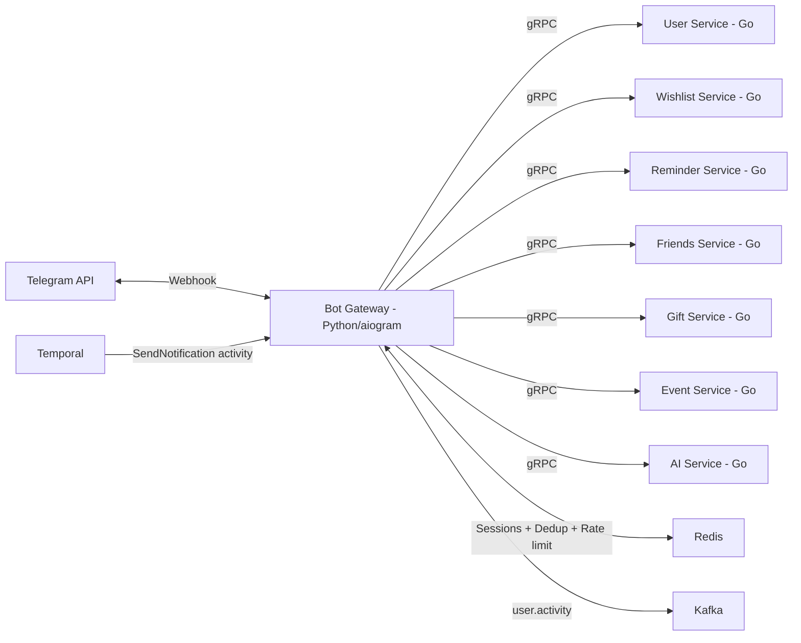
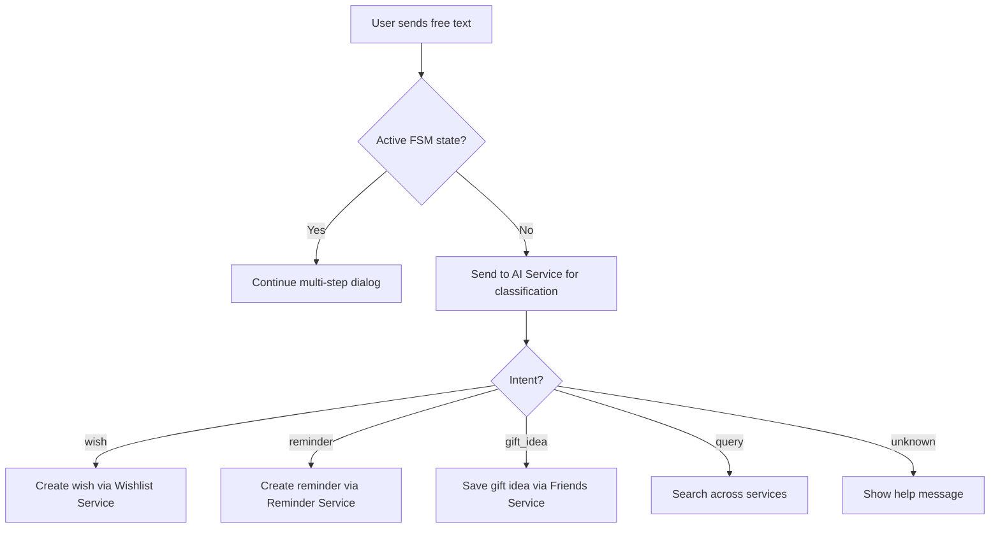
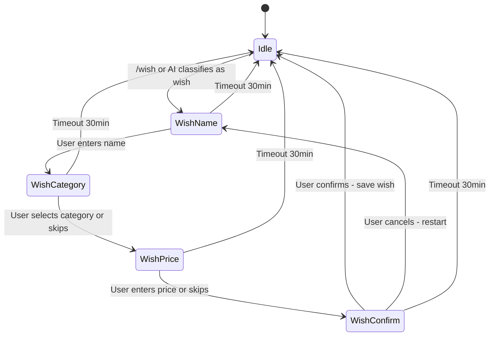

# Bot Gateway Service — Detailed Design

> **Phase:** 1 (MVP)  
> **Language:** Python 3.12+ (aiogram 3.x)  
> **Responsibility:** Telegram Bot API interface, message routing, session management, notification delivery  
> **Port:** 50051 (gRPC), 8080 (HTTP webhook)

---

## 1. Overview

Bot Gateway is the **single entry point** for all user interactions. It receives Telegram updates (messages, callbacks, inline queries), classifies them, routes to appropriate backend services via gRPC, and sends responses back to Telegram. It also serves as the **notification delivery endpoint** — Temporal workflow activities call its `SendNotification` gRPC method to deliver messages to users.

Built with **aiogram 3.x** (async Telegram framework for Python), it leverages Python's `asyncio` for high-concurrency I/O-bound workloads — ideal for a service that primarily waits on network calls (Telegram API, gRPC, Redis).



### Why Python for Bot Gateway?

- **aiogram 3.x** is the most mature async Telegram framework — rich middleware, FSM, i18n support out of the box
- Bot Gateway is **I/O-bound** (waiting on Telegram API, gRPC calls, Redis) — Python's `asyncio` handles this efficiently
- Telegram bot development has a **stronger Python ecosystem** (aiogram, python-telegram-bot, telethon)
- **Learning value:** polyglot architecture teaches real-world patterns (most companies use multiple languages)
- All backend services remain in **Go** for CPU-bound work, complex business logic, and Temporal workers

---

## 2. Responsibilities

### 2.1. Incoming Message Processing
- Receive Telegram webhook updates (or long-polling in dev)
- Parse update type: message, callback_query, inline_query, deep_link
- Load/create user session from Redis
- Route to appropriate handler based on:
  - Active session state (multi-step dialog via aiogram FSM)
  - Bot command (`/wish`, `/remind`, `/friends`, etc.)
  - AI classification (free-text messages)
- Format and send response back to Telegram

### 2.2. Notification Delivery (gRPC server)
- Expose `NotificationGateway` gRPC service for Temporal activities
- Rate limiting: 30 msg/sec global, 1 msg/sec per chat (Telegram limits)
- Deduplication: prevent same notification sent twice
- Retry-safe: Temporal handles retries, Bot Gateway is idempotent

### 2.3. Session Management
- Track multi-step conversations using aiogram's FSM + Redis storage
- Example: adding a wish step-by-step (name → category → price → confirm)
- Session TTL: 30 minutes of inactivity
- Session cleanup on completion or cancellation

### 2.4. Event Publishing
- Publish `user.activity` events to Kafka for analytics
- Uses Transactional Outbox? **No** — user activity events are fire-and-forget, losing one is acceptable. Direct Kafka produce with retries is sufficient.

---

## 3. Internal Architecture

```
bot-gateway/
├── bot_gateway/
│   ├── __init__.py
│   ├── __main__.py                    # Entry point: asyncio.run(main())
│   ├── app.py                         # Application factory, DI, lifespan
│   ├── config.py                      # Pydantic Settings configuration
│   ├── handlers/
│   │   ├── __init__.py
│   │   ├── commands.py                # Bot command handlers (/wish, /remind, etc.)
│   │   ├── messages.py                # Free-text message handler
│   │   ├── callbacks.py               # Inline keyboard callback handler
│   │   ├── inline.py                  # Inline query handler (wishlist sharing)
│   │   └── deeplink.py                # Deep link handler (t.me/bot?start=...)
│   ├── routers/
│   │   ├── __init__.py
│   │   ├── wish.py                    # Wish-related router (commands + FSM)
│   │   ├── reminder.py                # Reminder router
│   │   ├── friend.py                  # Friend router
│   │   ├── gift.py                    # Gift router
│   │   ├── event.py                   # Event router
│   │   └── common.py                  # /start, /help, /settings
│   ├── states/
│   │   ├── __init__.py
│   │   ├── wish.py                    # WishForm FSM states
│   │   ├── reminder.py                # ReminderForm FSM states
│   │   └── friend.py                  # FriendForm FSM states
│   ├── keyboards/
│   │   ├── __init__.py
│   │   ├── main_menu.py               # Main menu keyboard
│   │   ├── wish.py                    # Wish-related keyboards
│   │   ├── reminder.py                # Reminder keyboards (snooze, complete, etc.)
│   │   ├── friend.py                  # Friend-related keyboards
│   │   └── common.py                  # Shared keyboard helpers
│   ├── grpc_server/
│   │   ├── __init__.py
│   │   ├── server.py                  # gRPC server setup (runs alongside aiogram)
│   │   └── notification_service.py    # NotificationGateway gRPC servicer
│   ├── grpc_clients/
│   │   ├── __init__.py
│   │   ├── base.py                    # Base async gRPC channel manager
│   │   ├── user.py                    # User Service gRPC client
│   │   ├── wishlist.py                # Wishlist Service gRPC client
│   │   ├── reminder.py                # Reminder Service gRPC client
│   │   ├── friends.py                 # Friends Service gRPC client
│   │   ├── gift.py                    # Gift Service gRPC client
│   │   ├── event.py                   # Event Service gRPC client
│   │   └── ai.py                      # AI Service gRPC client
│   ├── services/
│   │   ├── __init__.py
│   │   ├── notification.py            # Notification sender (Telegram API calls)
│   │   ├── formatter.py               # Message formatting (Markdown, HTML)
│   │   ├── templates.py               # Notification message templates (Jinja2)
│   │   ├── ratelimit.py               # Redis token bucket rate limiter
│   │   └── dedup.py                   # Redis SET NX deduplication
│   ├── middleware/
│   │   ├── __init__.py
│   │   ├── logging.py                 # Structured logging middleware
│   │   ├── metrics.py                 # Prometheus metrics middleware
│   │   ├── user_context.py            # Load user from User Service, inject into context
│   │   └── error_handler.py           # Global error handler
│   ├── kafka/
│   │   ├── __init__.py
│   │   └── producer.py                # Async Kafka producer (aiokafka)
│   └── utils/
│       ├── __init__.py
│       └── callback_data.py           # Callback data factories (aiogram CallbackData)
├── tests/
│   ├── __init__.py
│   ├── conftest.py                    # Shared fixtures (mock bot, Redis, gRPC)
│   ├── unit/
│   │   ├── __init__.py
│   │   ├── test_commands.py
│   │   ├── test_callbacks.py
│   │   ├── test_states.py
│   │   ├── test_ratelimit.py
│   │   ├── test_dedup.py
│   │   └── test_formatter.py
│   └── integration/
│       ├── __init__.py
│       ├── test_redis_session.py
│       ├── test_grpc_notification.py
│       └── test_kafka_producer.py
├── Dockerfile
├── pyproject.toml
└── README.md
```

---

## 4. Key Dependencies

```toml
# pyproject.toml
[project]
name = "bot-gateway"
version = "0.1.0"
requires-python = ">=3.12"

dependencies = [
    "aiogram>=3.15,<4.0",             # Telegram Bot framework
    "grpcio>=1.68,<2.0",              # gRPC client + server
    "grpcio-tools>=1.68,<2.0",        # Protobuf code generation
    "grpcio-reflection>=1.68,<2.0",   # gRPC reflection (debugging)
    "grpcio-health-checking>=1.68",   # gRPC health checks
    "redis[hiredis]>=5.2,<6.0",       # Async Redis (redis-py with hiredis)
    "aiokafka>=0.12,<1.0",            # Async Kafka producer
    "pydantic-settings>=2.7,<3.0",    # Configuration management
    "structlog>=24.4,<25.0",          # Structured logging
    "prometheus-client>=0.21,<1.0",   # Prometheus metrics
    "opentelemetry-api>=1.29",        # OpenTelemetry tracing
    "opentelemetry-sdk>=1.29",
    "opentelemetry-instrumentation-grpc>=0.50b",
    "jinja2>=3.1,<4.0",              # Message templates
    "orjson>=3.10,<4.0",             # Fast JSON serialization
]

[project.optional-dependencies]
dev = [
    "pytest>=8.3",
    "pytest-asyncio>=0.24",
    "pytest-cov>=6.0",
    "testcontainers[redis,kafka]>=4.9",
    "grpcio-testing>=1.68",
    "ruff>=0.8",
    "mypy>=1.13",
    "bandit>=1.8",
    "pre-commit>=4.0",
]

[tool.ruff]
target-version = "py312"
line-length = 120

[tool.ruff.lint]
select = ["E", "F", "W", "I", "N", "UP", "ANN", "ASYNC", "S", "B", "A", "COM", "C4", "DTZ", "T10", "EM", "ISC", "ICN", "PIE", "PT", "RSE", "RET", "SLF", "SIM", "TID", "TCH", "ARG", "PTH", "ERA", "PL", "TRY", "FLY", "PERF", "RUF"]

[tool.mypy]
python_version = "3.12"
strict = true
warn_return_any = true
warn_unused_configs = true

[tool.pytest.ini_options]
asyncio_mode = "auto"
testpaths = ["tests"]
```

---

## 5. gRPC API

### 5.1. NotificationGateway (server — called by Temporal activities)

```protobuf
syntax = "proto3";
package gateway.v1;

service NotificationGateway {
  // Send a single notification to a user
  rpc SendNotification(SendNotificationRequest) returns (SendNotificationResponse);
  
  // Send notifications to multiple users (e.g., event reminders)
  rpc SendNotificationBatch(SendBatchRequest) returns (SendBatchResponse);
}

message SendNotificationRequest {
  int64 telegram_chat_id = 1;
  string text = 2;
  string parse_mode = 3;                    // "Markdown" or "HTML"
  repeated InlineButton buttons = 4;        // Optional inline keyboard
  string dedup_key = 5;                     // For deduplication
  NotificationType type = 6;
}

message InlineButton {
  string text = 1;
  string callback_data = 2;
}

enum NotificationType {
  NOTIFICATION_TYPE_UNSPECIFIED = 0;
  NOTIFICATION_TYPE_REMINDER = 1;
  NOTIFICATION_TYPE_BIRTHDAY = 2;
  NOTIFICATION_TYPE_GIFT_BOOKED = 3;
  NOTIFICATION_TYPE_EVENT_REMINDER = 4;
  NOTIFICATION_TYPE_WISHLIST_UPDATE = 5;
}

message SendNotificationResponse {
  bool delivered = 1;
  string message_id = 2;                    // Telegram message ID
  string error = 3;                         // Error if not delivered
}

message SendBatchRequest {
  repeated SendNotificationRequest notifications = 1;
}

message SendBatchResponse {
  repeated SendNotificationResponse results = 1;
  int32 delivered_count = 2;
  int32 failed_count = 3;
}
```

### 5.2. gRPC Server Implementation (Python)

```python
# bot_gateway/grpc_server/notification_service.py

import grpc
from google.protobuf import empty_pb2

from bot_gateway.services.dedup import Deduplicator
from bot_gateway.services.notification import NotificationSender
from bot_gateway.services.ratelimit import RateLimiter

# Generated from proto/gateway/v1/gateway.proto
from proto.gateway.v1 import gateway_pb2, gateway_pb2_grpc


class NotificationGatewayServicer(gateway_pb2_grpc.NotificationGatewayServicer):
    """gRPC server called by Temporal activities to deliver notifications."""

    def __init__(
        self,
        sender: NotificationSender,
        rate_limiter: RateLimiter,
        dedup: Deduplicator,
    ) -> None:
        self._sender = sender
        self._rate_limiter = rate_limiter
        self._dedup = dedup

    async def SendNotification(
        self,
        request: gateway_pb2.SendNotificationRequest,
        context: grpc.aio.ServicerContext,
    ) -> gateway_pb2.SendNotificationResponse:
        # 1. Check deduplication
        if request.dedup_key:
            is_dup = await self._dedup.is_duplicate(request.dedup_key)
            if is_dup:
                return gateway_pb2.SendNotificationResponse(
                    delivered=True,
                    error="deduplicated",
                )

        # 2. Check rate limit
        allowed, wait_seconds = await self._rate_limiter.allow(request.telegram_chat_id)
        if not allowed:
            await context.abort(
                grpc.StatusCode.RESOURCE_EXHAUSTED,
                f"Rate limited. Retry after {wait_seconds:.1f}s",
            )

        # 3. Send via Telegram
        message_id = await self._sender.send(
            chat_id=request.telegram_chat_id,
            text=request.text,
            parse_mode=request.parse_mode,
            buttons=request.buttons,
        )

        return gateway_pb2.SendNotificationResponse(
            delivered=True,
            message_id=str(message_id),
        )

    async def SendNotificationBatch(
        self,
        request: gateway_pb2.SendBatchRequest,
        context: grpc.aio.ServicerContext,
    ) -> gateway_pb2.SendBatchResponse:
        results: list[gateway_pb2.SendNotificationResponse] = []
        delivered = 0
        failed = 0

        for notification in request.notifications:
            resp = await self.SendNotification(notification, context)
            results.append(resp)
            if resp.delivered:
                delivered += 1
            else:
                failed += 1

        return gateway_pb2.SendBatchResponse(
            results=results,
            delivered_count=delivered,
            failed_count=failed,
        )
```

### 5.3. gRPC Client Base (calling Go backend services)

```python
# bot_gateway/grpc_clients/base.py

import grpc
import structlog

logger = structlog.get_logger()


class GrpcClientBase:
    """Base class for async gRPC clients connecting to Go backend services."""

    def __init__(self, target: str, service_name: str) -> None:
        self._target = target
        self._service_name = service_name
        self._channel: grpc.aio.Channel | None = None

    async def connect(self) -> None:
        self._channel = grpc.aio.insecure_channel(
            self._target,
            options=[
                ("grpc.keepalive_time_ms", 10000),
                ("grpc.keepalive_timeout_ms", 5000),
                ("grpc.keepalive_permit_without_calls", True),
                ("grpc.max_receive_message_length", 4 * 1024 * 1024),
                ("grpc.lb_policy", '{"pick_first":{}}'),
            ],
        )
        logger.info("gRPC channel created", service=self._service_name, target=self._target)

    async def close(self) -> None:
        if self._channel:
            await self._channel.close()
            logger.info("gRPC channel closed", service=self._service_name)

    @property
    def channel(self) -> grpc.aio.Channel:
        if self._channel is None:
            msg = f"gRPC channel not connected for {self._service_name}"
            raise RuntimeError(msg)
        return self._channel
```

```python
# bot_gateway/grpc_clients/wishlist.py

from bot_gateway.grpc_clients.base import GrpcClientBase

# Generated from proto/wishlist/v1/wishlist.proto
from proto.wishlist.v1 import wishlist_pb2, wishlist_pb2_grpc


class WishlistClient(GrpcClientBase):
    """Async gRPC client for Wishlist Service (Go)."""

    def __init__(self, target: str) -> None:
        super().__init__(target, "wishlist-service")
        self._stub: wishlist_pb2_grpc.WishlistServiceStub | None = None

    async def connect(self) -> None:
        await super().connect()
        self._stub = wishlist_pb2_grpc.WishlistServiceStub(self.channel)

    @property
    def stub(self) -> wishlist_pb2_grpc.WishlistServiceStub:
        if self._stub is None:
            msg = "WishlistClient not connected"
            raise RuntimeError(msg)
        return self._stub

    async def create_wish(
        self,
        user_id: str,
        name: str,
        category: str | None = None,
        price_min: float | None = None,
        price_max: float | None = None,
    ) -> wishlist_pb2.CreateWishResponse:
        request = wishlist_pb2.CreateWishRequest(
            user_id=user_id,
            name=name,
            category=category or "",
            price_min=price_min or 0,
            price_max=price_max or 0,
        )
        return await self.stub.CreateWish(request)

    async def list_wishes(self, user_id: str) -> wishlist_pb2.ListWishesResponse:
        request = wishlist_pb2.ListWishesRequest(user_id=user_id)
        return await self.stub.ListWishes(request)
```

---

## 6. Telegram Bot Commands

### MVP Commands

| Command | Description | Router | Backend Service |
|---------|------------|--------|-----------------|
| `/start` | Registration + welcome | `common.py` | User Service |
| `/help` | Show available commands | `common.py` | — (local) |
| `/wish` | Add a new wish (starts FSM dialog) | `wish.py` | Wishlist Service |
| `/wishes` | List my wishes | `wish.py` | Wishlist Service |
| `/remind` | Set a reminder (starts FSM dialog) | `reminder.py` | Reminder Service |
| `/reminders` | List upcoming reminders | `reminder.py` | Reminder Service |
| `/today` | What is planned for today | `reminder.py` | Reminder Service |
| `/settings` | Notification settings | `common.py` | User Service |

### Phase 2+ Commands

| Command | Description | Phase |
|---------|------------|-------|
| `/friend` | Add/view friend | Phase 2 |
| `/friends` | List friends | Phase 2 |
| `/birthdays` | Upcoming birthdays | Phase 2 |
| `/wishlist` | Share my wishlist | Phase 3 |
| `/gift` | Plan a gift | Phase 5 |
| `/event` | Create an event | Phase 6 |

### Free-Text Handling

When user sends a message that is not a command:



---

## 7. Session State Machine (aiogram FSM)

aiogram 3.x has a built-in **Finite State Machine** with pluggable storage backends. We use Redis storage for persistence across restarts.

### Example: Adding a Wish



### FSM State Definitions

```python
# bot_gateway/states/wish.py

from aiogram.fsm.state import State, StatesGroup


class WishForm(StatesGroup):
    """FSM states for the wish creation dialog."""

    name = State()          # Waiting for wish name
    category = State()      # Waiting for category selection
    price = State()         # Waiting for price range
    confirm = State()       # Waiting for confirmation
```

```python
# bot_gateway/states/reminder.py

from aiogram.fsm.state import State, StatesGroup


class ReminderForm(StatesGroup):
    """FSM states for the reminder creation dialog."""

    text = State()          # Waiting for reminder text
    time = State()          # Waiting for date/time
    recurrence = State()    # Waiting for recurrence selection (optional)
    confirm = State()       # Waiting for confirmation
```

### FSM Handler Example

```python
# bot_gateway/routers/wish.py

from aiogram import F, Router
from aiogram.filters import Command
from aiogram.fsm.context import FSMContext
from aiogram.types import CallbackQuery, Message

from bot_gateway.grpc_clients.wishlist import WishlistClient
from bot_gateway.keyboards.wish import (
    category_keyboard,
    confirm_keyboard,
    skip_keyboard,
)
from bot_gateway.states.wish import WishForm

router = Router(name="wish")


@router.message(Command("wish"))
async def cmd_wish(message: Message, state: FSMContext) -> None:
    """Start the wish creation dialog."""
    await state.set_state(WishForm.name)
    await message.answer(
        "🎁 What do you wish for?\n\nSend me the name of your wish:",
    )


@router.message(WishForm.name)
async def process_wish_name(message: Message, state: FSMContext) -> None:
    """Process the wish name and ask for category."""
    if not message.text or len(message.text) > 200:
        await message.answer("Please enter a valid wish name (up to 200 characters).")
        return

    await state.update_data(name=message.text)
    await state.set_state(WishForm.category)
    await message.answer(
        "📂 Choose a category (or skip):",
        reply_markup=category_keyboard(),
    )


@router.callback_query(WishForm.category, F.data.startswith("wish_cat:"))
async def process_wish_category(callback: CallbackQuery, state: FSMContext) -> None:
    """Process category selection and ask for price."""
    category = callback.data.split(":", 1)[1] if callback.data else ""
    await state.update_data(category=category if category != "skip" else None)
    await state.set_state(WishForm.price)
    await callback.message.edit_text(
        "💰 Enter a price range (e.g., '1000-5000') or skip:",
        reply_markup=skip_keyboard(),
    )
    await callback.answer()


@router.message(WishForm.confirm, F.text == "✅ Confirm")
async def process_wish_confirm(
    message: Message,
    state: FSMContext,
    wishlist_client: WishlistClient,
) -> None:
    """Save the wish via Wishlist Service gRPC."""
    data = await state.get_data()

    response = await wishlist_client.create_wish(
        user_id=str(message.from_user.id),
        name=data["name"],
        category=data.get("category"),
        price_min=data.get("price_min"),
        price_max=data.get("price_max"),
    )

    await state.clear()
    await message.answer(
        f"✅ Wish saved: **{data['name']}**\n"
        f"ID: `{response.wish_id}`",
        parse_mode="Markdown",
    )
```

---

## 8. Rate Limiting Implementation

```python
# bot_gateway/services/ratelimit.py

import time

import redis.asyncio as redis
import structlog

logger = structlog.get_logger()

# Lua script for atomic token bucket
_TOKEN_BUCKET_SCRIPT = """
local key = KEYS[1]
local max_tokens = tonumber(ARGV[1])
local refill_rate = tonumber(ARGV[2])
local now = tonumber(ARGV[3])

local bucket = redis.call('HMGET', key, 'tokens', 'last_refill')
local tokens = tonumber(bucket[1])
local last_refill = tonumber(bucket[2])

if tokens == nil then
    tokens = max_tokens
    last_refill = now
end

-- Refill tokens
local elapsed = now - last_refill
local new_tokens = math.min(max_tokens, tokens + elapsed * refill_rate)

if new_tokens >= 1 then
    redis.call('HSET', key, 'tokens', new_tokens - 1, 'last_refill', now)
    redis.call('EXPIRE', key, 60)
    return 1
else
    redis.call('HSET', key, 'tokens', new_tokens, 'last_refill', now)
    redis.call('EXPIRE', key, 60)
    return 0
end
"""


class RateLimiter:
    """Redis token bucket rate limiter for Telegram API compliance."""

    def __init__(
        self,
        redis_client: redis.Redis,
        global_per_second: int = 30,
        per_chat_per_second: int = 1,
    ) -> None:
        self._redis = redis_client
        self._global_rate = global_per_second
        self._chat_rate = per_chat_per_second
        self._script = self._redis.register_script(_TOKEN_BUCKET_SCRIPT)

    async def allow(self, chat_id: int) -> tuple[bool, float]:
        """Check if sending to this chat is allowed.

        Returns:
            Tuple of (allowed, wait_seconds).
        """
        now = time.time()

        # 1. Check global limit
        global_ok = await self._script(
            keys=["ratelimit:global"],
            args=[self._global_rate, self._global_rate, now],
        )
        if not global_ok:
            return False, 1.0 / self._global_rate

        # 2. Check per-chat limit
        chat_ok = await self._script(
            keys=[f"ratelimit:chat:{chat_id}"],
            args=[self._chat_rate, self._chat_rate, now],
        )
        if not chat_ok:
            return False, 1.0 / self._chat_rate

        return True, 0.0
```

---

## 9. Notification Deduplication

```python
# bot_gateway/services/dedup.py

import redis.asyncio as redis
import structlog

logger = structlog.get_logger()


class Deduplicator:
    """Redis-based deduplication using SET NX with TTL."""

    def __init__(self, redis_client: redis.Redis, ttl_seconds: int = 3600) -> None:
        self._redis = redis_client
        self._ttl = ttl_seconds

    async def is_duplicate(self, key: str) -> bool:
        """Check if this notification was already sent.

        Uses SET NX — returns True if key already exists (duplicate).
        """
        was_set = await self._redis.set(
            f"dedup:{key}",
            "1",
            nx=True,
            ex=self._ttl,
        )
        is_dup = was_set is None  # None means key already existed
        if is_dup:
            logger.info("Duplicate notification suppressed", dedup_key=key)
        return is_dup
```

Dedup key format: `{user_id}:{notification_type}:{entity_id}`

Examples:
- `123456:reminder:789` — reminder #789 for user 123456
- `123456:birthday:friend_42` — birthday reminder for friend #42
- `123456:gift_booked:wish_55` — gift booking notification for wish #55

---

## 10. Callback Query Routing

When user clicks an inline keyboard button, Telegram sends a callback query. aiogram routes it using `CallbackData` factories for type-safe parsing:

### Callback Data Factories

```python
# bot_gateway/utils/callback_data.py

from aiogram.filters.callback_data import CallbackData


class ReminderAction(CallbackData, prefix="reminder"):
    """Callback data for reminder actions."""

    action: str       # "complete", "snooze", "cancel"
    id: str           # Reminder ID
    duration: str = ""  # Snooze duration (e.g., "15m", "1h")


class WishAction(CallbackData, prefix="wish"):
    """Callback data for wish actions."""

    action: str  # "done", "delete", "edit"
    id: str      # Wish ID


class WishlistAction(CallbackData, prefix="wishlist"):
    """Callback data for public wishlist actions."""

    action: str  # "book"
    id: str      # Wish ID


class GiftVote(CallbackData, prefix="gift"):
    """Callback data for gift voting."""

    action: str       # "vote"
    group_id: str
    idea_id: str


class EventRSVP(CallbackData, prefix="event"):
    """Callback data for event RSVP."""

    action: str  # "rsvp"
    id: str      # Event ID
    status: str  # "yes", "no", "maybe"
```

### Callback Routing

| Callback Data Pattern | Factory | Action |
|----------------------|---------|--------|
| `reminder:{action}:{id}:{duration}` | `ReminderAction` | Signal Temporal workflow: complete/snooze/cancel |
| `wish:{action}:{id}` | `WishAction` | Mark wish as fulfilled / delete / edit |
| `wishlist:{action}:{id}` | `WishlistAction` | Book gift from public wishlist |
| `gift:{action}:{group_id}:{idea_id}` | `GiftVote` | Vote for gift idea |
| `event:{action}:{id}:{status}` | `EventRSVP` | RSVP to event |

```python
# bot_gateway/handlers/callbacks.py

from aiogram import F, Router
from aiogram.types import CallbackQuery

from bot_gateway.grpc_clients.reminder import ReminderClient
from bot_gateway.utils.callback_data import ReminderAction, WishAction

router = Router(name="callbacks")


@router.callback_query(ReminderAction.filter(F.action == "complete"))
async def reminder_complete(
    callback: CallbackQuery,
    callback_data: ReminderAction,
    reminder_client: ReminderClient,
) -> None:
    """Mark reminder as completed via Reminder Service gRPC."""
    await reminder_client.complete_reminder(callback_data.id)
    await callback.message.edit_text(
        f"✅ Reminder completed!",
    )
    await callback.answer()


@router.callback_query(ReminderAction.filter(F.action == "snooze"))
async def reminder_snooze(
    callback: CallbackQuery,
    callback_data: ReminderAction,
    reminder_client: ReminderClient,
) -> None:
    """Snooze reminder via Reminder Service gRPC (signals Temporal workflow)."""
    await reminder_client.snooze_reminder(
        reminder_id=callback_data.id,
        duration=callback_data.duration,
    )
    await callback.message.edit_text(
        f"⏰ Snoozed for {callback_data.duration}",
    )
    await callback.answer()
```

---

## 11. Kafka Integration

Bot Gateway publishes `user.activity` events directly to Kafka (no outbox needed — these are analytics events, losing one is acceptable):

```python
# bot_gateway/kafka/producer.py

import orjson
from aiokafka import AIOKafkaProducer
import structlog

logger = structlog.get_logger()


class ActivityProducer:
    """Async Kafka producer for user activity events."""

    def __init__(self, brokers: list[str], topic: str = "user.activity") -> None:
        self._brokers = brokers
        self._topic = topic
        self._producer: AIOKafkaProducer | None = None

    async def start(self) -> None:
        self._producer = AIOKafkaProducer(
            bootstrap_servers=",".join(self._brokers),
            value_serializer=orjson.dumps,
            key_serializer=lambda k: k.encode("utf-8"),
            acks="all",
            compression_type="snappy",
        )
        await self._producer.start()
        logger.info("Kafka producer started", topic=self._topic)

    async def stop(self) -> None:
        if self._producer:
            await self._producer.stop()
            logger.info("Kafka producer stopped")

    async def publish_activity(
        self,
        user_id: int,
        action: str,
        payload: str = "",
    ) -> None:
        """Publish a user activity event. Fire-and-forget."""
        if not self._producer:
            logger.warning("Kafka producer not started, skipping activity event")
            return

        event = {
            "user_id": user_id,
            "action": action,      # "message", "command", "callback", "inline"
            "payload": payload,    # Command name or intent
        }

        try:
            await self._producer.send(
                self._topic,
                key=str(user_id),
                value=event,
            )
        except Exception:
            # Fire-and-forget: log but don't fail the request
            logger.exception("Failed to publish activity event", user_id=user_id)
```

Topic: `user.activity`, Key: `user_id` (ensures ordering per user)

---

## 12. Application Entry Point

```python
# bot_gateway/__main__.py

import asyncio
import signal

import structlog

from bot_gateway.app import create_app

logger = structlog.get_logger()


async def main() -> None:
    """Start Bot Gateway: aiogram bot + gRPC server concurrently."""
    app = await create_app()

    # Handle graceful shutdown
    loop = asyncio.get_running_loop()
    shutdown_event = asyncio.Event()

    for sig in (signal.SIGINT, signal.SIGTERM):
        loop.add_signal_handler(sig, shutdown_event.set)

    try:
        # Run both servers concurrently
        async with asyncio.TaskGroup() as tg:
            tg.create_task(app.run_bot())          # aiogram polling/webhook
            tg.create_task(app.run_grpc_server())   # gRPC server for Temporal
            tg.create_task(shutdown_event.wait())    # Wait for shutdown signal
    except* KeyboardInterrupt:
        logger.info("Received keyboard interrupt")
    finally:
        await app.shutdown()
        logger.info("Bot Gateway shut down gracefully")


if __name__ == "__main__":
    asyncio.run(main())
```

```python
# bot_gateway/app.py

import grpc
from aiogram import Bot, Dispatcher
from aiogram.fsm.storage.redis import RedisStorage
import redis.asyncio as redis
import structlog

from bot_gateway.config import Settings
from bot_gateway.grpc_clients.user import UserClient
from bot_gateway.grpc_clients.wishlist import WishlistClient
from bot_gateway.grpc_clients.reminder import ReminderClient
from bot_gateway.grpc_clients.friends import FriendsClient
from bot_gateway.grpc_clients.gift import GiftClient
from bot_gateway.grpc_clients.event import EventClient
from bot_gateway.grpc_clients.ai import AIClient
from bot_gateway.grpc_server.notification_service import NotificationGatewayServicer
from bot_gateway.grpc_server.server import create_grpc_server
from bot_gateway.kafka.producer import ActivityProducer
from bot_gateway.middleware.logging import LoggingMiddleware
from bot_gateway.middleware.metrics import MetricsMiddleware
from bot_gateway.middleware.user_context import UserContextMiddleware
from bot_gateway.routers import common, wish, reminder, friend, gift, event
from bot_gateway.services.dedup import Deduplicator
from bot_gateway.services.notification import NotificationSender
from bot_gateway.services.ratelimit import RateLimiter

logger = structlog.get_logger()


class Application:
    """Main application container with dependency injection."""

    def __init__(self, settings: Settings) -> None:
        self.settings = settings

        # Redis connections (separate DBs)
        self.session_redis = redis.Redis.from_url(
            f"redis://{settings.redis.addr}/{settings.redis.session_db}",
        )
        self.ratelimit_redis = redis.Redis.from_url(
            f"redis://{settings.redis.addr}/{settings.redis.ratelimit_db}",
        )
        self.dedup_redis = redis.Redis.from_url(
            f"redis://{settings.redis.addr}/{settings.redis.dedup_db}",
        )

        # aiogram Bot + Dispatcher
        self.bot = Bot(token=settings.telegram.token)
        self.storage = RedisStorage(self.session_redis)
        self.dp = Dispatcher(storage=self.storage)

        # gRPC clients (to Go backend services)
        self.user_client = UserClient(settings.services.user)
        self.wishlist_client = WishlistClient(settings.services.wishlist)
        self.reminder_client = ReminderClient(settings.services.reminder)
        self.friends_client = FriendsClient(settings.services.friends)
        self.gift_client = GiftClient(settings.services.gift)
        self.event_client = EventClient(settings.services.event)
        self.ai_client = AIClient(settings.services.ai)

        # Services
        self.rate_limiter = RateLimiter(self.ratelimit_redis)
        self.dedup = Deduplicator(self.dedup_redis)
        self.sender = NotificationSender(self.bot)
        self.kafka_producer = ActivityProducer(
            settings.kafka.brokers,
            settings.kafka.topic_user_activity,
        )

        # gRPC server (for Temporal activities)
        self.grpc_server: grpc.aio.Server | None = None

        self._setup_dispatcher()

    def _setup_dispatcher(self) -> None:
        """Register middleware, routers, and inject dependencies."""
        # Middleware (outer → inner)
        self.dp.update.outer_middleware(LoggingMiddleware())
        self.dp.update.outer_middleware(MetricsMiddleware())
        self.dp.message.middleware(
            UserContextMiddleware(self.user_client),
        )

        # Include routers
        self.dp.include_routers(
            common.router,
            wish.router,
            reminder.router,
            friend.router,
            gift.router,
            event.router,
        )

    async def run_bot(self) -> None:
        """Start aiogram bot (webhook or long-polling)."""
        # Connect all gRPC clients
        for client in [
            self.user_client,
            self.wishlist_client,
            self.reminder_client,
            self.friends_client,
            self.gift_client,
            self.event_client,
            self.ai_client,
        ]:
            await client.connect()

        await self.kafka_producer.start()

        if self.settings.telegram.mode == "webhook":
            # Set webhook and start aiohttp server
            await self.bot.set_webhook(self.settings.telegram.webhook_url)
            logger.info("Webhook set", url=self.settings.telegram.webhook_url)
        else:
            # Long-polling for local development
            logger.info("Starting long-polling mode")

        await self.dp.start_polling(
            self.bot,
            # Inject dependencies into handlers via keyword arguments
            wishlist_client=self.wishlist_client,
            reminder_client=self.reminder_client,
            friends_client=self.friends_client,
            gift_client=self.gift_client,
            event_client=self.event_client,
            ai_client=self.ai_client,
            kafka_producer=self.kafka_producer,
        )

    async def run_grpc_server(self) -> None:
        """Start gRPC server for Temporal notification activities."""
        servicer = NotificationGatewayServicer(
            sender=self.sender,
            rate_limiter=self.rate_limiter,
            dedup=self.dedup,
        )
        self.grpc_server = await create_grpc_server(
            servicer=servicer,
            port=self.settings.grpc.port,
        )
        logger.info("gRPC server started", port=self.settings.grpc.port)
        await self.grpc_server.wait_for_termination()

    async def shutdown(self) -> None:
        """Graceful shutdown of all connections."""
        logger.info("Shutting down Bot Gateway...")

        if self.grpc_server:
            await self.grpc_server.stop(grace=5)

        await self.kafka_producer.stop()

        for client in [
            self.user_client,
            self.wishlist_client,
            self.reminder_client,
            self.friends_client,
            self.gift_client,
            self.event_client,
            self.ai_client,
        ]:
            await client.close()

        await self.session_redis.aclose()
        await self.ratelimit_redis.aclose()
        await self.dedup_redis.aclose()

        await self.bot.session.close()
        logger.info("Bot Gateway shutdown complete")


async def create_app() -> Application:
    """Application factory."""
    settings = Settings()
    return Application(settings)
```

---

## 13. Configuration

```python
# bot_gateway/config.py

from pydantic import Field
from pydantic_settings import BaseSettings


class TelegramSettings(BaseSettings):
    token: str = Field(alias="TELEGRAM_BOT_TOKEN")
    webhook_url: str = "https://bot.iwontforget.app/webhook"
    webhook_port: int = 8080
    mode: str = "webhook"  # "webhook" or "longpoll"


class GrpcSettings(BaseSettings):
    port: int = 50051
    max_recv_msg_size: int = 4 * 1024 * 1024  # 4MB


class RedisSettings(BaseSettings):
    addr: str = "redis:6379"
    session_db: int = 0
    ratelimit_db: int = 1
    dedup_db: int = 2


class KafkaSettings(BaseSettings):
    brokers: list[str] = ["kafka-0:9092", "kafka-1:9092", "kafka-2:9092"]
    topic_user_activity: str = "user.activity"


class ServiceEndpoints(BaseSettings):
    user: str = "user-service:50051"
    wishlist: str = "wishlist-service:50051"
    reminder: str = "reminder-service:50051"
    friends: str = "friends-service:50051"
    gift: str = "gift-service:50051"
    event: str = "event-service:50051"
    ai: str = "ai-service:50051"


class RateLimitSettings(BaseSettings):
    global_per_second: int = 30
    per_chat_per_second: int = 1


class SessionSettings(BaseSettings):
    ttl_minutes: int = 30


class Settings(BaseSettings):
    telegram: TelegramSettings = TelegramSettings()
    grpc: GrpcSettings = GrpcSettings()
    redis: RedisSettings = RedisSettings()
    kafka: KafkaSettings = KafkaSettings()
    services: ServiceEndpoints = ServiceEndpoints()
    ratelimit: RateLimitSettings = RateLimitSettings()
    session: SessionSettings = SessionSettings()
    log_level: str = "info"
    log_format: str = "json"

    class Config:
        env_nested_delimiter = "__"
```

---

## 14. Metrics (Prometheus)

| Metric | Type | Labels | Description |
|--------|------|--------|-------------|
| `bot_updates_total` | Counter | `type` (message/callback/inline) | Total Telegram updates received |
| `bot_commands_total` | Counter | `command` | Commands processed |
| `bot_messages_sent_total` | Counter | `type` (response/notification) | Messages sent to Telegram |
| `bot_notification_duration_seconds` | Histogram | `type` | Notification delivery latency |
| `bot_ratelimit_hits_total` | Counter | `scope` (global/per_chat) | Rate limit rejections |
| `bot_dedup_hits_total` | Counter | — | Deduplicated notifications |
| `bot_session_active` | Gauge | — | Currently active sessions |
| `bot_grpc_client_duration_seconds` | Histogram | `service`, `method` | gRPC call latency to backend services |

```python
# bot_gateway/middleware/metrics.py

from prometheus_client import Counter, Gauge, Histogram
from aiogram import BaseMiddleware
from aiogram.types import Update

UPDATES_TOTAL = Counter(
    "bot_updates_total",
    "Total Telegram updates received",
    ["type"],
)

COMMANDS_TOTAL = Counter(
    "bot_commands_total",
    "Bot commands processed",
    ["command"],
)

GRPC_CLIENT_DURATION = Histogram(
    "bot_grpc_client_duration_seconds",
    "gRPC call latency to backend services",
    ["service", "method"],
    buckets=[0.01, 0.025, 0.05, 0.1, 0.25, 0.5, 1.0, 2.5],
)

SESSIONS_ACTIVE = Gauge(
    "bot_session_active",
    "Currently active FSM sessions",
)


class MetricsMiddleware(BaseMiddleware):
    """Collect Prometheus metrics for all incoming updates."""

    async def __call__(self, handler, event: Update, data: dict):
        update_type = "unknown"
        if event.message:
            update_type = "message"
            if event.message.text and event.message.text.startswith("/"):
                command = event.message.text.split()[0]
                COMMANDS_TOTAL.labels(command=command).inc()
        elif event.callback_query:
            update_type = "callback"
        elif event.inline_query:
            update_type = "inline"

        UPDATES_TOTAL.labels(type=update_type).inc()
        return await handler(event, data)
```

---

## 15. Testing Strategy

| Test Type | What | Tool |
|-----------|------|------|
| **Unit** | Router logic, FSM state transitions, callback parsing, rate limiter, dedup, formatter | `pytest` + `pytest-asyncio` |
| **Integration** | Redis session/FSM storage, Redis rate limiter, Kafka producer, gRPC notification server | `testcontainers` |
| **gRPC** | NotificationGateway server, all gRPC clients | `grpcio-testing` + mocks |
| **Telegram mock** | Full update processing flow | aiogram test utilities + `unittest.mock` |

### Unit Test Example

```python
# tests/unit/test_dedup.py

import pytest
from unittest.mock import AsyncMock

from bot_gateway.services.dedup import Deduplicator


@pytest.fixture
def mock_redis():
    return AsyncMock()


@pytest.fixture
def dedup(mock_redis):
    return Deduplicator(mock_redis, ttl_seconds=3600)


async def test_not_duplicate_when_key_is_new(dedup, mock_redis):
    """First occurrence should not be flagged as duplicate."""
    mock_redis.set.return_value = True  # SET NX succeeded = new key
    result = await dedup.is_duplicate("123:reminder:456")
    assert result is False
    mock_redis.set.assert_called_once_with(
        "dedup:123:reminder:456", "1", nx=True, ex=3600,
    )


async def test_duplicate_when_key_exists(dedup, mock_redis):
    """Second occurrence should be flagged as duplicate."""
    mock_redis.set.return_value = None  # SET NX failed = key exists
    result = await dedup.is_duplicate("123:reminder:456")
    assert result is True
```

### FSM Test Example

```python
# tests/unit/test_states.py

import pytest
from aiogram.fsm.context import FSMContext
from aiogram.fsm.storage.memory import MemoryStorage
from aiogram.fsm.strategy import FSMStrategy
from unittest.mock import AsyncMock, MagicMock

from bot_gateway.routers.wish import cmd_wish, process_wish_name
from bot_gateway.states.wish import WishForm


@pytest.fixture
def storage():
    return MemoryStorage()


@pytest.fixture
async def state(storage):
    """Create a test FSM context."""
    return FSMContext(
        storage=storage,
        key=FSMContext.StorageKey(bot_id=1, chat_id=1, user_id=1),
    )


async def test_wish_command_sets_name_state(state):
    """'/wish' command should transition to WishForm.name state."""
    message = MagicMock()
    message.answer = AsyncMock()

    await cmd_wish(message, state)

    current_state = await state.get_state()
    assert current_state == WishForm.name
    message.answer.assert_called_once()


async def test_wish_name_transitions_to_category(state):
    """Entering a wish name should transition to WishForm.category."""
    await state.set_state(WishForm.name)

    message = MagicMock()
    message.text = "New headphones"
    message.answer = AsyncMock()

    await process_wish_name(message, state)

    current_state = await state.get_state()
    assert current_state == WishForm.category
    data = await state.get_data()
    assert data["name"] == "New headphones"
```

### Integration Test Example

```python
# tests/integration/test_grpc_notification.py

import pytest
import grpc
from testcontainers.redis import RedisContainer

from bot_gateway.grpc_server.notification_service import NotificationGatewayServicer
from bot_gateway.services.dedup import Deduplicator
from bot_gateway.services.ratelimit import RateLimiter
from bot_gateway.services.notification import NotificationSender

from proto.gateway.v1 import gateway_pb2, gateway_pb2_grpc


@pytest.fixture(scope="module")
def redis_container():
    with RedisContainer() as container:
        yield container


@pytest.fixture
async def grpc_server(redis_container):
    """Start a real gRPC server with Redis-backed rate limiter and dedup."""
    import redis.asyncio as aioredis

    redis_url = redis_container.get_connection_url()
    redis_client = aioredis.from_url(redis_url)

    sender = NotificationSender(bot=MockBot())
    rate_limiter = RateLimiter(redis_client)
    dedup = Deduplicator(redis_client)

    servicer = NotificationGatewayServicer(sender, rate_limiter, dedup)

    server = grpc.aio.server()
    gateway_pb2_grpc.add_NotificationGatewayServicer_to_server(servicer, server)
    port = server.add_insecure_port("[::]:0")
    await server.start()

    yield f"localhost:{port}"

    await server.stop(grace=0)
    await redis_client.aclose()


async def test_send_notification(grpc_server):
    """Test sending a notification through the gRPC server."""
    async with grpc.aio.insecure_channel(grpc_server) as channel:
        stub = gateway_pb2_grpc.NotificationGatewayStub(channel)
        response = await stub.SendNotification(
            gateway_pb2.SendNotificationRequest(
                telegram_chat_id=123456,
                text="Test reminder!",
                parse_mode="Markdown",
                dedup_key="123456:reminder:1",
                type=gateway_pb2.NOTIFICATION_TYPE_REMINDER,
            ),
        )
        assert response.delivered is True
```

---

## 16. Dockerfile

```dockerfile
# bot-gateway/Dockerfile

# ---- Build stage: generate protobuf stubs ----
FROM python:3.12-slim AS proto-builder

WORKDIR /build
RUN pip install --no-cache-dir grpcio-tools>=1.68

# Copy proto definitions
COPY proto/ proto/

# Generate Python stubs
RUN python -m grpc_tools.protoc \
    --proto_path=proto \
    --python_out=proto \
    --grpc_python_out=proto \
    --pyi_out=proto \
    proto/gateway/v1/gateway.proto \
    proto/user/v1/user.proto \
    proto/wishlist/v1/wishlist.proto \
    proto/reminder/v1/reminder.proto \
    proto/friends/v1/friends.proto \
    proto/gift/v1/gift.proto \
    proto/event/v1/event.proto \
    proto/ai/v1/ai.proto

# ---- Runtime stage ----
FROM python:3.12-slim AS runtime

# Security: non-root user
RUN groupadd -r botgw && useradd -r -g botgw botgw

WORKDIR /app

# Install dependencies first (cache layer)
COPY bot-gateway/pyproject.toml .
RUN pip install --no-cache-dir . && \
    pip install --no-cache-dir grpcio-health-checking>=1.68

# Copy generated proto stubs
COPY --from=proto-builder /build/proto /app/proto

# Copy application code
COPY bot-gateway/bot_gateway /app/bot_gateway

# Switch to non-root user
USER botgw

# Expose ports
EXPOSE 8080 50051

# Health check
HEALTHCHECK --interval=30s --timeout=5s --retries=3 \
    CMD python -c "import grpc; ch = grpc.insecure_channel('localhost:50051'); grpc.channel_ready_future(ch).result(timeout=3)" || exit 1

# Run
ENTRYPOINT ["python", "-m", "bot_gateway"]
```

---

## 17. Deployment

- **Replicas:** 2 (min) — 5 (max, HPA based on CPU)
- **Resources:** 100m-500m CPU, 128Mi-512Mi memory
- **Health checks:** gRPC health check on port 50051
- **Readiness:** Telegram webhook registered + Redis connected + all gRPC clients connected
- **Liveness:** gRPC health check
- **PDB:** minAvailable: 1

```yaml
# deploy/bot-gateway/deployment.yaml
apiVersion: apps/v1
kind: Deployment
metadata:
  name: bot-gateway
  namespace: iwontforget
spec:
  replicas: 2
  selector:
    matchLabels:
      app: bot-gateway
  template:
    metadata:
      labels:
        app: bot-gateway
    spec:
      containers:
        - name: bot-gateway
          image: ghcr.io/iwontforget/bot-gateway:latest
          ports:
            - containerPort: 8080
              name: http
            - containerPort: 50051
              name: grpc
          env:
            - name: TELEGRAM_BOT_TOKEN
              valueFrom:
                secretKeyRef:
                  name: telegram-secret
                  key: token
            - name: REDIS__ADDR
              value: "redis-sentinel:26379"
            - name: SERVICES__USER
              value: "user-service:50051"
            - name: SERVICES__WISHLIST
              value: "wishlist-service:50051"
            - name: SERVICES__REMINDER
              value: "reminder-service:50051"
          resources:
            requests:
              cpu: 100m
              memory: 128Mi
            limits:
              cpu: 500m
              memory: 512Mi
          livenessProbe:
            grpc:
              port: 50051
            initialDelaySeconds: 10
            periodSeconds: 15
          readinessProbe:
            grpc:
              port: 50051
            initialDelaySeconds: 5
            periodSeconds: 10
```

---

## 18. Roadmap per Phase

| Phase | What Bot Gateway does |
|-------|----------------------|
| **Phase 0** | Scaffold Python project, aiogram setup, Telegram webhook, basic /start command |
| **Phase 1** | Full command set for wishes + reminders, FSM dialogs, notification delivery gRPC server, Kafka user.activity |
| **Phase 2** | Friend commands, birthday notification callbacks |
| **Phase 3** | Deep links for wishlist sharing, inline mode, booking callbacks |
| **Phase 4** | AI classification integration for free-text messages |
| **Phase 5** | Group gift callbacks, voting keyboards |
| **Phase 6** | Event commands, RSVP callbacks, participant queries |

---

## Appendix: Design Decisions

### Why aiogram 3.x over python-telegram-bot?

- **Native async/await** — aiogram is built on asyncio from the ground up
- **Built-in FSM** with pluggable storage (Redis, MongoDB, memory) — perfect for multi-step dialogs
- **Middleware system** similar to Express.js — clean separation of concerns
- **CallbackData factories** — type-safe callback query parsing (no manual string splitting)
- **Router system** — modular handler organization (like Flask blueprints)
- **Active development** — aiogram 3.x is the most actively maintained Python Telegram framework

### Why grpcio over grpclib?

- **grpcio** is the official gRPC Python implementation maintained by Google
- Better compatibility with `buf generate` and official protobuf tooling
- More mature async support (`grpc.aio`) since gRPC 1.32+
- Larger community and more production usage

### Why redis-py over aioredis?

- **aioredis** was merged into **redis-py** starting from v4.2+
- `redis.asyncio` is now the official async Redis client for Python
- Single dependency, maintained by Redis Inc.
- `hiredis` optional dependency for C-level parsing performance
