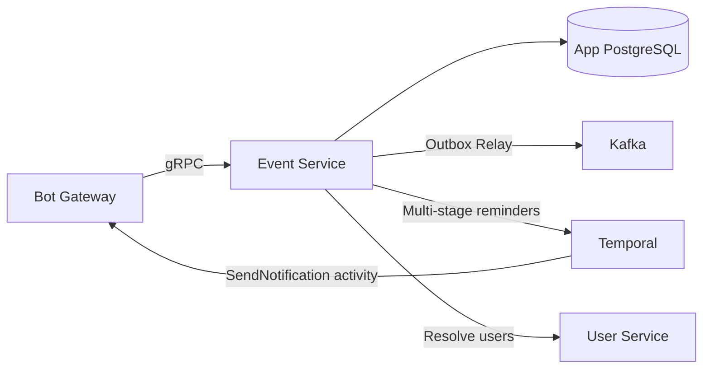
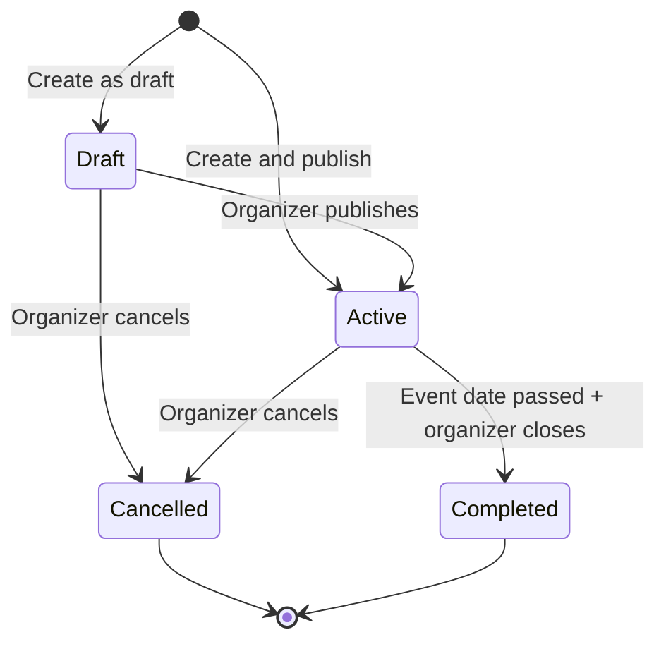
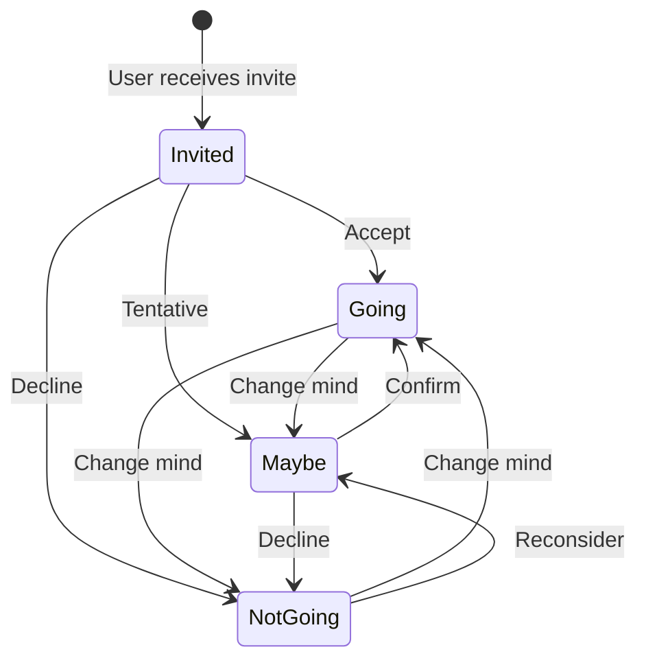
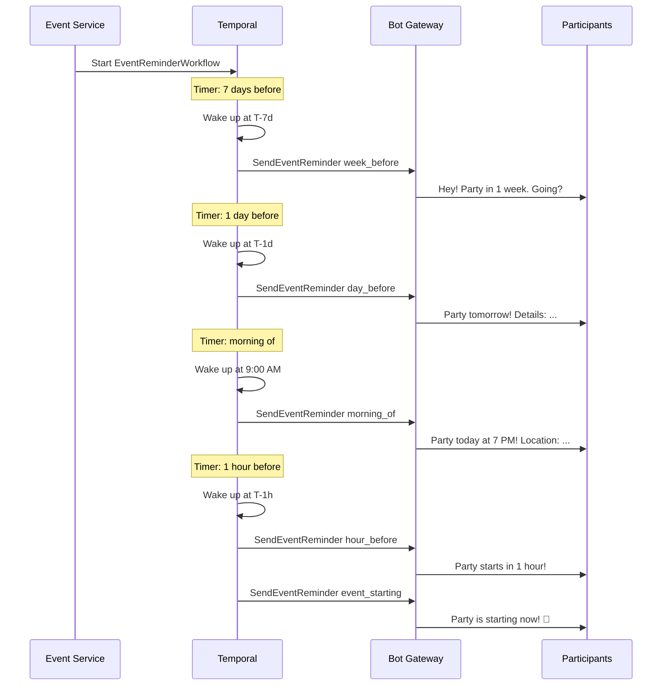
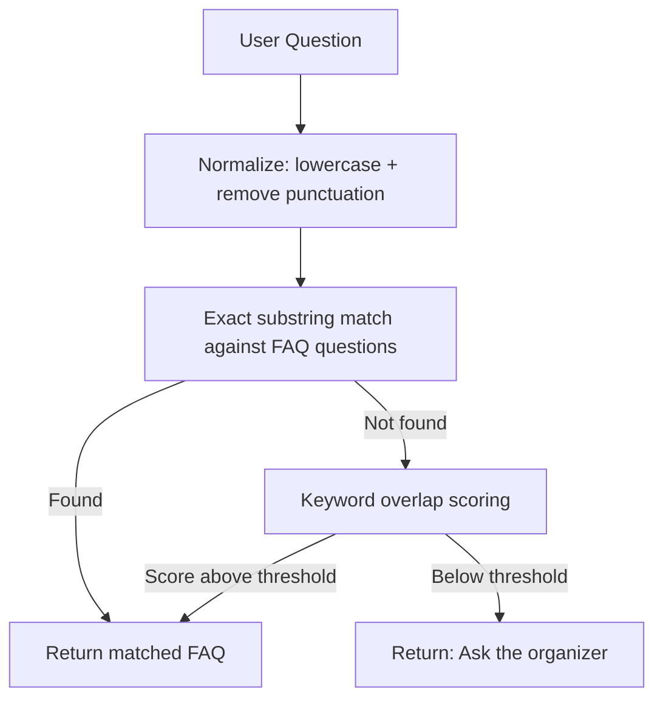

# Event Service — Detailed Design

> **Phase:** 6  
> **Responsibility:** Event creation, participant management, tasks, shopping lists, multi-stage reminders  
> **Port:** 50051 (gRPC)

---

## 1. Overview

Event Service manages the full lifecycle of events and meetups — birthdays, parties, trips, team gatherings. It handles participant invitations, RSVP tracking, task assignment, shopping lists, FAQ for participants, and coordinates with Temporal for multi-stage reminder workflows. The bot becomes a central hub where participants can ask about event details, check their tasks, and get timely reminders.



---

## 2. Responsibilities

### Core (Phase 6)
- **Event CRUD:** Create, update, delete events with date, time, location
- **Participant management:** Invite via share link, RSVP (going / maybe / not going)
- **Task assignment:** Organizer assigns tasks to participants, track completion
- **Shopping list:** Shared list of items to buy, participants claim items
- **FAQ:** Organizer adds Q&A pairs, participants query the bot for answers
- **Multi-stage reminders:** Temporal workflow sends reminders at configured intervals before the event
- **Event info queries:** Participants ask the bot "where is the party?" and get instant answers

### Cross-Service Interactions
- **User Service:** Resolve participant Telegram IDs → user profiles, timezone for reminders
- **Bot Gateway:** All notifications via Temporal → Bot Gateway gRPC
- **Friends Service:** (future) Auto-suggest events for upcoming birthdays

---

## 3. Database Schema

```sql
-- Events
CREATE TABLE events (
    id              BIGSERIAL PRIMARY KEY,
    organizer_id    BIGINT NOT NULL,               -- User who created the event
    title           TEXT NOT NULL,
    description     TEXT,
    event_date      TIMESTAMPTZ NOT NULL,          -- When the event starts
    event_end_date  TIMESTAMPTZ,                   -- When the event ends (optional)
    location        TEXT,                           -- Address or place name
    location_url    TEXT,                           -- Google Maps / Yandex Maps link
    event_type      TEXT NOT NULL DEFAULT 'other',  -- "birthday", "party", "trip", "dinner", "team", "other"
    max_participants INT,                           -- Optional cap
    status          TEXT NOT NULL DEFAULT 'active', -- "draft", "active", "cancelled", "completed"
    share_code      TEXT UNIQUE,                    -- For invite links
    workflow_id     TEXT,                           -- Temporal reminder workflow ID
    reminder_config JSONB,                          -- Custom reminder schedule
    created_at      TIMESTAMPTZ NOT NULL DEFAULT NOW(),
    updated_at      TIMESTAMPTZ NOT NULL DEFAULT NOW()
);

CREATE INDEX idx_events_organizer ON events(organizer_id);
CREATE INDEX idx_events_date ON events(event_date);
CREATE INDEX idx_events_status ON events(status) WHERE status = 'active';
CREATE INDEX idx_events_share_code ON events(share_code) WHERE share_code IS NOT NULL;

-- Event participants
CREATE TABLE event_participants (
    id              BIGSERIAL PRIMARY KEY,
    event_id        BIGINT NOT NULL REFERENCES events(id) ON DELETE CASCADE,
    user_id         BIGINT NOT NULL,
    rsvp_status     TEXT NOT NULL DEFAULT 'invited', -- "invited", "going", "maybe", "not_going"
    role            TEXT NOT NULL DEFAULT 'guest',    -- "organizer", "co_organizer", "guest"
    invited_at      TIMESTAMPTZ NOT NULL DEFAULT NOW(),
    responded_at    TIMESTAMPTZ,
    created_at      TIMESTAMPTZ NOT NULL DEFAULT NOW(),
    updated_at      TIMESTAMPTZ NOT NULL DEFAULT NOW(),
    UNIQUE(event_id, user_id)
);

CREATE INDEX idx_event_participants_event ON event_participants(event_id);
CREATE INDEX idx_event_participants_user ON event_participants(user_id);

-- Tasks assigned to participants
CREATE TABLE event_tasks (
    id              BIGSERIAL PRIMARY KEY,
    event_id        BIGINT NOT NULL REFERENCES events(id) ON DELETE CASCADE,
    assigned_to     BIGINT,                        -- user_id, NULL = unassigned
    title           TEXT NOT NULL,
    description     TEXT,
    status          TEXT NOT NULL DEFAULT 'pending', -- "pending", "in_progress", "done", "cancelled"
    due_date        TIMESTAMPTZ,                    -- Optional deadline
    created_by      BIGINT NOT NULL,
    created_at      TIMESTAMPTZ NOT NULL DEFAULT NOW(),
    updated_at      TIMESTAMPTZ NOT NULL DEFAULT NOW()
);

CREATE INDEX idx_event_tasks_event ON event_tasks(event_id);
CREATE INDEX idx_event_tasks_assigned ON event_tasks(assigned_to) WHERE assigned_to IS NOT NULL;

-- Shopping list items
CREATE TABLE event_shopping_list (
    id              BIGSERIAL PRIMARY KEY,
    event_id        BIGINT NOT NULL REFERENCES events(id) ON DELETE CASCADE,
    item_name       TEXT NOT NULL,
    quantity        TEXT,                           -- "2 бутылки", "1 кг", "3 шт"
    estimated_price INT,                            -- In smallest currency unit
    claimed_by      BIGINT,                        -- user_id who will buy this
    purchased       BOOLEAN NOT NULL DEFAULT FALSE,
    created_by      BIGINT NOT NULL,
    created_at      TIMESTAMPTZ NOT NULL DEFAULT NOW(),
    updated_at      TIMESTAMPTZ NOT NULL DEFAULT NOW()
);

CREATE INDEX idx_event_shopping_event ON event_shopping_list(event_id);

-- FAQ entries for participants
CREATE TABLE event_faq (
    id              BIGSERIAL PRIMARY KEY,
    event_id        BIGINT NOT NULL REFERENCES events(id) ON DELETE CASCADE,
    question        TEXT NOT NULL,                  -- "Какой дресс-код?", "Где парковка?"
    answer          TEXT NOT NULL,
    display_order   INT NOT NULL DEFAULT 0,
    created_by      BIGINT NOT NULL,
    created_at      TIMESTAMPTZ NOT NULL DEFAULT NOW(),
    updated_at      TIMESTAMPTZ NOT NULL DEFAULT NOW()
);

CREATE INDEX idx_event_faq_event ON event_faq(event_id);

-- Transactional Outbox for Kafka events
CREATE TABLE outbox_events (
    id              BIGSERIAL PRIMARY KEY,
    aggregate_type  TEXT NOT NULL,                  -- "event", "event_task", "event_shopping"
    aggregate_id    BIGINT NOT NULL,
    event_type      TEXT NOT NULL,                  -- "event.created", "event.rsvp_changed", etc.
    payload         JSONB NOT NULL,
    created_at      TIMESTAMPTZ NOT NULL DEFAULT NOW(),
    published_at    TIMESTAMPTZ                     -- NULL until relay publishes to Kafka
);

CREATE INDEX idx_outbox_unpublished ON outbox_events(created_at)
    WHERE published_at IS NULL;
```

---

## 4. Event Status State Machine



### RSVP State Machine



---

## 5. gRPC API

```protobuf
syntax = "proto3";
package iwontforget.event.v1;

import "google/protobuf/timestamp.proto";

service EventService {
  // Event lifecycle
  rpc CreateEvent(CreateEventRequest) returns (Event);
  rpc GetEvent(GetEventRequest) returns (Event);
  rpc ListMyEvents(ListMyEventsRequest) returns (ListMyEventsResponse);
  rpc UpdateEvent(UpdateEventRequest) returns (Event);
  rpc CancelEvent(CancelEventRequest) returns (Event);
  rpc CompleteEvent(CompleteEventRequest) returns (Event);

  // Participants
  rpc JoinEvent(JoinEventRequest) returns (EventParticipant);
  rpc UpdateRSVP(UpdateRSVPRequest) returns (EventParticipant);
  rpc ListParticipants(ListParticipantsRequest) returns (ListParticipantsResponse);
  rpc RemoveParticipant(RemoveParticipantRequest) returns (Empty);

  // Tasks
  rpc CreateTask(CreateTaskRequest) returns (EventTask);
  rpc ListTasks(ListTasksRequest) returns (ListTasksResponse);
  rpc UpdateTask(UpdateTaskRequest) returns (EventTask);
  rpc AssignTask(AssignTaskRequest) returns (EventTask);
  rpc CompleteTask(CompleteTaskRequest) returns (EventTask);
  rpc DeleteTask(DeleteTaskRequest) returns (Empty);

  // Shopping list
  rpc AddShoppingItem(AddShoppingItemRequest) returns (ShoppingItem);
  rpc ListShoppingItems(ListShoppingItemsRequest) returns (ListShoppingItemsResponse);
  rpc ClaimShoppingItem(ClaimShoppingItemRequest) returns (ShoppingItem);
  rpc MarkItemPurchased(MarkItemPurchasedRequest) returns (ShoppingItem);
  rpc DeleteShoppingItem(DeleteShoppingItemRequest) returns (Empty);

  // FAQ
  rpc AddFAQ(AddFAQRequest) returns (FAQEntry);
  rpc ListFAQ(ListFAQRequest) returns (ListFAQResponse);
  rpc UpdateFAQ(UpdateFAQRequest) returns (FAQEntry);
  rpc DeleteFAQ(DeleteFAQRequest) returns (Empty);
  rpc AskQuestion(AskQuestionRequest) returns (AskQuestionResponse);

  // Event info (for participant queries)
  rpc GetEventSummary(GetEventSummaryRequest) returns (EventSummary);
}

// ─── Event Messages ───

message CreateEventRequest {
  int64 organizer_id = 1;
  string title = 2;
  optional string description = 3;
  google.protobuf.Timestamp event_date = 4;
  optional google.protobuf.Timestamp event_end_date = 5;
  optional string location = 6;
  optional string location_url = 7;
  string event_type = 8;
  optional int32 max_participants = 9;
  optional ReminderConfig reminder_config = 10;
  bool publish_immediately = 11;
}

message Event {
  int64 id = 1;
  int64 organizer_id = 2;
  string title = 3;
  string description = 4;
  google.protobuf.Timestamp event_date = 5;
  google.protobuf.Timestamp event_end_date = 6;
  string location = 7;
  string location_url = 8;
  string event_type = 9;
  int32 max_participants = 10;
  string status = 11;
  string share_code = 12;
  ReminderConfig reminder_config = 13;
  ParticipantCounts participant_counts = 14;
  google.protobuf.Timestamp created_at = 15;
  google.protobuf.Timestamp updated_at = 16;
}

message ParticipantCounts {
  int32 going = 1;
  int32 maybe = 2;
  int32 not_going = 3;
  int32 invited = 4;
  int32 total = 5;
}

message ReminderConfig {
  bool week_before = 1;       // 7 days before
  bool day_before = 2;        // 1 day before
  bool morning_of = 3;        // Morning of event day
  bool hour_before = 4;       // 1 hour before
  repeated int32 custom_hours_before = 5;  // Custom: e.g., [48, 12, 3]
}

message GetEventRequest {
  int64 event_id = 1;
  int64 user_id = 2;
}

message ListMyEventsRequest {
  int64 user_id = 1;
  optional string role_filter = 2;     // "organizer", "participant", or empty for all
  optional string time_filter = 3;     // "upcoming", "past", or empty for all
  int32 limit = 4;
  int32 offset = 5;
}

message ListMyEventsResponse {
  repeated Event events = 1;
  int32 total = 2;
}

message UpdateEventRequest {
  int64 event_id = 1;
  int64 user_id = 2;
  optional string title = 3;
  optional string description = 4;
  optional google.protobuf.Timestamp event_date = 5;
  optional google.protobuf.Timestamp event_end_date = 6;
  optional string location = 7;
  optional string location_url = 8;
  optional ReminderConfig reminder_config = 9;
}

message CancelEventRequest {
  int64 event_id = 1;
  int64 user_id = 2;
  optional string reason = 3;
}

message CompleteEventRequest {
  int64 event_id = 1;
  int64 user_id = 2;
}

// ─── Participant Messages ───

message JoinEventRequest {
  string share_code = 1;
  int64 user_id = 2;
}

message UpdateRSVPRequest {
  int64 event_id = 1;
  int64 user_id = 2;
  string rsvp_status = 3;  // "going", "maybe", "not_going"
}

message EventParticipant {
  int64 id = 1;
  int64 event_id = 2;
  int64 user_id = 3;
  string rsvp_status = 4;
  string role = 5;
  google.protobuf.Timestamp responded_at = 6;
}

message ListParticipantsRequest {
  int64 event_id = 1;
  optional string rsvp_filter = 2;  // Filter by RSVP status
}

message ListParticipantsResponse {
  repeated EventParticipant participants = 1;
}

message RemoveParticipantRequest {
  int64 event_id = 1;
  int64 user_id = 2;        // Organizer
  int64 target_user_id = 3;  // User to remove
}

// ─── Task Messages ───

message CreateTaskRequest {
  int64 event_id = 1;
  int64 created_by = 2;
  string title = 3;
  optional string description = 4;
  optional int64 assigned_to = 5;
  optional google.protobuf.Timestamp due_date = 6;
}

message EventTask {
  int64 id = 1;
  int64 event_id = 2;
  int64 assigned_to = 3;
  string title = 4;
  string description = 5;
  string status = 6;
  google.protobuf.Timestamp due_date = 7;
  int64 created_by = 8;
  google.protobuf.Timestamp created_at = 9;
}

message ListTasksRequest {
  int64 event_id = 1;
  optional string status_filter = 2;
  optional int64 assigned_to_filter = 3;
}

message ListTasksResponse {
  repeated EventTask tasks = 1;
}

message UpdateTaskRequest {
  int64 task_id = 1;
  int64 user_id = 2;
  optional string title = 3;
  optional string description = 4;
  optional google.protobuf.Timestamp due_date = 5;
}

message AssignTaskRequest {
  int64 task_id = 1;
  int64 user_id = 2;       // Organizer
  int64 assigned_to = 3;    // Target user
}

message CompleteTaskRequest {
  int64 task_id = 1;
  int64 user_id = 2;
}

message DeleteTaskRequest {
  int64 task_id = 1;
  int64 user_id = 2;
}

// ─── Shopping List Messages ───

message AddShoppingItemRequest {
  int64 event_id = 1;
  int64 created_by = 2;
  string item_name = 3;
  optional string quantity = 4;
  optional int32 estimated_price = 5;
}

message ShoppingItem {
  int64 id = 1;
  int64 event_id = 2;
  string item_name = 3;
  string quantity = 4;
  int32 estimated_price = 5;
  int64 claimed_by = 6;
  bool purchased = 7;
  int64 created_by = 8;
}

message ListShoppingItemsRequest {
  int64 event_id = 1;
  optional bool unclaimed_only = 2;
}

message ListShoppingItemsResponse {
  repeated ShoppingItem items = 1;
  int32 total_estimated = 2;
  int32 total_purchased = 3;
}

message ClaimShoppingItemRequest {
  int64 item_id = 1;
  int64 user_id = 2;
}

message MarkItemPurchasedRequest {
  int64 item_id = 1;
  int64 user_id = 2;
}

message DeleteShoppingItemRequest {
  int64 item_id = 1;
  int64 user_id = 2;
}

// ─── FAQ Messages ───

message AddFAQRequest {
  int64 event_id = 1;
  int64 created_by = 2;
  string question = 3;
  string answer = 4;
}

message FAQEntry {
  int64 id = 1;
  int64 event_id = 2;
  string question = 3;
  string answer = 4;
  int32 display_order = 5;
}

message ListFAQRequest {
  int64 event_id = 1;
}

message ListFAQResponse {
  repeated FAQEntry entries = 1;
}

message UpdateFAQRequest {
  int64 faq_id = 1;
  int64 user_id = 2;
  optional string question = 3;
  optional string answer = 4;
}

message DeleteFAQRequest {
  int64 faq_id = 1;
  int64 user_id = 2;
}

// Participant asks a free-text question, matched against FAQ
message AskQuestionRequest {
  int64 event_id = 1;
  int64 user_id = 2;
  string question_text = 3;
}

message AskQuestionResponse {
  bool found = 1;
  FAQEntry matched_faq = 2;       // If found in FAQ
  string fallback_message = 3;     // If not found: "Ask the organizer"
}

// ─── Event Summary ───

message GetEventSummaryRequest {
  int64 event_id = 1;
  int64 user_id = 2;
}

message EventSummary {
  Event event = 1;
  ParticipantCounts counts = 2;
  repeated EventTask my_tasks = 3;
  repeated ShoppingItem my_shopping_items = 4;
  int32 total_tasks = 5;
  int32 completed_tasks = 6;
  int32 total_shopping_items = 7;
  int32 purchased_shopping_items = 8;
}

message Empty {}
```

---

## 6. Internal Architecture

```
services/event-service/
├── cmd/
│   └── main.go                    # Entry point, DI wiring
├── internal/
│   ├── app/
│   │   ├── service.go             # Business logic orchestrator
│   │   ├── event.go               # Event CRUD operations
│   │   ├── participant.go         # Participant + RSVP management
│   │   ├── task.go                # Task assignment and tracking
│   │   ├── shopping.go            # Shopping list operations
│   │   ├── faq.go                 # FAQ management + question matching
│   │   └── summary.go            # Event summary aggregation
│   ├── domain/
│   │   ├── event.go               # Event aggregate
│   │   ├── participant.go         # Participant entity
│   │   ├── task.go                # Task entity
│   │   ├── shopping_item.go       # ShoppingItem entity
│   │   ├── faq.go                 # FAQ entry entity
│   │   └── events.go              # Domain event definitions
│   ├── port/
│   │   ├── repository.go          # Repository interfaces
│   │   └── services.go            # External service interfaces
│   ├── adapter/
│   │   ├── postgres/
│   │   │   ├── event_repo.go
│   │   │   ├── participant_repo.go
│   │   │   ├── task_repo.go
│   │   │   ├── shopping_repo.go
│   │   │   ├── faq_repo.go
│   │   │   └── outbox_repo.go
│   │   ├── grpc/
│   │   │   └── handler.go         # gRPC server implementation
│   │   └── kafka/
│   │       └── relay.go           # Outbox relay → Kafka publisher
│   ├── workflow/
│   │   ├── event_reminder_workflow.go   # Multi-stage reminder workflow
│   │   ├── task_reminder_workflow.go    # Task deadline reminders
│   │   ├── activities.go                # Temporal activities
│   │   └── worker.go                    # Temporal worker registration
│   └── config/
│       └── config.go
├── migrations/
│   └── 001_init.sql
└── Dockerfile
```

---

## 7. Temporal Workflows

### 7.1. Event Reminder Workflow

The `EventReminderWorkflow` sends multi-stage reminders to all participants at configured intervals before the event. It supports both default stages (1 week, 1 day, morning, 1 hour) and custom intervals.

```go
package workflow

import (
    "sort"
    "time"

    "go.temporal.io/sdk/temporal"
    "go.temporal.io/sdk/workflow"
)

type EventReminderInput struct {
    EventID    int64
    EventDate  time.Time
    Config     ReminderConfig
}

type ReminderConfig struct {
    WeekBefore       bool
    DayBefore        bool
    MorningOf        bool
    HourBefore       bool
    CustomHoursBefore []int  // e.g., [48, 12, 3]
}

// Signal names
const (
    SignalEventUpdated   = "event_updated"
    SignalEventCancelled = "event_cancelled"
)

func EventReminderWorkflow(ctx workflow.Context, input EventReminderInput) error {
    logger := workflow.GetLogger(ctx)

    activityOpts := workflow.ActivityOptions{
        StartToCloseTimeout: 30 * time.Second,
        RetryPolicy: &temporal.RetryPolicy{
            InitialInterval:    1 * time.Second,
            BackoffCoefficient: 2.0,
            MaximumInterval:    30 * time.Second,
            MaximumAttempts:    5,
        },
    }
    ctx = workflow.WithActivityOptions(ctx, activityOpts)

    // Build sorted list of reminder times
    reminders := buildReminderSchedule(input.EventDate, input.Config)

    logger.Info("Event reminder workflow started",
        "eventID", input.EventID,
        "reminderCount", len(reminders),
    )

    cancelled := false
    cancelCh := workflow.GetSignalChannel(ctx, SignalEventCancelled)
    updateCh := workflow.GetSignalChannel(ctx, SignalEventUpdated)

    for _, reminder := range reminders {
        waitDuration := reminder.Time.Sub(workflow.Now(ctx))
        if waitDuration <= 0 {
            // This reminder time has already passed, skip
            continue
        }

        // Wait until reminder time, but listen for cancellation/updates
        timerCtx, timerCancel := workflow.WithCancel(ctx)
        timerFuture := workflow.NewTimer(timerCtx, waitDuration)

        selector := workflow.NewSelector(ctx)

        selector.AddFuture(timerFuture, func(f workflow.Future) {
            // Timer fired — send the reminder
            err := workflow.ExecuteActivity(ctx, SendEventReminderActivity, EventReminderActivityInput{
                EventID:      input.EventID,
                ReminderType: reminder.Type,
            }).Get(ctx, nil)
            if err != nil {
                logger.Warn("Failed to send event reminder", "type", reminder.Type, "error", err)
            }
        })

        selector.AddReceive(cancelCh, func(c workflow.ReceiveChannel, more bool) {
            c.Receive(ctx, nil)
            cancelled = true
            timerCancel()
        })

        selector.AddReceive(updateCh, func(c workflow.ReceiveChannel, more bool) {
            var newDate time.Time
            c.Receive(ctx, &newDate)
            // Event date changed — restart workflow with new date
            input.EventDate = newDate
            timerCancel()
        })

        selector.Select(ctx)

        if cancelled {
            logger.Info("Event cancelled, stopping reminders", "eventID", input.EventID)
            return nil
        }
    }

    // All reminders sent — send final "event starting now" notification
    _ = workflow.ExecuteActivity(ctx, SendEventReminderActivity, EventReminderActivityInput{
        EventID:      input.EventID,
        ReminderType: "event_starting",
    }).Get(ctx, nil)

    logger.Info("Event reminder workflow completed", "eventID", input.EventID)
    return nil
}

type ReminderPoint struct {
    Time time.Time
    Type string
}

func buildReminderSchedule(eventDate time.Time, config ReminderConfig) []ReminderPoint {
    var reminders []ReminderPoint

    if config.WeekBefore {
        reminders = append(reminders, ReminderPoint{
            Time: eventDate.Add(-7 * 24 * time.Hour),
            Type: "week_before",
        })
    }
    if config.DayBefore {
        reminders = append(reminders, ReminderPoint{
            Time: eventDate.Add(-24 * time.Hour),
            Type: "day_before",
        })
    }
    if config.MorningOf {
        // Morning of event day = 9:00 AM on event date
        morning := time.Date(
            eventDate.Year(), eventDate.Month(), eventDate.Day(),
            9, 0, 0, 0, eventDate.Location(),
        )
        reminders = append(reminders, ReminderPoint{
            Time: morning,
            Type: "morning_of",
        })
    }
    if config.HourBefore {
        reminders = append(reminders, ReminderPoint{
            Time: eventDate.Add(-1 * time.Hour),
            Type: "hour_before",
        })
    }

    for _, hours := range config.CustomHoursBefore {
        reminders = append(reminders, ReminderPoint{
            Time: eventDate.Add(-time.Duration(hours) * time.Hour),
            Type: "custom",
        })
    }

    // Sort chronologically
    sort.Slice(reminders, func(i, j int) bool {
        return reminders[i].Time.Before(reminders[j].Time)
    })

    return reminders
}
```

### 7.2. Task Reminder Workflow

Reminds task assignees about their pending tasks as the event approaches.

```go
func TaskReminderWorkflow(ctx workflow.Context, input TaskReminderInput) error {
    logger := workflow.GetLogger(ctx)

    activityOpts := workflow.ActivityOptions{
        StartToCloseTimeout: 30 * time.Second,
        RetryPolicy: &temporal.RetryPolicy{
            InitialInterval:    1 * time.Second,
            BackoffCoefficient: 2.0,
            MaximumInterval:    30 * time.Second,
            MaximumAttempts:    5,
        },
    }
    ctx = workflow.WithActivityOptions(ctx, activityOpts)

    // Check incomplete tasks 3 days before event, then 1 day before
    checkPoints := []time.Duration{
        -3 * 24 * time.Hour,
        -1 * 24 * time.Hour,
    }

    for _, offset := range checkPoints {
        checkTime := input.EventDate.Add(offset)
        waitDuration := checkTime.Sub(workflow.Now(ctx))
        if waitDuration <= 0 {
            continue
        }

        _ = workflow.NewTimer(ctx, waitDuration).Get(ctx, nil)

        // Fetch incomplete tasks and remind assignees
        err := workflow.ExecuteActivity(ctx, RemindIncompleteTasksActivity, input.EventID).Get(ctx, nil)
        if err != nil {
            logger.Warn("Failed to send task reminders", "error", err)
        }
    }

    return nil
}

type TaskReminderInput struct {
    EventID   int64
    EventDate time.Time
}
```

### 7.3. Multi-Stage Reminder Sequence



### 7.4. Activities

```go
// SendEventReminderActivity sends a reminder to all "going" and "maybe" participants.
func SendEventReminderActivity(ctx context.Context, input EventReminderActivityInput) error {
    // 1. Fetch event details from DB
    // 2. Fetch participants with rsvp_status IN ("going", "maybe")
    // 3. Build reminder message based on ReminderType:
    //    - week_before: "Event X in 1 week! Are you going?"
    //    - day_before: "Event X tomorrow! Details: ..."
    //    - morning_of: "Event X today at TIME! Location: ..."
    //    - hour_before: "Event X starts in 1 hour!"
    //    - event_starting: "Event X is starting now! 🎉"
    // 4. For each participant, call Bot Gateway SendNotification gRPC
    return nil
}

// RemindIncompleteTasksActivity sends reminders to assignees with pending tasks.
func RemindIncompleteTasksActivity(ctx context.Context, eventID int64) error {
    // 1. Fetch tasks WHERE status IN ("pending", "in_progress") AND assigned_to IS NOT NULL
    // 2. Group by assigned_to
    // 3. For each assignee, send reminder with their task list via Bot Gateway
    return nil
}

type EventReminderActivityInput struct {
    EventID      int64
    ReminderType string
}
```

---

## 8. Kafka Events

### Topic: `event.events`

| Event Type | Trigger | Payload |
|------------|---------|---------|
| `event.created` | New event created | `{event_id, organizer_id, title, event_date, event_type}` |
| `event.updated` | Event details changed | `{event_id, changed_fields}` |
| `event.cancelled` | Event cancelled | `{event_id, reason}` |
| `event.completed` | Event marked complete | `{event_id}` |
| `event.rsvp_changed` | Participant RSVP updated | `{event_id, user_id, old_status, new_status}` |
| `event.task_completed` | Task marked done | `{event_id, task_id, user_id}` |
| `event.item_purchased` | Shopping item bought | `{event_id, item_id, user_id}` |

### Outbox Relay

Same pattern as other services — goroutine polls `outbox_events` table every 500ms, publishes to Kafka, marks as published.

### Consumers

Event Service does **not** consume from other topics in Phase 6. Future phases may add:
- Consuming `friend.events` to auto-suggest birthday events

---

## 9. FAQ Question Matching

The `AskQuestion` RPC allows participants to ask free-text questions about an event. The service matches against stored FAQ entries using a simple approach:

### Matching Strategy



**Phase 6 (MVP):** Simple keyword overlap — tokenize question and FAQ entries, score by word intersection. Return best match if score > 0.5.

**Phase 8 (AI):** Use AI Service for semantic similarity matching — embed FAQ entries and user question, find nearest neighbor.

### Common Questions Auto-Handled

Even without FAQ entries, the bot can answer from event fields:
- "Где будет?" / "Where?" → `event.location` + `event.location_url`
- "Во сколько?" / "What time?" → `event.event_date`
- "Кто идёт?" / "Who is going?" → participant list with `rsvp_status = going`
- "Что купить?" / "What to buy?" → unclaimed shopping list items

---

## 10. Access Control

| Operation | Who Can Do It |
|-----------|---------------|
| Create event | Any authenticated user |
| View event details | Organizer + participants |
| Join event | Anyone with share code |
| Update event | Organizer or co-organizer |
| Cancel event | Organizer only |
| Update RSVP | The participant themselves |
| Create task | Organizer or co-organizer |
| Assign task | Organizer or co-organizer |
| Complete task | Assigned user or organizer |
| Add shopping item | Any participant |
| Claim shopping item | Any participant |
| Mark item purchased | Claimer or organizer |
| Add FAQ | Organizer or co-organizer |
| Ask question | Any participant |
| Remove participant | Organizer only |

---

## 11. Bot Commands (Phase 6)

| Command | Description |
|---------|-------------|
| `/event_create` | Start creating an event |
| `/event_list` | List my events (upcoming/past) |
| `/event_info <id>` | View event details and summary |
| `/event_join <code>` | Join event via share code |
| `/event_rsvp <id>` | Update RSVP status |
| `/event_tasks <id>` | View and manage tasks |
| `/event_shop <id>` | View and manage shopping list |
| `/event_faq <id>` | View FAQ or ask a question |
| `/event_invite <id>` | Get share link |

### Inline Keyboard Flows

```
[Create Event]
  → Enter title
  → Set date and time
  → Set location (optional)
  → Select type (birthday / party / trip / dinner / other)
  → Configure reminders (checkboxes: 1 week / 1 day / morning / 1 hour)
  → Publish or save as draft
  → Share link generated

[RSVP]
  → [✅ Going] [🤔 Maybe] [❌ Not Going]

[Task Board]
  → Show tasks grouped by status
  → [➕ Add Task] button
  → [✅ Done] button per task
  → [📋 My Tasks] filter

[Shopping List]
  → Show items with claimed_by and purchased status
  → [🛒 I will buy this] button
  → [✅ Purchased] button
  → [➕ Add Item] button
```

---

## 12. Configuration

```yaml
service:
  name: event-service
  port: 50051

database:
  host: app-postgresql-rw.infrastructure.svc
  port: 5432
  name: iwontforget
  schema: events
  pool_size: 10

kafka:
  brokers:
    - kafka-bootstrap.infrastructure.svc:9092
  topic: event.events
  outbox_poll_interval: 500ms

temporal:
  host: temporal-frontend.temporal.svc:7233
  namespace: iwontforget
  task_queue: event-service-queue
  worker_count: 3

grpc_clients:
  user_service: user-service.iwontforget.svc:50051
  bot_gateway: bot-gateway.iwontforget.svc:50051

observability:
  metrics_port: 9090
  health_port: 8080
  log_level: info
  log_format: json
```

---

## 13. Metrics

| Metric | Type | Labels | Description |
|--------|------|--------|-------------|
| `events_created_total` | Counter | `event_type` | Total events created |
| `events_completed_total` | Counter | `event_type` | Events that reached completion |
| `events_cancelled_total` | Counter | — | Cancelled events |
| `event_participants` | Histogram | — | Number of participants per event |
| `event_rsvp_total` | Counter | `status` (going/maybe/not_going) | RSVP responses |
| `event_tasks_total` | Counter | `status` (pending/done/cancelled) | Task status changes |
| `event_shopping_items_total` | Counter | `purchased` (true/false) | Shopping list items |
| `event_faq_questions_total` | Counter | `matched` (true/false) | FAQ question attempts |
| `event_reminder_sent_total` | Counter | `type` (week/day/morning/hour) | Reminders sent |
| `event_grpc_request_duration_seconds` | Histogram | `method`, `status` | gRPC latency |

---

## 14. Testing Strategy

### Unit Tests
- **RSVP transitions:** Valid/invalid state changes
- **FAQ matching:** Keyword overlap scoring, edge cases (empty FAQ, no match)
- **Reminder schedule builder:** Correct times for all config combinations
- **Access control:** Organizer-only operations, participant checks
- **Shopping list:** Claim/unclaim, purchase tracking

### Integration Tests (Testcontainers)
- Full event lifecycle: create → invite → RSVP → tasks → shopping → complete
- Concurrent RSVP updates from multiple participants
- Outbox relay publishes correct Kafka events
- Share code generation and redemption
- FAQ question matching with various inputs

### Temporal Workflow Tests

```go
func TestEventReminderWorkflow_AllStages(t *testing.T) {
    testSuite := &testsuite.WorkflowTestSuite{}
    env := testSuite.NewTestWorkflowEnvironment()

    env.RegisterActivity(SendEventReminderActivity)

    callCount := 0
    env.OnActivity(SendEventReminderActivity, mock.Anything, mock.Anything).
        Return(func(ctx context.Context, input EventReminderActivityInput) error {
            callCount++
            return nil
        })

    eventDate := time.Now().Add(8 * 24 * time.Hour) // 8 days from now
    env.ExecuteWorkflow(EventReminderWorkflow, EventReminderInput{
        EventID:   1,
        EventDate: eventDate,
        Config: ReminderConfig{
            WeekBefore: true,
            DayBefore:  true,
            MorningOf:  true,
            HourBefore: true,
        },
    })

    require.True(t, env.IsWorkflowCompleted())
    require.NoError(t, env.GetWorkflowError())
    // 4 configured stages + 1 "event_starting" = 5 reminders
    require.Equal(t, 5, callCount)
}

func TestEventReminderWorkflow_Cancellation(t *testing.T) {
    testSuite := &testsuite.WorkflowTestSuite{}
    env := testSuite.NewTestWorkflowEnvironment()

    env.RegisterActivity(SendEventReminderActivity)
    env.OnActivity(SendEventReminderActivity, mock.Anything, mock.Anything).Return(nil)

    // Cancel after first reminder
    env.RegisterDelayedCallback(func() {
        env.SignalWorkflow(SignalEventCancelled, nil)
    }, 7*24*time.Hour+1*time.Minute) // Just after week_before fires

    eventDate := time.Now().Add(8 * 24 * time.Hour)
    env.ExecuteWorkflow(EventReminderWorkflow, EventReminderInput{
        EventID:   1,
        EventDate: eventDate,
        Config: ReminderConfig{
            WeekBefore: true,
            DayBefore:  true,
            HourBefore: true,
        },
    })

    require.True(t, env.IsWorkflowCompleted())
    require.NoError(t, env.GetWorkflowError())
}
```

### Contract Tests
- Buf breaking change detection for `event/v1` protobuf package

---

## 15. Deployment

```yaml
apiVersion: apps/v1
kind: Deployment
metadata:
  name: event-service
  namespace: iwontforget
spec:
  replicas: 2
  selector:
    matchLabels:
      app: event-service
  template:
    metadata:
      labels:
        app: event-service
    spec:
      containers:
        - name: event-service
          image: ghcr.io/iwontforget/event-service:latest
          ports:
            - containerPort: 50051
              name: grpc
            - containerPort: 9090
              name: metrics
            - containerPort: 8080
              name: health
          env:
            - name: DB_DSN
              valueFrom:
                secretKeyRef:
                  name: app-postgresql-credentials
                  key: dsn
          resources:
            requests:
              cpu: 100m
              memory: 128Mi
            limits:
              cpu: 500m
              memory: 256Mi
          livenessProbe:
            httpGet:
              path: /healthz
              port: health
            initialDelaySeconds: 5
          readinessProbe:
            httpGet:
              path: /readyz
              port: health
            initialDelaySeconds: 5
---
apiVersion: autoscaling/v2
kind: HorizontalPodAutoscaler
metadata:
  name: event-service
  namespace: iwontforget
spec:
  scaleTargetRef:
    apiVersion: apps/v1
    kind: Deployment
    name: event-service
  minReplicas: 2
  maxReplicas: 5
  metrics:
    - type: Resource
      resource:
        name: cpu
        target:
          type: Utilization
          averageUtilization: 70
```

---

## 16. Phase Roadmap

| Phase | What Gets Built |
|-------|----------------|
| **Phase 6** | Full Event Service: events CRUD, participants, RSVP, tasks, shopping list, FAQ, multi-stage Temporal reminders, task reminders. Bot commands and inline keyboards. |
| **Phase 7** | Observability: reminder delivery tracking, participant engagement metrics, event completion dashboards |
| **Phase 8** | AI-powered FAQ matching (semantic search), auto-suggest events from friend birthdays, smart task assignment |

---

## 17. Design Decisions

### Why multi-stage reminders via Temporal (not cron)?

A cron job checking "events happening soon" would need to:
1. Query all active events every minute
2. Calculate which reminder stage each event is at
3. Track which reminders were already sent (dedup state)
4. Handle timezone differences per participant

Temporal workflows eliminate all of this complexity:
- Each event gets its own workflow with precise timers
- State is durable — no dedup tracking needed
- Cancellation/rescheduling is a simple signal
- Each workflow is independently testable

### Why FAQ in Event Service (not AI Service)?

Phase 6 FAQ uses simple keyword matching — no AI needed. The matching logic is trivial (tokenize + overlap score) and lives close to the data. In Phase 8, the `AskQuestion` handler can optionally call AI Service for semantic matching as a fallback when keyword matching fails.

### Shopping List vs. Separate Service

Shopping list is tightly coupled to events — it only exists in the context of an event, shares access control with event participants, and has no independent lifecycle. Extracting it into a separate service would add network hops without meaningful domain separation.