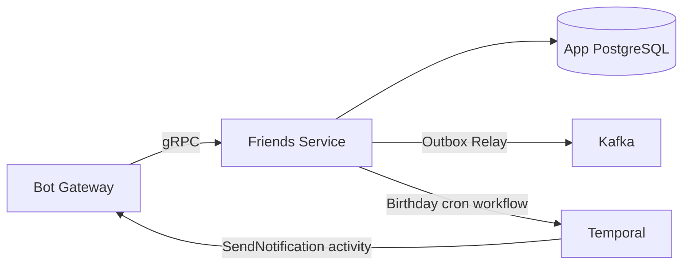

# Friends Service — Detailed Design

> **Phase:** 2  
> **Responsibility:** Friend profiles, interests, birthdays, gift ideas, notes  
> **Port:** 50051 (gRPC)

---

## 1. Overview

Friends Service manages profiles of people the user cares about — friends, family, colleagues. It stores their interests, preferences, birthdays, gift ideas, and conversation notes. It also runs a daily Temporal cron workflow to check upcoming birthdays and trigger notifications.



---

## 2. Database Schema

```sql
-- Friends (people the user tracks)
CREATE TABLE friends (
    id              BIGSERIAL PRIMARY KEY,
    user_id         BIGINT NOT NULL,               -- The user who owns this friend record
    name            TEXT NOT NULL,
    telegram_id     BIGINT,                        -- If friend is also a bot user
    birthday        DATE,
    relationship    TEXT,                           -- "friend", "family", "partner", "colleague"
    notes           TEXT,                           -- General notes
    created_at      TIMESTAMPTZ NOT NULL DEFAULT NOW(),
    updated_at      TIMESTAMPTZ NOT NULL DEFAULT NOW()
);

CREATE INDEX idx_friends_user_id ON friends(user_id);
CREATE INDEX idx_friends_birthday ON friends(birthday) WHERE birthday IS NOT NULL;

-- Friend interests and preferences
CREATE TABLE friend_interests (
    id              BIGSERIAL PRIMARY KEY,
    friend_id       BIGINT NOT NULL REFERENCES friends(id) ON DELETE CASCADE,
    category        TEXT NOT NULL,                  -- "hobby", "brand", "size", "dislikes", "food", "other"
    value           TEXT NOT NULL,                  -- "кофе", "Nike", "L", "не любит сладкое"
    created_at      TIMESTAMPTZ NOT NULL DEFAULT NOW()
);

CREATE INDEX idx_friend_interests_friend ON friend_interests(friend_id);

-- Gift ideas for a friend
CREATE TABLE friend_gift_ideas (
    id              BIGSERIAL PRIMARY KEY,
    friend_id       BIGINT NOT NULL REFERENCES friends(id) ON DELETE CASCADE,
    user_id         BIGINT NOT NULL,
    title           TEXT NOT NULL,
    description     TEXT,
    price_estimate  INT,
    url             TEXT,
    status          TEXT NOT NULL DEFAULT 'idea',   -- "idea", "planned", "purchased", "gifted"
    occasion        TEXT,                           -- "birthday", "new_year", "just_because"
    created_at      TIMESTAMPTZ NOT NULL DEFAULT NOW(),
    updated_at      TIMESTAMPTZ NOT NULL DEFAULT NOW()
);

CREATE INDEX idx_friend_gift_ideas_friend ON friend_gift_ideas(friend_id);

-- Gift history (what was actually gifted)
CREATE TABLE friend_gift_history (
    id              BIGSERIAL PRIMARY KEY,
    friend_id       BIGINT NOT NULL REFERENCES friends(id) ON DELETE CASCADE,
    user_id         BIGINT NOT NULL,
    title           TEXT NOT NULL,
    occasion        TEXT,
    date_gifted     DATE,
    price           INT,
    reaction        TEXT,                           -- "loved", "liked", "neutral", "didn't_like"
    notes           TEXT,
    created_at      TIMESTAMPTZ NOT NULL DEFAULT NOW()
);

CREATE INDEX idx_friend_gift_history_friend ON friend_gift_history(friend_id);

-- Notes from conversations
CREATE TABLE friend_notes (
    id              BIGSERIAL PRIMARY KEY,
    friend_id       BIGINT NOT NULL REFERENCES friends(id) ON DELETE CASCADE,
    user_id         BIGINT NOT NULL,
    text            TEXT NOT NULL,
    source          TEXT DEFAULT 'manual',          -- "manual", "ai_extracted"
    created_at      TIMESTAMPTZ NOT NULL DEFAULT NOW()
);

CREATE INDEX idx_friend_notes_friend ON friend_notes(friend_id);

-- Transactional Outbox
CREATE TABLE outbox_events (
    id              BIGSERIAL PRIMARY KEY,
    topic           TEXT NOT NULL,
    key             TEXT NOT NULL,
    payload         JSONB NOT NULL,
    created_at      TIMESTAMPTZ NOT NULL DEFAULT NOW(),
    published       BOOLEAN NOT NULL DEFAULT FALSE,
    published_at    TIMESTAMPTZ
);

CREATE INDEX idx_outbox_unpublished ON outbox_events(published, created_at) WHERE NOT published;
```

---

## 3. gRPC API

```protobuf
syntax = "proto3";
package friends.v1;

service FriendsService {
  // Friend CRUD
  rpc AddFriend(AddFriendRequest) returns (Friend);
  rpc GetFriend(GetFriendRequest) returns (Friend);
  rpc ListFriends(ListFriendsRequest) returns (ListFriendsResponse);
  rpc UpdateFriend(UpdateFriendRequest) returns (Friend);
  rpc DeleteFriend(DeleteFriendRequest) returns (DeleteFriendResponse);
  
  // Interests
  rpc AddInterest(AddInterestRequest) returns (Interest);
  rpc ListInterests(ListInterestsRequest) returns (ListInterestsResponse);
  rpc DeleteInterest(DeleteInterestRequest) returns (DeleteInterestResponse);
  
  // Gift ideas
  rpc AddGiftIdea(AddGiftIdeaRequest) returns (GiftIdea);
  rpc ListGiftIdeas(ListGiftIdeasRequest) returns (ListGiftIdeasResponse);
  rpc UpdateGiftIdea(UpdateGiftIdeaRequest) returns (GiftIdea);
  
  // Gift history
  rpc AddGiftHistory(AddGiftHistoryRequest) returns (GiftHistory);
  rpc ListGiftHistory(ListGiftHistoryRequest) returns (ListGiftHistoryResponse);
  
  // Notes
  rpc AddNote(AddNoteRequest) returns (Note);
  rpc ListNotes(ListNotesRequest) returns (ListNotesResponse);
  
  // Birthdays
  rpc ListUpcomingBirthdays(ListUpcomingBirthdaysRequest) returns (ListUpcomingBirthdaysResponse);
  
  // Full profile (for AI recommendations)
  rpc GetFriendProfile(GetFriendProfileRequest) returns (FriendProfile);
}

message Friend {
  int64 id = 1;
  int64 user_id = 2;
  string name = 3;
  optional int64 telegram_id = 4;
  optional string birthday = 5;          // ISO date
  optional string relationship = 6;
  optional string notes = 7;
  google.protobuf.Timestamp created_at = 8;
}

message FriendProfile {
  Friend friend = 1;
  repeated Interest interests = 2;
  repeated GiftIdea gift_ideas = 3;
  repeated GiftHistory gift_history = 4;
  repeated Note recent_notes = 5;
}

message ListUpcomingBirthdaysRequest {
  int64 user_id = 1;
  int32 days_ahead = 2;                  // How many days to look ahead
}

message ListUpcomingBirthdaysResponse {
  repeated BirthdayEntry birthdays = 1;
}

message BirthdayEntry {
  Friend friend = 1;
  string date = 2;                       // ISO date
  int32 days_until = 3;
}
```

---

## 4. Temporal Workflows

### Birthday Check Workflow (daily cron)

```go
// Started with CronSchedule: "0 8 * * *" (every day at 08:00)
func BirthdayCheckWorkflow(ctx workflow.Context) error {
    actOpts := workflow.ActivityOptions{
        StartToCloseTimeout: 30 * time.Second,
        RetryPolicy: &temporal.RetryPolicy{MaximumAttempts: 3},
    }
    ctx = workflow.WithActivityOptions(ctx, actOpts)
    
    // 1. Get all users who have friends with upcoming birthdays
    var notifications []BirthdayNotification
    err := workflow.ExecuteActivity(ctx, GetUpcomingBirthdayNotifications, 14).Get(ctx, &notifications)
    if err != nil {
        return err
    }
    
    // 2. Send notification to each user
    for _, n := range notifications {
        _ = workflow.ExecuteActivity(ctx, SendBirthdayReminderActivity, n).Get(ctx, nil)
    }
    
    return nil
}
```

---

## 5. Kafka Events

| Event | Topic | Key | Payload |
|-------|-------|-----|---------|
| `friend.created` | `friend.events` | `user:{user_id}` | `{friend_id, name, birthday}` |
| `friend.updated` | `friend.events` | `user:{user_id}` | `{friend_id, changed_fields}` |
| `friend.interest_added` | `friend.events` | `user:{user_id}` | `{friend_id, category, value}` |
| `friend.gift_idea_added` | `friend.events` | `user:{user_id}` | `{friend_id, title, price}` |
| `friend.gift_given` | `friend.events` | `user:{user_id}` | `{friend_id, title, reaction}` |
| `friend.birthday_upcoming` | `friend.events` | `user:{user_id}` | `{friend_id, name, date, days_until}` |

---

## 6. Internal Architecture

```
friends-service/
├── cmd/
│   └── main.go
├── internal/
│   ├── app/
│   │   └── app.go
│   ├── config/
│   │   └── config.go
│   ├── server/
│   │   └── grpc.go
│   ├── service/
│   │   ├── friend.go
│   │   ├── interest.go
│   │   ├── gift_idea.go
│   │   ├── gift_history.go
│   │   └── note.go
│   ├── repository/
│   │   ├── friend.go
│   │   ├── interest.go
│   │   ├── gift_idea.go
│   │   ├── gift_history.go
│   │   ├── note.go
│   │   └── outbox.go
│   ├── model/
│   │   └── friend.go
│   ├── workflow/
│   │   ├── birthday_check.go
│   │   └── activities.go
│   ├── worker/
│   │   └── worker.go
│   └── outbox/
│       └── relay.go
├── migrations/
├── Dockerfile
└── go.mod
```

---

## 7. Deployment

- **Replicas:** 2 (min)
- **Resources:** 100m-300m CPU, 128Mi-256Mi memory
- **Temporal worker:** Runs inside the service for birthday cron

---

## 8. Roadmap per Phase

| Phase | What Friends Service does |
|-------|--------------------------|
| **Phase 2** | Friend CRUD, interests, gift ideas, notes, birthday check workflow |
| **Phase 4** | AI-extracted interests from notes, gift recommendation data provider |
| **Phase 5** | Integration with Gift Service for group gift friend resolution |
