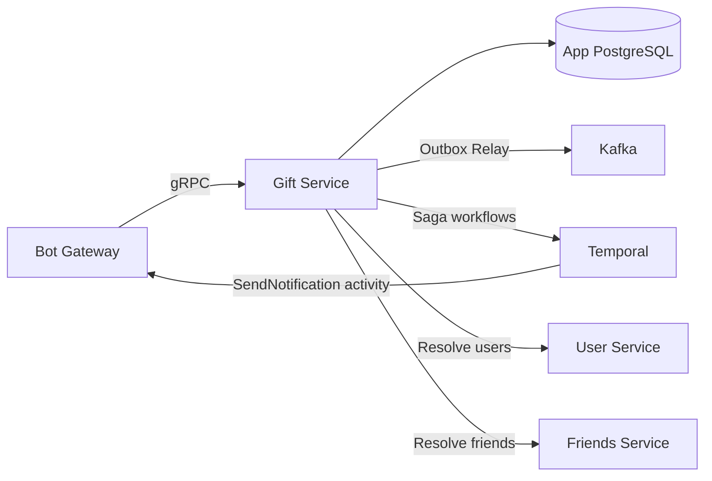
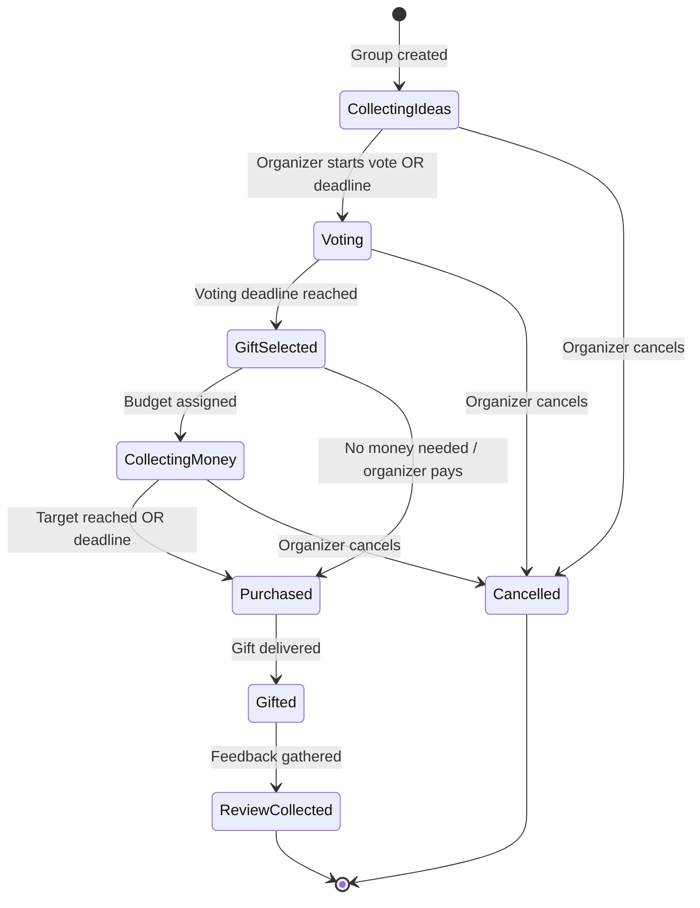
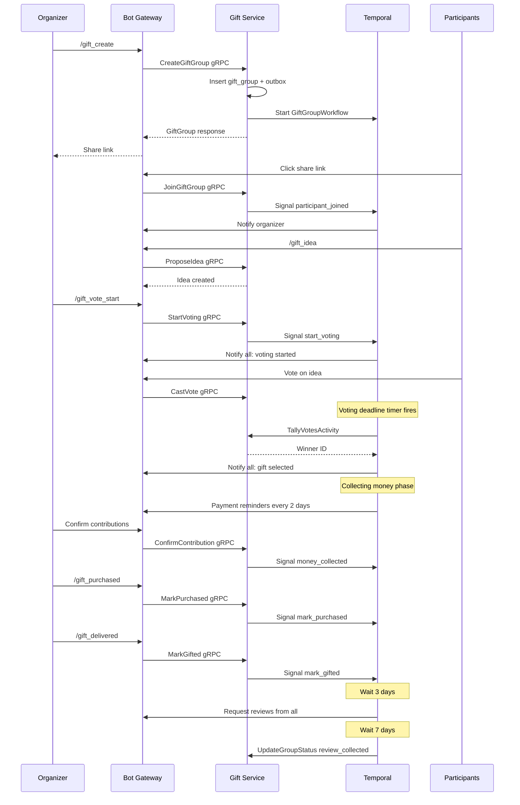

# Gift Service — Detailed Design

> **Phase:** 5  
> **Responsibility:** Group gift coordination, voting, budget tracking, saga lifecycle  
> **Port:** 50051 (gRPC)

---

## 1. Overview

Gift Service manages the full lifecycle of group gifts — from creation through idea collection, voting, money pooling, purchase, and delivery. It implements the **Saga pattern via Temporal** to coordinate multi-user, multi-step workflows that can span days or weeks. Individual gift tracking (simple gift ideas per friend) lives in [Friends Service](friends-service.md); Gift Service handles the **collaborative** dimension.



---

## 2. Responsibilities

### Core (Phase 5)
- **Group gift creation:** Organizer creates a group gift for a recipient
- **Participant management:** Invite users via share link, accept/decline
- **Idea proposals:** Participants suggest gift ideas with links and prices
- **Voting:** Participants vote on proposed ideas, deadline-based
- **Gift selection:** Auto-select winner or organizer picks
- **Budget tracking:** Target amount, per-participant contributions
- **Money collection:** Track who paid, send reminders to those who haven't
- **Purchase coordination:** Assign buyer, mark as purchased
- **Delivery and review:** Mark as gifted, collect feedback
- **Saga orchestration:** Temporal workflow manages the entire lifecycle

### Cross-Service Interactions
- **User Service:** Resolve participant Telegram IDs → user profiles
- **Friends Service:** Link group gift to a friend profile, pull interests for context
- **Bot Gateway:** All notifications via Temporal → Bot Gateway gRPC

---

## 3. Database Schema

```sql
-- Group gift campaigns
CREATE TABLE gift_groups (
    id              BIGSERIAL PRIMARY KEY,
    organizer_id    BIGINT NOT NULL,               -- User who created the group gift
    recipient_name  TEXT NOT NULL,                  -- Name of the person receiving the gift
    friend_id       BIGINT,                        -- Optional link to friends.id
    occasion        TEXT,                           -- "birthday", "wedding", "new_year", "farewell", "other"
    occasion_date   DATE,                           -- When the gift should be ready
    title           TEXT NOT NULL,                  -- Group gift title / description
    description     TEXT,
    budget_target   INT,                            -- Target amount in smallest currency unit
    budget_current  INT NOT NULL DEFAULT 0,         -- Currently collected amount
    currency        TEXT NOT NULL DEFAULT 'RUB',
    status          TEXT NOT NULL DEFAULT 'collecting_ideas',
    -- Status values: collecting_ideas, voting, gift_selected,
    --               collecting_money, purchased, gifted, review_collected, cancelled
    voting_deadline TIMESTAMPTZ,                    -- When voting ends
    money_deadline  TIMESTAMPTZ,                    -- When money collection ends
    share_code      TEXT UNIQUE,                    -- For invite links
    workflow_id     TEXT,                           -- Temporal workflow ID
    created_at      TIMESTAMPTZ NOT NULL DEFAULT NOW(),
    updated_at      TIMESTAMPTZ NOT NULL DEFAULT NOW()
);

CREATE INDEX idx_gift_groups_organizer ON gift_groups(organizer_id);
CREATE INDEX idx_gift_groups_status ON gift_groups(status);
CREATE INDEX idx_gift_groups_share_code ON gift_groups(share_code) WHERE share_code IS NOT NULL;
CREATE INDEX idx_gift_groups_occasion_date ON gift_groups(occasion_date) WHERE occasion_date IS NOT NULL;

-- Participants in a group gift
CREATE TABLE gift_participants (
    id              BIGSERIAL PRIMARY KEY,
    gift_group_id   BIGINT NOT NULL REFERENCES gift_groups(id) ON DELETE CASCADE,
    user_id         BIGINT NOT NULL,
    role            TEXT NOT NULL DEFAULT 'participant',  -- "organizer", "participant", "buyer"
    status          TEXT NOT NULL DEFAULT 'invited',      -- "invited", "accepted", "declined", "left"
    contribution    INT NOT NULL DEFAULT 0,               -- How much this person contributed
    joined_at       TIMESTAMPTZ,
    created_at      TIMESTAMPTZ NOT NULL DEFAULT NOW(),
    updated_at      TIMESTAMPTZ NOT NULL DEFAULT NOW(),
    UNIQUE(gift_group_id, user_id)
);

CREATE INDEX idx_gift_participants_group ON gift_participants(gift_group_id);
CREATE INDEX idx_gift_participants_user ON gift_participants(user_id);

-- Gift ideas proposed by participants
CREATE TABLE gift_ideas (
    id              BIGSERIAL PRIMARY KEY,
    gift_group_id   BIGINT NOT NULL REFERENCES gift_groups(id) ON DELETE CASCADE,
    proposed_by     BIGINT NOT NULL,               -- user_id of proposer
    title           TEXT NOT NULL,
    description     TEXT,
    url             TEXT,                           -- Link to product
    estimated_price INT,                            -- Estimated cost
    is_winner       BOOLEAN NOT NULL DEFAULT FALSE, -- Selected after voting
    created_at      TIMESTAMPTZ NOT NULL DEFAULT NOW()
);

CREATE INDEX idx_gift_ideas_group ON gift_ideas(gift_group_id);

-- Votes on gift ideas
CREATE TABLE gift_votes (
    id              BIGSERIAL PRIMARY KEY,
    gift_idea_id    BIGINT NOT NULL REFERENCES gift_ideas(id) ON DELETE CASCADE,
    user_id         BIGINT NOT NULL,
    vote            INT NOT NULL DEFAULT 1,         -- +1 upvote, -1 downvote (or just +1 for simple voting)
    created_at      TIMESTAMPTZ NOT NULL DEFAULT NOW(),
    UNIQUE(gift_idea_id, user_id)                   -- One vote per user per idea
);

CREATE INDEX idx_gift_votes_idea ON gift_votes(gift_idea_id);

-- Money contributions tracking
CREATE TABLE gift_contributions (
    id              BIGSERIAL PRIMARY KEY,
    gift_group_id   BIGINT NOT NULL REFERENCES gift_groups(id) ON DELETE CASCADE,
    user_id         BIGINT NOT NULL,
    amount          INT NOT NULL,                   -- Amount contributed
    confirmed_by    BIGINT,                         -- Organizer who confirmed receipt
    confirmed_at    TIMESTAMPTZ,
    note            TEXT,                            -- "Перевёл на карту", "Отдам наличкой"
    created_at      TIMESTAMPTZ NOT NULL DEFAULT NOW()
);

CREATE INDEX idx_gift_contributions_group ON gift_contributions(gift_group_id);
CREATE INDEX idx_gift_contributions_user ON gift_contributions(user_id);

-- Transactional Outbox for Kafka events
CREATE TABLE outbox_events (
    id              BIGSERIAL PRIMARY KEY,
    aggregate_type  TEXT NOT NULL,                  -- "gift_group", "gift_idea", "gift_vote"
    aggregate_id    BIGINT NOT NULL,
    event_type      TEXT NOT NULL,                  -- "gift.group_created", "gift.voted", etc.
    payload         JSONB NOT NULL,
    created_at      TIMESTAMPTZ NOT NULL DEFAULT NOW(),
    published_at    TIMESTAMPTZ                     -- NULL until relay publishes to Kafka
);

CREATE INDEX idx_outbox_unpublished ON outbox_events(created_at)
    WHERE published_at IS NULL;
```

---

## 4. Status State Machine



### Status Transition Rules

| From | To | Trigger | Who Can Trigger |
|------|----|---------|-----------------|
| `collecting_ideas` | `voting` | Organizer starts vote or idea deadline reached | Organizer / Temporal timer |
| `collecting_ideas` | `cancelled` | Organizer cancels | Organizer |
| `voting` | `gift_selected` | Voting deadline reached, top idea selected | Temporal timer |
| `voting` | `cancelled` | Organizer cancels | Organizer |
| `gift_selected` | `collecting_money` | Budget assigned to participants | Organizer |
| `gift_selected` | `purchased` | Organizer pays alone | Organizer |
| `collecting_money` | `purchased` | Target reached or money deadline | Organizer / Temporal timer |
| `collecting_money` | `cancelled` | Organizer cancels | Organizer |
| `purchased` | `gifted` | Gift delivered to recipient | Organizer / Buyer |
| `gifted` | `review_collected` | All participants gave feedback | Temporal timer (3 days after gifted) |

---

## 5. gRPC API

```protobuf
syntax = "proto3";
package iwontforget.gift.v1;

import "google/protobuf/timestamp.proto";

// ─── Gift Group Management ───

service GiftService {
  // Group lifecycle
  rpc CreateGiftGroup(CreateGiftGroupRequest) returns (GiftGroup);
  rpc GetGiftGroup(GetGiftGroupRequest) returns (GiftGroup);
  rpc ListMyGiftGroups(ListMyGiftGroupsRequest) returns (ListMyGiftGroupsResponse);
  rpc UpdateGiftGroup(UpdateGiftGroupRequest) returns (GiftGroup);
  rpc CancelGiftGroup(CancelGiftGroupRequest) returns (GiftGroup);

  // Participants
  rpc JoinGiftGroup(JoinGiftGroupRequest) returns (GiftParticipant);
  rpc LeaveGiftGroup(LeaveGiftGroupRequest) returns (Empty);
  rpc ListParticipants(ListParticipantsRequest) returns (ListParticipantsResponse);
  rpc UpdateParticipantRole(UpdateParticipantRoleRequest) returns (GiftParticipant);

  // Ideas
  rpc ProposeIdea(ProposeIdeaRequest) returns (GiftIdea);
  rpc ListIdeas(ListIdeasRequest) returns (ListIdeasResponse);
  rpc DeleteIdea(DeleteIdeaRequest) returns (Empty);

  // Voting
  rpc StartVoting(StartVotingRequest) returns (GiftGroup);
  rpc CastVote(CastVoteRequest) returns (GiftVote);
  rpc GetVotingResults(GetVotingResultsRequest) returns (VotingResults);

  // Money
  rpc RecordContribution(RecordContributionRequest) returns (GiftContribution);
  rpc ConfirmContribution(ConfirmContributionRequest) returns (GiftContribution);
  rpc GetBudgetSummary(GetBudgetSummaryRequest) returns (BudgetSummary);

  // Status transitions
  rpc MarkPurchased(MarkPurchasedRequest) returns (GiftGroup);
  rpc MarkGifted(MarkGiftedRequest) returns (GiftGroup);
  rpc SubmitReview(SubmitReviewRequest) returns (Empty);
}

// ─── Messages ───

message CreateGiftGroupRequest {
  int64 organizer_id = 1;
  string recipient_name = 2;
  optional int64 friend_id = 3;
  optional string occasion = 4;
  optional google.protobuf.Timestamp occasion_date = 5;
  string title = 6;
  optional string description = 7;
  optional int32 budget_target = 8;
  optional google.protobuf.Timestamp voting_deadline = 9;
  optional google.protobuf.Timestamp money_deadline = 10;
}

message GiftGroup {
  int64 id = 1;
  int64 organizer_id = 2;
  string recipient_name = 3;
  optional int64 friend_id = 4;
  string occasion = 5;
  google.protobuf.Timestamp occasion_date = 6;
  string title = 7;
  string description = 8;
  int32 budget_target = 9;
  int32 budget_current = 10;
  string currency = 11;
  string status = 12;
  google.protobuf.Timestamp voting_deadline = 13;
  google.protobuf.Timestamp money_deadline = 14;
  string share_code = 15;
  int32 participant_count = 16;
  int32 idea_count = 17;
  GiftIdea winning_idea = 18;
  google.protobuf.Timestamp created_at = 19;
  google.protobuf.Timestamp updated_at = 20;
}

message GetGiftGroupRequest {
  int64 group_id = 1;
  int64 user_id = 2;  // For access control
}

message ListMyGiftGroupsRequest {
  int64 user_id = 1;
  optional string status_filter = 2;  // Filter by status
  int32 limit = 3;
  int32 offset = 4;
}

message ListMyGiftGroupsResponse {
  repeated GiftGroup groups = 1;
  int32 total = 2;
}

message UpdateGiftGroupRequest {
  int64 group_id = 1;
  int64 user_id = 2;
  optional string title = 3;
  optional string description = 4;
  optional int32 budget_target = 5;
  optional google.protobuf.Timestamp voting_deadline = 6;
  optional google.protobuf.Timestamp money_deadline = 7;
}

message CancelGiftGroupRequest {
  int64 group_id = 1;
  int64 user_id = 2;  // Must be organizer
  optional string reason = 3;
}

// ─── Participants ───

message JoinGiftGroupRequest {
  string share_code = 1;
  int64 user_id = 2;
}

message LeaveGiftGroupRequest {
  int64 group_id = 1;
  int64 user_id = 2;
}

message GiftParticipant {
  int64 id = 1;
  int64 gift_group_id = 2;
  int64 user_id = 3;
  string role = 4;
  string status = 5;
  int32 contribution = 6;
  google.protobuf.Timestamp joined_at = 7;
}

message ListParticipantsRequest {
  int64 group_id = 1;
}

message ListParticipantsResponse {
  repeated GiftParticipant participants = 1;
}

message UpdateParticipantRoleRequest {
  int64 group_id = 1;
  int64 user_id = 2;       // Organizer making the change
  int64 target_user_id = 3; // User whose role changes
  string role = 4;           // "buyer", "participant"
}

// ─── Ideas ───

message ProposeIdeaRequest {
  int64 group_id = 1;
  int64 user_id = 2;
  string title = 3;
  optional string description = 4;
  optional string url = 5;
  optional int32 estimated_price = 6;
}

message GiftIdea {
  int64 id = 1;
  int64 gift_group_id = 2;
  int64 proposed_by = 3;
  string title = 4;
  string description = 5;
  string url = 6;
  int32 estimated_price = 7;
  bool is_winner = 8;
  int32 vote_count = 9;
  google.protobuf.Timestamp created_at = 10;
}

message ListIdeasRequest {
  int64 group_id = 1;
}

message ListIdeasResponse {
  repeated GiftIdea ideas = 1;
}

message DeleteIdeaRequest {
  int64 idea_id = 1;
  int64 user_id = 2;  // Must be proposer or organizer
}

// ─── Voting ───

message StartVotingRequest {
  int64 group_id = 1;
  int64 user_id = 2;  // Must be organizer
  google.protobuf.Timestamp deadline = 3;
}

message CastVoteRequest {
  int64 idea_id = 1;
  int64 user_id = 2;
  int32 vote = 3;  // +1 or -1
}

message GiftVote {
  int64 id = 1;
  int64 gift_idea_id = 2;
  int64 user_id = 3;
  int32 vote = 4;
}

message GetVotingResultsRequest {
  int64 group_id = 1;
}

message VotingResults {
  repeated IdeaWithVotes ideas = 1;
  bool voting_closed = 2;
  google.protobuf.Timestamp deadline = 3;
}

message IdeaWithVotes {
  GiftIdea idea = 1;
  int32 total_votes = 2;
  repeated int64 voter_ids = 3;
}

// ─── Money ───

message RecordContributionRequest {
  int64 group_id = 1;
  int64 user_id = 2;
  int32 amount = 3;
  optional string note = 4;
}

message ConfirmContributionRequest {
  int64 contribution_id = 1;
  int64 user_id = 2;  // Must be organizer
}

message GiftContribution {
  int64 id = 1;
  int64 gift_group_id = 2;
  int64 user_id = 3;
  int32 amount = 4;
  optional int64 confirmed_by = 5;
  optional google.protobuf.Timestamp confirmed_at = 6;
  string note = 7;
  google.protobuf.Timestamp created_at = 8;
}

message GetBudgetSummaryRequest {
  int64 group_id = 1;
}

message BudgetSummary {
  int32 target = 1;
  int32 collected = 2;
  int32 confirmed = 3;
  int32 pending = 4;
  repeated ParticipantBudget participants = 5;
}

message ParticipantBudget {
  int64 user_id = 1;
  int32 contributed = 2;
  bool confirmed = 3;
}

// ─── Status Transitions ───

message MarkPurchasedRequest {
  int64 group_id = 1;
  int64 user_id = 2;  // Must be organizer or buyer
  optional string purchase_note = 3;
}

message MarkGiftedRequest {
  int64 group_id = 1;
  int64 user_id = 2;
}

message SubmitReviewRequest {
  int64 group_id = 1;
  int64 user_id = 2;
  string reaction = 3;  // "loved", "liked", "neutral"
  optional string comment = 4;
}

message Empty {}
```

---

## 6. Internal Architecture

```
services/gift-service/
├── cmd/
│   └── main.go                    # Entry point, DI wiring
├── internal/
│   ├── app/
│   │   ├── service.go             # Business logic orchestrator
│   │   ├── group.go               # Group gift CRUD operations
│   │   ├── participant.go         # Participant management
│   │   ├── idea.go                # Idea proposals
│   │   ├── voting.go              # Voting logic + winner selection
│   │   ├── budget.go              # Contribution tracking
│   │   └── transitions.go         # Status transition validation
│   ├── domain/
│   │   ├── gift_group.go          # GiftGroup aggregate
│   │   ├── participant.go         # Participant entity
│   │   ├── idea.go                # GiftIdea entity
│   │   ├── vote.go                # Vote value object
│   │   ├── contribution.go        # Contribution entity
│   │   └── events.go              # Domain event definitions
│   ├── port/
│   │   ├── repository.go          # Repository interfaces
│   │   └── services.go            # External service interfaces
│   ├── adapter/
│   │   ├── postgres/
│   │   │   ├── group_repo.go      # GiftGroup repository
│   │   │   ├── participant_repo.go
│   │   │   ├── idea_repo.go
│   │   │   ├── vote_repo.go
│   │   │   ├── contribution_repo.go
│   │   │   └── outbox_repo.go     # Outbox event storage
│   │   ├── grpc/
│   │   │   └── handler.go         # gRPC server implementation
│   │   └── kafka/
│   │       └── relay.go           # Outbox relay → Kafka publisher
│   ├── workflow/
│   │   ├── gift_group_workflow.go  # Main saga workflow
│   │   ├── activities.go           # Temporal activities
│   │   └── worker.go               # Temporal worker registration
│   └── config/
│       └── config.go
├── migrations/
│   └── 001_init.sql
└── Dockerfile
```

---

## 7. Temporal Saga Workflow

The `GiftGroupWorkflow` is the heart of Gift Service — a long-running Temporal workflow that orchestrates the entire group gift lifecycle. It uses **signals** for external events (organizer actions, participant joins) and **timers** for deadlines.

### 7.1. Workflow Definition

```go
package workflow

import (
    "time"

    "go.temporal.io/sdk/temporal"
    "go.temporal.io/sdk/workflow"
)

type GiftGroupWorkflowInput struct {
    GroupID        int64
    OrganizerID    int64
    OccasionDate   *time.Time
    VotingDeadline *time.Time
    MoneyDeadline  *time.Time
}

type GiftGroupState struct {
    Status          string
    ParticipantIDs  []int64
    WinningIdeaID   *int64
    BudgetTarget    int32
    BudgetCollected int32
}

// Signal names
const (
    SignalStartVoting      = "start_voting"
    SignalVotingComplete   = "voting_complete"
    SignalMoneyCollected   = "money_collected"
    SignalMarkPurchased    = "mark_purchased"
    SignalMarkGifted       = "mark_gifted"
    SignalCancel           = "cancel"
    SignalParticipantJoined = "participant_joined"
)

func GiftGroupWorkflow(ctx workflow.Context, input GiftGroupWorkflowInput) error {
    logger := workflow.GetLogger(ctx)
    state := &GiftGroupState{Status: "collecting_ideas"}

    activityOpts := workflow.ActivityOptions{
        StartToCloseTimeout: 30 * time.Second,
        RetryPolicy: &temporal.RetryPolicy{
            InitialInterval:    1 * time.Second,
            BackoffCoefficient: 2.0,
            MaximumInterval:    30 * time.Second,
            MaximumAttempts:    5,
        },
    }
    ctx = workflow.WithActivityOptions(ctx, activityOpts)

    // ─── Phase 1: Collecting Ideas ───
    logger.Info("Gift group workflow started", "groupID", input.GroupID)

    err := workflow.ExecuteActivity(ctx, NotifyParticipantsActivity, NotifyInput{
        GroupID: input.GroupID,
        Message: "group_created",
    }).Get(ctx, nil)
    if err != nil {
        logger.Warn("Failed to notify on creation", "error", err)
    }

    // Wait for organizer to start voting, or voting deadline, or cancellation
    ideaPhaseComplete := false
    for !ideaPhaseComplete {
        selector := workflow.NewSelector(ctx)

        // Signal: organizer starts voting manually
        signalCh := workflow.GetSignalChannel(ctx, SignalStartVoting)
        selector.AddReceive(signalCh, func(c workflow.ReceiveChannel, more bool) {
            var deadline time.Time
            c.Receive(ctx, &deadline)
            state.Status = "voting"
            ideaPhaseComplete = true
        })

        // Signal: cancellation
        cancelCh := workflow.GetSignalChannel(ctx, SignalCancel)
        selector.AddReceive(cancelCh, func(c workflow.ReceiveChannel, more bool) {
            c.Receive(ctx, nil)
            state.Status = "cancelled"
            ideaPhaseComplete = true
        })

        // Timer: auto-start voting at deadline
        if input.VotingDeadline != nil {
            duration := input.VotingDeadline.Sub(workflow.Now(ctx))
            if duration > 0 {
                selector.AddFuture(workflow.NewTimer(ctx, duration), func(f workflow.Future) {
                    state.Status = "voting"
                    ideaPhaseComplete = true
                })
            }
        }

        // Signal: new participant joined (just log, don't exit loop)
        joinCh := workflow.GetSignalChannel(ctx, SignalParticipantJoined)
        selector.AddReceive(joinCh, func(c workflow.ReceiveChannel, more bool) {
            var userID int64
            c.Receive(ctx, &userID)
            state.ParticipantIDs = append(state.ParticipantIDs, userID)
        })

        selector.Select(ctx)
    }

    if state.Status == "cancelled" {
        return handleCancellation(ctx, input.GroupID)
    }

    // ─── Phase 2: Voting ───
    logger.Info("Voting phase started", "groupID", input.GroupID)

    _ = workflow.ExecuteActivity(ctx, UpdateGroupStatusActivity, StatusInput{
        GroupID: input.GroupID,
        Status:  "voting",
    }).Get(ctx, nil)

    _ = workflow.ExecuteActivity(ctx, NotifyParticipantsActivity, NotifyInput{
        GroupID: input.GroupID,
        Message: "voting_started",
    }).Get(ctx, nil)

    // Wait for voting deadline or manual close
    votingComplete := false
    for !votingComplete {
        selector := workflow.NewSelector(ctx)

        signalCh := workflow.GetSignalChannel(ctx, SignalVotingComplete)
        selector.AddReceive(signalCh, func(c workflow.ReceiveChannel, more bool) {
            var ideaID int64
            c.Receive(ctx, &ideaID)
            state.WinningIdeaID = &ideaID
            state.Status = "gift_selected"
            votingComplete = true
        })

        cancelCh := workflow.GetSignalChannel(ctx, SignalCancel)
        selector.AddReceive(cancelCh, func(c workflow.ReceiveChannel, more bool) {
            c.Receive(ctx, nil)
            state.Status = "cancelled"
            votingComplete = true
        })

        // Auto-close voting after deadline
        if input.VotingDeadline != nil {
            remaining := input.VotingDeadline.Sub(workflow.Now(ctx))
            if remaining > 0 {
                selector.AddFuture(workflow.NewTimer(ctx, remaining), func(f workflow.Future) {
                    // Activity to tally votes and select winner
                    var winnerID int64
                    _ = workflow.ExecuteActivity(ctx, TallyVotesActivity, input.GroupID).Get(ctx, &winnerID)
                    state.WinningIdeaID = &winnerID
                    state.Status = "gift_selected"
                    votingComplete = true
                })
            }
        }

        selector.Select(ctx)
    }

    if state.Status == "cancelled" {
        return handleCancellation(ctx, input.GroupID)
    }

    // ─── Phase 3: Gift Selected → Collecting Money ───
    logger.Info("Gift selected", "groupID", input.GroupID, "ideaID", state.WinningIdeaID)

    _ = workflow.ExecuteActivity(ctx, UpdateGroupStatusActivity, StatusInput{
        GroupID: input.GroupID,
        Status:  "gift_selected",
    }).Get(ctx, nil)

    _ = workflow.ExecuteActivity(ctx, NotifyParticipantsActivity, NotifyInput{
        GroupID: input.GroupID,
        Message: "gift_selected",
    }).Get(ctx, nil)

    // Transition to collecting money
    state.Status = "collecting_money"
    _ = workflow.ExecuteActivity(ctx, UpdateGroupStatusActivity, StatusInput{
        GroupID: input.GroupID,
        Status:  "collecting_money",
    }).Get(ctx, nil)

    // ─── Phase 4: Collecting Money ───
    // Send periodic reminders until money deadline or target reached
    moneyCollected := false
    reminderInterval := 2 * 24 * time.Hour // Remind every 2 days

    for !moneyCollected {
        selector := workflow.NewSelector(ctx)

        signalCh := workflow.GetSignalChannel(ctx, SignalMoneyCollected)
        selector.AddReceive(signalCh, func(c workflow.ReceiveChannel, more bool) {
            c.Receive(ctx, nil)
            moneyCollected = true
            state.Status = "purchased"
        })

        cancelCh := workflow.GetSignalChannel(ctx, SignalCancel)
        selector.AddReceive(cancelCh, func(c workflow.ReceiveChannel, more bool) {
            c.Receive(ctx, nil)
            state.Status = "cancelled"
            moneyCollected = true
        })

        // Periodic reminder
        selector.AddFuture(workflow.NewTimer(ctx, reminderInterval), func(f workflow.Future) {
            _ = workflow.ExecuteActivity(ctx, SendMoneyReminderActivity, input.GroupID).Get(ctx, nil)
        })

        // Money deadline
        if input.MoneyDeadline != nil {
            remaining := input.MoneyDeadline.Sub(workflow.Now(ctx))
            if remaining > 0 {
                selector.AddFuture(workflow.NewTimer(ctx, remaining), func(f workflow.Future) {
                    moneyCollected = true
                    state.Status = "purchased"
                })
            }
        }

        selector.Select(ctx)
    }

    if state.Status == "cancelled" {
        return handleCancellation(ctx, input.GroupID)
    }

    // ─── Phase 5: Purchased → Gifted ───
    _ = workflow.ExecuteActivity(ctx, UpdateGroupStatusActivity, StatusInput{
        GroupID: input.GroupID,
        Status:  "purchased",
    }).Get(ctx, nil)

    // Wait for gift delivery signal or occasion date
    giftDelivered := false
    for !giftDelivered {
        selector := workflow.NewSelector(ctx)

        signalCh := workflow.GetSignalChannel(ctx, SignalMarkGifted)
        selector.AddReceive(signalCh, func(c workflow.ReceiveChannel, more bool) {
            c.Receive(ctx, nil)
            giftDelivered = true
        })

        cancelCh := workflow.GetSignalChannel(ctx, SignalCancel)
        selector.AddReceive(cancelCh, func(c workflow.ReceiveChannel, more bool) {
            c.Receive(ctx, nil)
            state.Status = "cancelled"
            giftDelivered = true
        })

        // Auto-trigger on occasion date
        if input.OccasionDate != nil {
            remaining := input.OccasionDate.Sub(workflow.Now(ctx))
            if remaining > 0 {
                selector.AddFuture(workflow.NewTimer(ctx, remaining), func(f workflow.Future) {
                    _ = workflow.ExecuteActivity(ctx, NotifyParticipantsActivity, NotifyInput{
                        GroupID: input.GroupID,
                        Message: "occasion_day_arrived",
                    }).Get(ctx, nil)
                })
            }
        }

        selector.Select(ctx)
    }

    if state.Status == "cancelled" {
        return handleCancellation(ctx, input.GroupID)
    }

    // ─── Phase 6: Gifted → Review Collection ───
    _ = workflow.ExecuteActivity(ctx, UpdateGroupStatusActivity, StatusInput{
        GroupID: input.GroupID,
        Status:  "gifted",
    }).Get(ctx, nil)

    _ = workflow.ExecuteActivity(ctx, NotifyParticipantsActivity, NotifyInput{
        GroupID: input.GroupID,
        Message: "gift_delivered",
    }).Get(ctx, nil)

    // Wait 3 days then ask for reviews
    _ = workflow.NewTimer(ctx, 3*24*time.Hour).Get(ctx, nil)

    _ = workflow.ExecuteActivity(ctx, RequestReviewsActivity, input.GroupID).Get(ctx, nil)

    // Wait another 7 days for reviews to come in, then close
    _ = workflow.NewTimer(ctx, 7*24*time.Hour).Get(ctx, nil)

    _ = workflow.ExecuteActivity(ctx, UpdateGroupStatusActivity, StatusInput{
        GroupID: input.GroupID,
        Status:  "review_collected",
    }).Get(ctx, nil)

    logger.Info("Gift group workflow completed", "groupID", input.GroupID)
    return nil
}

func handleCancellation(ctx workflow.Context, groupID int64) error {
    _ = workflow.ExecuteActivity(ctx, UpdateGroupStatusActivity, StatusInput{
        GroupID: groupID,
        Status:  "cancelled",
    }).Get(ctx, nil)

    _ = workflow.ExecuteActivity(ctx, NotifyParticipantsActivity, NotifyInput{
        GroupID: groupID,
        Message: "group_cancelled",
    }).Get(ctx, nil)

    return nil
}
```

### 7.2. Activities

```go
package workflow

import (
    "context"
    "fmt"
)

// NotifyParticipantsActivity sends a notification to all participants
// via Bot Gateway's SendNotification gRPC endpoint.
func NotifyParticipantsActivity(ctx context.Context, input NotifyInput) error {
    // 1. Fetch all participants for the group from DB
    // 2. For each participant, call Bot Gateway SendNotification
    // 3. Return error only if critical failure (Temporal will retry)
    return nil
}

// UpdateGroupStatusActivity updates the gift group status in the database.
func UpdateGroupStatusActivity(ctx context.Context, input StatusInput) error {
    // 1. Update gift_groups.status in PostgreSQL
    // 2. Write outbox event for Kafka
    return nil
}

// TallyVotesActivity counts votes and selects the winning idea.
func TallyVotesActivity(ctx context.Context, groupID int64) (int64, error) {
    // 1. SELECT gift_ideas with vote counts for this group
    // 2. Pick idea with highest votes
    // 3. Mark as is_winner = true
    // 4. Return winning idea ID
    return 0, nil
}

// SendMoneyReminderActivity sends payment reminders to participants
// who haven't contributed yet.
func SendMoneyReminderActivity(ctx context.Context, groupID int64) error {
    // 1. Fetch participants without confirmed contributions
    // 2. Send reminder via Bot Gateway for each
    return nil
}

// RequestReviewsActivity asks all participants to submit feedback.
func RequestReviewsActivity(ctx context.Context, groupID int64) error {
    // 1. Fetch all participants
    // 2. Send review request via Bot Gateway
    return nil
}

type NotifyInput struct {
    GroupID int64
    Message string
}

type StatusInput struct {
    GroupID int64
    Status  string
}
```

### 7.3. Workflow Lifecycle Sequence



---

## 8. Kafka Events

### Topic: `gift.events`

| Event Type | Trigger | Payload |
|------------|---------|---------|
| `gift.group_created` | New group gift created | `{group_id, organizer_id, recipient_name, occasion}` |
| `gift.participant_joined` | User joins group | `{group_id, user_id}` |
| `gift.voting_started` | Voting phase begins | `{group_id, idea_count, deadline}` |
| `gift.gift_selected` | Winning idea chosen | `{group_id, idea_id, title, price}` |
| `gift.contribution_confirmed` | Money contribution confirmed | `{group_id, user_id, amount}` |
| `gift.purchased` | Gift bought | `{group_id, buyer_id}` |
| `gift.gifted` | Gift delivered | `{group_id}` |
| `gift.group_cancelled` | Group gift cancelled | `{group_id, reason}` |

### Outbox Relay

Same pattern as [Wishlist Service](wishlist-service.md) — a goroutine polls `outbox_events` table every 500ms, publishes to Kafka, marks as published.

### Consumers

Gift Service does **not** consume from other topics in Phase 5. Future phases may add:
- Consuming `friend.events` to auto-suggest group gifts for upcoming birthdays

---

## 9. Access Control

| Operation | Who Can Do It |
|-----------|---------------|
| Create group | Any authenticated user |
| View group details | Organizer + accepted participants |
| Join group | Anyone with share code |
| Propose idea | Accepted participants |
| Start voting | Organizer only |
| Cast vote | Accepted participants |
| Record contribution | Any participant (self-report) |
| Confirm contribution | Organizer only |
| Mark purchased | Organizer or assigned buyer |
| Mark gifted | Organizer or assigned buyer |
| Cancel group | Organizer only |
| Submit review | Any participant |

---

## 10. Bot Commands (Phase 5)

| Command | Description |
|---------|-------------|
| `/gift_create` | Start creating a group gift |
| `/gift_list` | List my group gifts (as organizer or participant) |
| `/gift_info <id>` | View group gift details |
| `/gift_idea <id>` | Propose a gift idea |
| `/gift_vote <id>` | Vote on ideas |
| `/gift_pay <id>` | Record a contribution |
| `/gift_status <id>` | Check budget and status |

### Inline Keyboard Flows

```
[Create Group Gift]
  → Enter recipient name
  → Select occasion (birthday / wedding / new_year / other)
  → Set occasion date
  → Set budget target (optional)
  → Set voting deadline (optional)
  → Confirm → Share link generated

[Vote on Ideas]
  → Show idea list with 👍/👎 buttons
  → Show current vote counts
  → [Close Voting] button for organizer

[Budget Dashboard]
  → Show target vs collected
  → Per-participant breakdown
  → [Remind Unpaid] button for organizer
```

---

## 11. Configuration

```yaml
service:
  name: gift-service
  port: 50051

database:
  host: app-postgresql-rw.infrastructure.svc
  port: 5432
  name: iwontforget
  schema: gifts
  pool_size: 10

kafka:
  brokers:
    - kafka-bootstrap.infrastructure.svc:9092
  topic: gift.events
  outbox_poll_interval: 500ms

temporal:
  host: temporal-frontend.temporal.svc:7233
  namespace: iwontforget
  task_queue: gift-service-queue
  worker_count: 3

grpc_clients:
  user_service: user-service.iwontforget.svc:50051
  friends_service: friends-service.iwontforget.svc:50051
  bot_gateway: bot-gateway.iwontforget.svc:50051

observability:
  metrics_port: 9090
  health_port: 8080
  log_level: info
  log_format: json
```

---

## 12. Metrics

| Metric | Type | Labels | Description |
|--------|------|--------|-------------|
| `gift_groups_created_total` | Counter | `occasion` | Total group gifts created |
| `gift_groups_completed_total` | Counter | `outcome` (gifted/cancelled) | Completed group gifts |
| `gift_group_participants` | Histogram | — | Number of participants per group |
| `gift_ideas_proposed_total` | Counter | — | Total ideas proposed |
| `gift_votes_cast_total` | Counter | — | Total votes cast |
| `gift_contributions_total` | Counter | `confirmed` (true/false) | Money contributions |
| `gift_budget_collection_ratio` | Histogram | — | collected/target ratio at purchase |
| `gift_workflow_duration_seconds` | Histogram | `phase` | Time spent in each workflow phase |
| `gift_grpc_request_duration_seconds` | Histogram | `method`, `status` | gRPC latency |

---

## 13. Testing Strategy

### Unit Tests
- **Voting logic:** Tally algorithm, tie-breaking, edge cases (no votes, single idea)
- **Status transitions:** Valid/invalid transition matrix
- **Access control:** Organizer-only operations, participant checks
- **Budget calculations:** Contribution tracking, over-payment handling

### Integration Tests (Testcontainers)
- Full group lifecycle: create → join → propose → vote → pay → purchase → gift → review
- Concurrent voting from multiple participants
- Outbox relay publishes correct Kafka events
- Share code generation and redemption

### Temporal Workflow Tests
```go
func TestGiftGroupWorkflow_HappyPath(t *testing.T) {
    testSuite := &testsuite.WorkflowTestSuite{}
    env := testSuite.NewTestWorkflowEnvironment()

    // Register activities
    env.RegisterActivity(NotifyParticipantsActivity)
    env.RegisterActivity(UpdateGroupStatusActivity)
    env.RegisterActivity(TallyVotesActivity)
    env.RegisterActivity(SendMoneyReminderActivity)
    env.RegisterActivity(RequestReviewsActivity)

    // Mock activities
    env.OnActivity(NotifyParticipantsActivity, mock.Anything, mock.Anything).Return(nil)
    env.OnActivity(UpdateGroupStatusActivity, mock.Anything, mock.Anything).Return(nil)
    env.OnActivity(TallyVotesActivity, mock.Anything, mock.Anything).Return(int64(42), nil)
    env.OnActivity(SendMoneyReminderActivity, mock.Anything, mock.Anything).Return(nil)
    env.OnActivity(RequestReviewsActivity, mock.Anything, mock.Anything).Return(nil)

    // Send signals at appropriate times
    env.RegisterDelayedCallback(func() {
        env.SignalWorkflow(SignalStartVoting, time.Now().Add(24*time.Hour))
    }, 1*time.Hour)

    env.RegisterDelayedCallback(func() {
        env.SignalWorkflow(SignalVotingComplete, int64(42))
    }, 25*time.Hour)

    env.RegisterDelayedCallback(func() {
        env.SignalWorkflow(SignalMoneyCollected, nil)
    }, 48*time.Hour)

    env.RegisterDelayedCallback(func() {
        env.SignalWorkflow(SignalMarkGifted, nil)
    }, 72*time.Hour)

    deadline := time.Now().Add(48 * time.Hour)
    env.ExecuteWorkflow(GiftGroupWorkflow, GiftGroupWorkflowInput{
        GroupID:        1,
        OrganizerID:    100,
        VotingDeadline: &deadline,
    })

    require.True(t, env.IsWorkflowCompleted())
    require.NoError(t, env.GetWorkflowError())
}

func TestGiftGroupWorkflow_Cancellation(t *testing.T) {
    testSuite := &testsuite.WorkflowTestSuite{}
    env := testSuite.NewTestWorkflowEnvironment()

    env.RegisterActivity(NotifyParticipantsActivity)
    env.RegisterActivity(UpdateGroupStatusActivity)

    env.OnActivity(NotifyParticipantsActivity, mock.Anything, mock.Anything).Return(nil)
    env.OnActivity(UpdateGroupStatusActivity, mock.Anything, mock.Anything).Return(nil)

    // Cancel during idea collection phase
    env.RegisterDelayedCallback(func() {
        env.SignalWorkflow(SignalCancel, nil)
    }, 30*time.Minute)

    env.ExecuteWorkflow(GiftGroupWorkflow, GiftGroupWorkflowInput{
        GroupID:     1,
        OrganizerID: 100,
    })

    require.True(t, env.IsWorkflowCompleted())
    require.NoError(t, env.GetWorkflowError())
}
```

### Contract Tests
- Buf breaking change detection for `gift/v1` protobuf package

---

## 14. Deployment

```yaml
apiVersion: apps/v1
kind: Deployment
metadata:
  name: gift-service
  namespace: iwontforget
spec:
  replicas: 2
  selector:
    matchLabels:
      app: gift-service
  template:
    metadata:
      labels:
        app: gift-service
    spec:
      containers:
        - name: gift-service
          image: ghcr.io/iwontforget/gift-service:latest
          ports:
            - containerPort: 50051
              name: grpc
            - containerPort: 9090
              name: metrics
            - containerPort: 8080
              name: health
          env:
            - name: DB_DSN
              valueFrom:
                secretKeyRef:
                  name: app-postgresql-credentials
                  key: dsn
          resources:
            requests:
              cpu: 100m
              memory: 128Mi
            limits:
              cpu: 500m
              memory: 256Mi
          livenessProbe:
            httpGet:
              path: /healthz
              port: health
            initialDelaySeconds: 5
          readinessProbe:
            httpGet:
              path: /readyz
              port: health
            initialDelaySeconds: 5
---
apiVersion: autoscaling/v2
kind: HorizontalPodAutoscaler
metadata:
  name: gift-service
  namespace: iwontforget
spec:
  scaleTargetRef:
    apiVersion: apps/v1
    kind: Deployment
    name: gift-service
  minReplicas: 2
  maxReplicas: 5
  metrics:
    - type: Resource
      resource:
        name: cpu
        target:
          type: Utilization
          averageUtilization: 70
```

---

## 15. Phase Roadmap

| Phase | What Gets Built |
|-------|----------------|
| **Phase 5** | Full Gift Service: group creation, participants, ideas, voting, budget, purchase, delivery, reviews. Temporal saga workflow. Kafka events. Bot commands. |
| **Phase 7** | Observability: distributed tracing across saga steps, budget dashboards, workflow duration alerts |
| **Phase 8** | AI-powered gift suggestions based on friend profile, auto-create group gift for upcoming birthdays |

---

## 16. Design Decisions

### Why Temporal Saga (not Kafka choreography)?

Group gift coordination involves **multi-step, multi-user, deadline-driven** processes that can span weeks. Temporal provides:

1. **Durable timers** — voting deadlines, money collection reminders, review windows
2. **Signal-based coordination** — organizer and participants interact at unpredictable times
3. **Visibility** — query workflow state to show current phase in bot UI
4. **Compensation** — if cancelled at any phase, notify all participants consistently
5. **Testability** — Temporal test suite allows time-skipping through the entire saga

A Kafka choreography approach would require each service to maintain its own state machine and coordinate via events — far more complex for a workflow that has 8 states and multiple timer-based transitions.

### Why separate from Friends Service?

Individual gift ideas (simple notes like "Маша хочет книгу") live in Friends Service because they're part of the friend profile. Group gifts are a **collaborative workflow** involving multiple users, voting, money, and deadlines — a fundamentally different domain that justifies its own service boundary.

### Voting Algorithm

Simple majority vote with tie-breaking rules:
1. Idea with most +1 votes wins
2. On tie: idea proposed earlier wins (FIFO)
3. Organizer can override and manually select winner