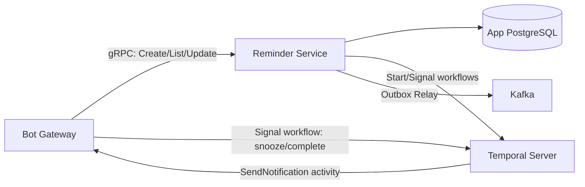
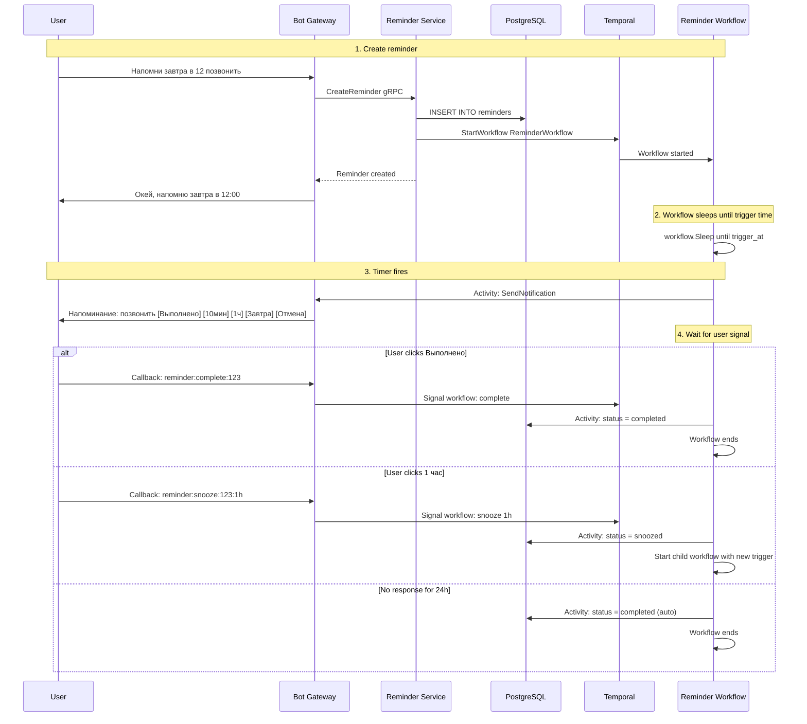

# Reminder Service — Detailed Design

> **Phase:** 1 (MVP)  
> **Responsibility:** Reminder CRUD, scheduling via Temporal, recurring reminders  
> **Port:** 50051 (gRPC)

---

## 1. Overview

Reminder Service manages the lifecycle of user reminders — from creation to notification delivery. It stores reminder metadata in PostgreSQL and delegates scheduling/execution to Temporal workflows. When a reminder fires, the Temporal workflow executes a `SendNotification` activity that calls Bot Gateway to deliver the message via Telegram.



---

## 2. Responsibilities

- **Reminder CRUD:** Create, list, update, delete reminders
- **One-time reminders:** Fire once at a specific time
- **Recurring reminders:** Fire on a cron schedule (every Monday, every month 25th, etc.)
- **Temporal workflow management:** Start, signal, cancel workflows
- **Snooze/reschedule:** Handle user actions on triggered reminders
- **Kafka events:** Log reminder lifecycle events via Transactional Outbox

---

## 3. Database Schema

```sql
-- Reminders
CREATE TABLE reminders (
    id              BIGSERIAL PRIMARY KEY,
    user_id         BIGINT NOT NULL,
    text            TEXT NOT NULL,                  -- "позвонить в клинику"
    
    -- Scheduling
    trigger_at      TIMESTAMPTZ,                   -- For one-time reminders
    cron_expression TEXT,                           -- For recurring: "0 9 * * MON"
    timezone        TEXT NOT NULL DEFAULT 'Europe/Moscow',
    is_recurring    BOOLEAN NOT NULL DEFAULT FALSE,
    
    -- Status
    status          TEXT NOT NULL DEFAULT 'active', -- "active", "triggered", "snoozed", "completed", "cancelled"
    
    -- Temporal
    workflow_id     TEXT,                           -- Temporal workflow ID
    workflow_run_id TEXT,                           -- Temporal run ID
    
    -- Metadata
    snooze_count    INT NOT NULL DEFAULT 0,
    last_triggered_at TIMESTAMPTZ,
    next_trigger_at   TIMESTAMPTZ,                 -- Computed for display
    completed_at    TIMESTAMPTZ,
    
    created_at      TIMESTAMPTZ NOT NULL DEFAULT NOW(),
    updated_at      TIMESTAMPTZ NOT NULL DEFAULT NOW()
);

CREATE INDEX idx_reminders_user_id ON reminders(user_id);
CREATE INDEX idx_reminders_user_status ON reminders(user_id, status);
CREATE INDEX idx_reminders_next_trigger ON reminders(next_trigger_at) WHERE status = 'active';

-- Transactional Outbox
CREATE TABLE outbox_events (
    id              BIGSERIAL PRIMARY KEY,
    topic           TEXT NOT NULL,
    key             TEXT NOT NULL,
    payload         JSONB NOT NULL,
    created_at      TIMESTAMPTZ NOT NULL DEFAULT NOW(),
    published       BOOLEAN NOT NULL DEFAULT FALSE,
    published_at    TIMESTAMPTZ
);

CREATE INDEX idx_outbox_unpublished ON outbox_events(published, created_at) WHERE NOT published;
```

---

## 4. gRPC API

```protobuf
syntax = "proto3";
package reminder.v1;

service ReminderService {
  // Create a new reminder (starts Temporal workflow)
  rpc CreateReminder(CreateReminderRequest) returns (Reminder);
  
  // Get a single reminder
  rpc GetReminder(GetReminderRequest) returns (Reminder);
  
  // List user's reminders
  rpc ListReminders(ListRemindersRequest) returns (ListRemindersResponse);
  
  // List today's reminders for a user
  rpc ListTodayReminders(ListTodayRemindersRequest) returns (ListRemindersResponse);
  
  // Update reminder (reschedule)
  rpc UpdateReminder(UpdateReminderRequest) returns (Reminder);
  
  // Cancel a reminder (terminates Temporal workflow)
  rpc CancelReminder(CancelReminderRequest) returns (CancelReminderResponse);
  
  // Signal a running workflow: snooze
  rpc SnoozeReminder(SnoozeReminderRequest) returns (SnoozeReminderResponse);
  
  // Signal a running workflow: complete
  rpc CompleteReminder(CompleteReminderRequest) returns (CompleteReminderResponse);
}

message CreateReminderRequest {
  int64 user_id = 1;
  string text = 2;
  
  // One of these must be set:
  optional google.protobuf.Timestamp trigger_at = 3;  // One-time
  optional string cron_expression = 4;                  // Recurring
  
  optional string timezone = 5;
}

message Reminder {
  int64 id = 1;
  int64 user_id = 2;
  string text = 3;
  google.protobuf.Timestamp trigger_at = 4;
  string cron_expression = 5;
  string timezone = 6;
  bool is_recurring = 7;
  string status = 8;
  int32 snooze_count = 9;
  google.protobuf.Timestamp next_trigger_at = 10;
  google.protobuf.Timestamp created_at = 11;
}

message GetReminderRequest {
  int64 reminder_id = 1;
  int64 user_id = 2;
}

message ListRemindersRequest {
  int64 user_id = 1;
  optional string status = 2;           // Filter by status
  int32 page = 3;
  int32 page_size = 4;
}

message ListTodayRemindersRequest {
  int64 user_id = 1;
  string timezone = 2;
}

message ListRemindersResponse {
  repeated Reminder reminders = 1;
  int32 total = 2;
}

message UpdateReminderRequest {
  int64 reminder_id = 1;
  int64 user_id = 2;
  optional string text = 3;
  optional google.protobuf.Timestamp trigger_at = 4;
  optional string cron_expression = 5;
}

message CancelReminderRequest {
  int64 reminder_id = 1;
  int64 user_id = 2;
}

message CancelReminderResponse {
  bool cancelled = 1;
}

message SnoozeReminderRequest {
  int64 reminder_id = 1;
  int64 user_id = 2;
  string duration = 3;                  // "10m", "1h", "3h", "1d"
}

message SnoozeReminderResponse {
  google.protobuf.Timestamp new_trigger_at = 1;
}

message CompleteReminderRequest {
  int64 reminder_id = 1;
  int64 user_id = 2;
}

message CompleteReminderResponse {
  bool completed = 1;
}
```

---

## 5. Temporal Workflows

### 5.1. One-Time Reminder Workflow

```go
const (
    SignalSnooze   = "snooze"
    SignalComplete = "complete"
    SignalCancel   = "cancel"
)

type ReminderInput struct {
    ReminderID  int64
    UserID      int64
    TelegramChatID int64
    Text        string
    TriggerAt   time.Time
    Timezone    string
}

type UserAction struct {
    Type     string        // "snooze", "complete", "cancel"
    Duration time.Duration // For snooze
}

func ReminderWorkflow(ctx workflow.Context, input ReminderInput) error {
    logger := workflow.GetLogger(ctx)
    
    // Activity options with retry for notification delivery
    actOpts := workflow.ActivityOptions{
        StartToCloseTimeout: 30 * time.Second,
        RetryPolicy: &temporal.RetryPolicy{
            InitialInterval:    1 * time.Second,
            BackoffCoefficient: 2.0,
            MaximumInterval:    30 * time.Second,
            MaximumAttempts:    5,
        },
    }
    ctx = workflow.WithActivityOptions(ctx, actOpts)
    
    // 1. Sleep until trigger time
    duration := input.TriggerAt.Sub(workflow.Now(ctx))
    if duration > 0 {
        logger.Info("Sleeping until trigger time", "duration", duration)
        if err := workflow.Sleep(ctx, duration); err != nil {
            return err
        }
    }
    
    // 2. Send notification via Bot Gateway
    notifReq := SendNotificationInput{
        TelegramChatID: input.TelegramChatID,
        Text:           formatReminderMessage(input.Text),
        DedupKey:       fmt.Sprintf("%d:reminder:%d", input.UserID, input.ReminderID),
        Type:           "reminder",
        Buttons: []Button{
            {Text: "Выполнено", Data: fmt.Sprintf("reminder:complete:%d", input.ReminderID)},
            {Text: "10 мин", Data: fmt.Sprintf("reminder:snooze:%d:10m", input.ReminderID)},
            {Text: "1 час", Data: fmt.Sprintf("reminder:snooze:%d:1h", input.ReminderID)},
            {Text: "Завтра", Data: fmt.Sprintf("reminder:snooze:%d:24h", input.ReminderID)},
            {Text: "Отмена", Data: fmt.Sprintf("reminder:cancel:%d", input.ReminderID)},
        },
    }
    if err := workflow.ExecuteActivity(ctx, SendNotificationActivity, notifReq).Get(ctx, nil); err != nil {
        logger.Error("Failed to send notification", "error", err)
        // Don't fail the workflow — log the event and continue waiting
    }
    
    // 3. Log event to Kafka via outbox
    logReq := LogReminderEventInput{
        ReminderID: input.ReminderID,
        UserID:     input.UserID,
        EventType:  "triggered",
    }
    _ = workflow.ExecuteActivity(ctx, LogReminderEventActivity, logReq).Get(ctx, nil)
    
    // 4. Wait for user action (with 24h timeout)
    var action UserAction
    actionReceived := false
    
    signalCh := workflow.GetSignalChannel(ctx, "user_action")
    timerCtx, timerCancel := workflow.WithCancel(ctx)
    timerFuture := workflow.NewTimer(timerCtx, 24*time.Hour)
    
    selector := workflow.NewSelector(ctx)
    
    selector.AddReceive(signalCh, func(c workflow.ReceiveChannel, more bool) {
        c.Receive(ctx, &action)
        actionReceived = true
    })
    
    selector.AddFuture(timerFuture, func(f workflow.Future) {
        // Auto-complete after 24h of no response
        action = UserAction{Type: "auto_complete"}
        actionReceived = true
    })
    
    selector.Select(ctx)
    timerCancel()
    
    // 5. Handle user action
    switch action.Type {
    case "snooze":
        // Update DB status
        _ = workflow.ExecuteActivity(ctx, UpdateReminderStatusActivity, UpdateStatusInput{
            ReminderID: input.ReminderID,
            Status:     "snoozed",
            NextTrigger: workflow.Now(ctx).Add(action.Duration),
        }).Get(ctx, nil)
        
        // Log snooze event
        _ = workflow.ExecuteActivity(ctx, LogReminderEventActivity, LogReminderEventInput{
            ReminderID: input.ReminderID,
            UserID:     input.UserID,
            EventType:  "snoozed",
        }).Get(ctx, nil)
        
        // Recurse with new trigger time
        newInput := input
        newInput.TriggerAt = workflow.Now(ctx).Add(action.Duration)
        return workflow.ExecuteChildWorkflow(ctx, ReminderWorkflow, newInput).Get(ctx, nil)
        
    case "complete", "auto_complete":
        _ = workflow.ExecuteActivity(ctx, UpdateReminderStatusActivity, UpdateStatusInput{
            ReminderID: input.ReminderID,
            Status:     "completed",
        }).Get(ctx, nil)
        
        _ = workflow.ExecuteActivity(ctx, LogReminderEventActivity, LogReminderEventInput{
            ReminderID: input.ReminderID,
            UserID:     input.UserID,
            EventType:  "completed",
        }).Get(ctx, nil)
        
    case "cancel":
        _ = workflow.ExecuteActivity(ctx, UpdateReminderStatusActivity, UpdateStatusInput{
            ReminderID: input.ReminderID,
            Status:     "cancelled",
        }).Get(ctx, nil)
    }
    
    return nil
}
```

### 5.2. Recurring Reminder Workflow

Uses Temporal's built-in cron schedule — each cron iteration triggers a one-time reminder workflow:

```go
func RecurringReminderWorkflow(ctx workflow.Context, input ReminderInput) error {
    // This workflow is started with CronSchedule option
    // Temporal automatically re-runs it on schedule
    
    // Each iteration: send notification and wait for action
    // But don't block the cron — use a child workflow for the wait
    childOpts := workflow.ChildWorkflowOptions{
        WorkflowID: fmt.Sprintf("reminder-iteration-%d-%s", 
            input.ReminderID, workflow.Now(ctx).Format("20060102-150405")),
    }
    childCtx := workflow.WithChildOptions(ctx, childOpts)
    
    iterationInput := input
    iterationInput.TriggerAt = workflow.Now(ctx) // Fire immediately
    
    // Fire and forget — don't wait for child to complete
    workflow.ExecuteChildWorkflow(childCtx, ReminderWorkflow, iterationInput)
    
    return nil
}

// Starting a recurring reminder
func (s *ReminderService) startRecurringWorkflow(ctx context.Context, reminder *Reminder) error {
    opts := client.StartWorkflowOptions{
        ID:           fmt.Sprintf("recurring-reminder-%d", reminder.ID),
        TaskQueue:    "reminders",
        CronSchedule: reminder.CronExpression,
    }
    
    input := ReminderInput{
        ReminderID:     reminder.ID,
        UserID:         reminder.UserID,
        TelegramChatID: reminder.TelegramChatID,
        Text:           reminder.Text,
        Timezone:       reminder.Timezone,
    }
    
    we, err := s.temporalClient.ExecuteWorkflow(ctx, opts, RecurringReminderWorkflow, input)
    if err != nil {
        return fmt.Errorf("start recurring workflow: %w", err)
    }
    
    // Save workflow ID for later management
    reminder.WorkflowID = we.GetID()
    reminder.WorkflowRunID = we.GetRunID()
    return s.repo.UpdateWorkflowIDs(ctx, reminder)
}
```

### 5.3. Temporal Activities

```go
// SendNotificationActivity — calls Bot Gateway gRPC
func SendNotificationActivity(ctx context.Context, input SendNotificationInput) error {
    // This activity is executed by Temporal worker
    // It calls Bot Gateway's NotificationGateway.SendNotification gRPC
    resp, err := gatewayClient.SendNotification(ctx, &gatewaypb.SendNotificationRequest{
        TelegramChatId: input.TelegramChatID,
        Text:           input.Text,
        ParseMode:      "Markdown",
        DedupKey:       input.DedupKey,
        Type:           gatewaypb.NotificationType_NOTIFICATION_TYPE_REMINDER,
        Buttons:        toProtoButtons(input.Buttons),
    })
    if err != nil {
        return fmt.Errorf("send notification: %w", err)
    }
    if !resp.Delivered {
        return fmt.Errorf("notification not delivered: %s", resp.Error)
    }
    return nil
}

// UpdateReminderStatusActivity — updates reminder status in DB
func UpdateReminderStatusActivity(ctx context.Context, input UpdateStatusInput) error {
    return reminderRepo.UpdateStatus(ctx, input.ReminderID, input.Status, input.NextTrigger)
}

// LogReminderEventActivity — writes to outbox for Kafka
func LogReminderEventActivity(ctx context.Context, input LogReminderEventInput) error {
    return outboxRepo.Insert(ctx, OutboxEvent{
        Topic:   "reminder.events",
        Key:     fmt.Sprintf("user:%d", input.UserID),
        Payload: input,
    })
}
```

---

## 6. Workflow Lifecycle



---

## 7. Kafka Events (via Transactional Outbox)

| Event | Topic | Key | When | Payload |
|-------|-------|-----|------|---------|
| `reminder.created` | `reminder.events` | `user:{user_id}` | New reminder | `{reminder_id, user_id, text, trigger_at}` |
| `reminder.triggered` | `reminder.events` | `user:{user_id}` | Timer fired | `{reminder_id, user_id, text}` |
| `reminder.snoozed` | `reminder.events` | `user:{user_id}` | User snoozed | `{reminder_id, user_id, snooze_duration, new_trigger}` |
| `reminder.completed` | `reminder.events` | `user:{user_id}` | User completed | `{reminder_id, user_id}` |
| `reminder.cancelled` | `reminder.events` | `user:{user_id}` | User cancelled | `{reminder_id, user_id}` |

> These events are for **audit trail and analytics only**. Notification delivery is handled by Temporal activities, not Kafka consumers.

---

## 8. Internal Architecture

```
reminder-service/
├── cmd/
│   └── main.go
├── internal/
│   ├── app/
│   │   └── app.go
│   ├── config/
│   │   └── config.go
│   ├── server/
│   │   └── grpc.go                    # gRPC server
│   ├── service/
│   │   └── reminder.go                # Business logic + Temporal client
│   ├── repository/
│   │   ├── reminder.go                # PostgreSQL queries
│   │   └── outbox.go                  # Outbox queries
│   ├── model/
│   │   └── reminder.go
│   ├── workflow/
│   │   ├── reminder.go                # One-time reminder workflow
│   │   ├── recurring.go               # Recurring reminder workflow
│   │   └── activities.go              # Temporal activities
│   ├── worker/
│   │   └── worker.go                  # Temporal worker registration
│   └── outbox/
│       └── relay.go                   # Outbox relay worker
├── migrations/
│   ├── 001_create_reminders.up.sql
│   ├── 001_create_reminders.down.sql
│   ├── 002_create_outbox.up.sql
│   └── 002_create_outbox.down.sql
├── Dockerfile
└── go.mod
```

---

## 9. Temporal Worker Configuration

The Reminder Service runs a Temporal worker that processes workflows and activities:

```go
func NewWorker(c client.Client, gatewayClient gatewaypb.NotificationGatewayClient, repo *repository.ReminderRepo, outboxRepo *repository.OutboxRepo) worker.Worker {
    w := worker.New(c, "reminders", worker.Options{
        MaxConcurrentWorkflowTaskPollers:  4,
        MaxConcurrentActivityTaskPollers:  8,
    })
    
    // Register workflows
    w.RegisterWorkflow(ReminderWorkflow)
    w.RegisterWorkflow(RecurringReminderWorkflow)
    
    // Register activities with dependencies
    activities := &Activities{
        gatewayClient: gatewayClient,
        reminderRepo:  repo,
        outboxRepo:    outboxRepo,
    }
    w.RegisterActivity(activities.SendNotificationActivity)
    w.RegisterActivity(activities.UpdateReminderStatusActivity)
    w.RegisterActivity(activities.LogReminderEventActivity)
    
    return w
}
```

---

## 10. Cron Expression Examples

| User says | Cron expression | Description |
|-----------|----------------|-------------|
| "каждый понедельник утром" | `0 9 * * MON` | Every Monday at 9:00 |
| "каждый день в 18:00" | `0 18 * * *` | Every day at 18:00 |
| "каждый месяц 25 числа" | `0 10 25 * *` | 25th of every month at 10:00 |
| "каждую пятницу вечером" | `0 19 * * FRI` | Every Friday at 19:00 |
| "каждые 2 недели" | `0 10 */14 * *` | Every 14 days at 10:00 |

> In MVP, cron expressions are generated by the AI Service from natural language. Fallback: Bot Gateway offers preset options via inline keyboard.

---

## 11. Configuration

```yaml
grpc:
  port: 50051

database:
  dsn: ${REMINDER_DB_DSN}
  max_open_conns: 10

temporal:
  host: "temporal:7233"
  namespace: "iwontforget"
  task_queue: "reminders"

services:
  gateway: "bot-gateway:50051"           # For SendNotification activity

kafka:
  brokers:
    - "kafka-0:9092"
    - "kafka-1:9092"
    - "kafka-2:9092"
  topic: "reminder.events"

logging:
  level: "info"
  format: "json"
```

---

## 12. Metrics

| Metric | Type | Labels | Description |
|--------|------|--------|-------------|
| `reminders_created_total` | Counter | `type` (one_time/recurring) | Reminders created |
| `reminders_triggered_total` | Counter | — | Reminders fired |
| `reminders_snoozed_total` | Counter | `duration` | Snooze actions |
| `reminders_completed_total` | Counter | `method` (manual/auto) | Completions |
| `reminder_workflow_duration_seconds` | Histogram | — | Total workflow duration |
| `reminder_notification_latency_seconds` | Histogram | — | Time from trigger to delivery |

---

## 13. Testing Strategy

| Test Type | What | Tool |
|-----------|------|------|
| **Unit** | Cron expression validation, workflow input building | Go `testing` |
| **Workflow** | Full workflow execution with mock activities | Temporal test framework (`go.temporal.io/sdk/testsuite`) |
| **Integration** | Repository CRUD, outbox relay | Testcontainers (PostgreSQL) |
| **gRPC** | All RPC methods, Temporal client mocking | `grpc.testing` |

---

## 14. Deployment

- **Replicas:** 2 (min) — each replica runs both gRPC server AND Temporal worker
- **Resources:** 100m-500m CPU, 128Mi-512Mi memory
- **Health checks:** gRPC health check + Temporal worker health
- **PDB:** minAvailable: 1

---

## 15. Roadmap per Phase

| Phase | What Reminder Service does |
|-------|--------------------------|
| **Phase 1** | One-time reminders, recurring reminders, snooze/complete/cancel, Temporal workflows, Kafka outbox |
| **Phase 2** | Birthday reminder integration (Friends Service starts BirthdayCheckWorkflow) |
| **Phase 4** | AI-parsed natural language time expressions |
| **Phase 6** | Event reminder workflows (multi-stage) |
