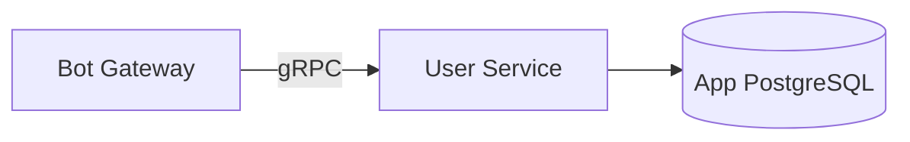

# User Service — Detailed Design

> **Phase:** 1 (MVP)  
> **Responsibility:** User registration, settings, timezone, friend connections  
> **Port:** 50051 (gRPC)

---

## 1. Overview

User Service manages user identity, preferences, and notification settings. It's the first service called when a new Telegram user interacts with the bot. It maps Telegram user IDs to internal user records and stores per-user configuration.



User Service is **synchronous only** — no Kafka publishing, no Temporal workflows. It's a simple CRUD service that other services query to resolve user information.

---

## 2. Responsibilities

- **User registration:** Create user record on first `/start` interaction
- **User lookup:** Get user by Telegram ID or internal ID
- **Settings management:** Timezone, notification preferences, language
- **Share code generation:** Unique codes for wishlist sharing
- **User connections:** Track which users are connected (for wishlist sharing, group gifts)

---

## 3. Database Schema

```sql
-- Users table
CREATE TABLE users (
    id              BIGSERIAL PRIMARY KEY,
    telegram_id     BIGINT UNIQUE NOT NULL,
    telegram_username TEXT,
    first_name      TEXT NOT NULL,
    last_name       TEXT,
    timezone        TEXT NOT NULL DEFAULT 'Europe/Moscow',
    language        TEXT NOT NULL DEFAULT 'ru',
    share_code      TEXT UNIQUE NOT NULL,          -- For wishlist sharing deep links
    created_at      TIMESTAMPTZ NOT NULL DEFAULT NOW(),
    updated_at      TIMESTAMPTZ NOT NULL DEFAULT NOW()
);

CREATE INDEX idx_users_telegram_id ON users(telegram_id);
CREATE INDEX idx_users_share_code ON users(share_code);

-- User notification settings
CREATE TABLE user_settings (
    id              BIGSERIAL PRIMARY KEY,
    user_id         BIGINT NOT NULL REFERENCES users(id) ON DELETE CASCADE,
    
    -- Notification toggles
    reminders_enabled       BOOLEAN NOT NULL DEFAULT TRUE,
    birthday_reminders      BOOLEAN NOT NULL DEFAULT TRUE,
    gift_notifications      BOOLEAN NOT NULL DEFAULT TRUE,
    event_notifications     BOOLEAN NOT NULL DEFAULT TRUE,
    wishlist_notifications  BOOLEAN NOT NULL DEFAULT TRUE,
    
    -- Timing preferences
    morning_hour    INT NOT NULL DEFAULT 9,        -- When to send morning digests
    evening_hour    INT NOT NULL DEFAULT 21,       -- When to send evening summaries
    quiet_hours_start INT DEFAULT NULL,            -- Don't disturb from (hour)
    quiet_hours_end   INT DEFAULT NULL,            -- Don't disturb until (hour)
    
    -- Birthday reminder timing
    birthday_remind_days INT NOT NULL DEFAULT 14,  -- Days before birthday to remind
    
    created_at      TIMESTAMPTZ NOT NULL DEFAULT NOW(),
    updated_at      TIMESTAMPTZ NOT NULL DEFAULT NOW(),
    
    UNIQUE(user_id)
);

-- User connections (for wishlist sharing, group gifts)
CREATE TABLE user_connections (
    id              BIGSERIAL PRIMARY KEY,
    user_id         BIGINT NOT NULL REFERENCES users(id) ON DELETE CASCADE,
    connected_user_id BIGINT NOT NULL REFERENCES users(id) ON DELETE CASCADE,
    status          TEXT NOT NULL DEFAULT 'active', -- active, blocked
    connected_at    TIMESTAMPTZ NOT NULL DEFAULT NOW(),
    
    UNIQUE(user_id, connected_user_id)
);

CREATE INDEX idx_user_connections_user ON user_connections(user_id);
```

---

## 4. gRPC API

```protobuf
syntax = "proto3";
package user.v1;

service UserService {
  // Get or create user from Telegram data (called on every /start)
  rpc GetOrCreateUser(GetOrCreateUserRequest) returns (User);
  
  // Get user by internal ID
  rpc GetUser(GetUserRequest) returns (User);
  
  // Get user by share code (for wishlist deep links)
  rpc GetUserByShareCode(GetUserByShareCodeRequest) returns (User);
  
  // Update user settings
  rpc UpdateSettings(UpdateSettingsRequest) returns (UserSettings);
  
  // Get user settings
  rpc GetSettings(GetSettingsRequest) returns (UserSettings);
  
  // Connect two users (when one opens another's wishlist)
  rpc ConnectUsers(ConnectUsersRequest) returns (ConnectUsersResponse);
  
  // Check if users are connected
  rpc AreConnected(AreConnectedRequest) returns (AreConnectedResponse);
}

message GetOrCreateUserRequest {
  int64 telegram_id = 1;
  string telegram_username = 2;
  string first_name = 3;
  string last_name = 4;
}

message User {
  int64 id = 1;
  int64 telegram_id = 2;
  string telegram_username = 3;
  string first_name = 4;
  string last_name = 5;
  string timezone = 6;
  string language = 7;
  string share_code = 8;
  google.protobuf.Timestamp created_at = 9;
}

message GetUserRequest {
  int64 user_id = 1;
}

message GetUserByShareCodeRequest {
  string share_code = 1;
}

message UpdateSettingsRequest {
  int64 user_id = 1;
  optional string timezone = 2;
  optional string language = 3;
  optional bool reminders_enabled = 4;
  optional bool birthday_reminders = 5;
  optional bool gift_notifications = 6;
  optional bool event_notifications = 7;
  optional int32 morning_hour = 8;
  optional int32 evening_hour = 9;
  optional int32 quiet_hours_start = 10;
  optional int32 quiet_hours_end = 11;
  optional int32 birthday_remind_days = 12;
}

message UserSettings {
  int64 user_id = 1;
  bool reminders_enabled = 2;
  bool birthday_reminders = 3;
  bool gift_notifications = 4;
  bool event_notifications = 5;
  int32 morning_hour = 6;
  int32 evening_hour = 7;
  optional int32 quiet_hours_start = 8;
  optional int32 quiet_hours_end = 9;
  int32 birthday_remind_days = 10;
}

message GetSettingsRequest {
  int64 user_id = 1;
}

message ConnectUsersRequest {
  int64 user_id = 1;
  int64 connected_user_id = 2;
}

message ConnectUsersResponse {
  bool created = 1;  // true if new connection, false if already existed
}

message AreConnectedRequest {
  int64 user_id = 1;
  int64 other_user_id = 2;
}

message AreConnectedResponse {
  bool connected = 1;
}
```

---

## 5. Internal Architecture

```
user-service/
├── cmd/
│   └── main.go
├── internal/
│   ├── app/
│   │   └── app.go                     # Application wiring
│   ├── config/
│   │   └── config.go
│   ├── server/
│   │   └── grpc.go                    # gRPC server implementation
│   ├── service/
│   │   ├── user.go                    # User business logic
│   │   └── settings.go               # Settings business logic
│   ├── repository/
│   │   ├── user.go                    # User PostgreSQL queries
│   │   ├── settings.go               # Settings PostgreSQL queries
│   │   └── connection.go             # Connection PostgreSQL queries
│   └── model/
│       ├── user.go                    # Domain models
│       └── settings.go
├── migrations/
│   ├── 001_create_users.up.sql
│   ├── 001_create_users.down.sql
│   ├── 002_create_settings.up.sql
│   ├── 002_create_settings.down.sql
│   ├── 003_create_connections.up.sql
│   └── 003_create_connections.down.sql
├── Dockerfile
└── go.mod
```

---

## 6. Share Code Generation

Share codes are used for wishlist deep links: `t.me/bot?start=wishlist_{share_code}`

```go
// Generate a unique, URL-safe share code
func generateShareCode() string {
    b := make([]byte, 8)
    rand.Read(b)
    return base62.Encode(b) // ~11 characters, e.g., "a3Bx9kLm2Qp"
}
```

---

## 7. Configuration

```yaml
grpc:
  port: 50051

database:
  dsn: ${USER_DB_DSN}
  max_open_conns: 10
  max_idle_conns: 5
  conn_max_lifetime: 5m

defaults:
  timezone: "Europe/Moscow"
  language: "ru"
  morning_hour: 9
  evening_hour: 21
  birthday_remind_days: 14

logging:
  level: "info"
  format: "json"
```

---

## 8. Metrics

| Metric | Type | Labels | Description |
|--------|------|--------|-------------|
| `user_registrations_total` | Counter | — | New user registrations |
| `user_lookups_total` | Counter | `method` (by_id/by_telegram/by_share_code) | User lookups |
| `user_settings_updates_total` | Counter | — | Settings changes |
| `user_connections_total` | Counter | — | New user connections |

---

## 9. Testing Strategy

| Test Type | What | Tool |
|-----------|------|------|
| **Unit** | Share code generation, settings validation | Go `testing` |
| **Integration** | All repository methods against real PostgreSQL | Testcontainers |
| **gRPC** | All RPC methods end-to-end | `grpc.testing` |

---

## 10. Deployment

- **Replicas:** 2 (min)
- **Resources:** 50m-200m CPU, 64Mi-256Mi memory
- **Health checks:** gRPC health check
- **PDB:** minAvailable: 1

---

## 11. Roadmap per Phase

| Phase | What User Service does |
|-------|----------------------|
| **Phase 1** | User registration, settings, timezone, share code generation |
| **Phase 3** | User connections for wishlist sharing |
| **Phase 5** | Group membership for group gifts |
