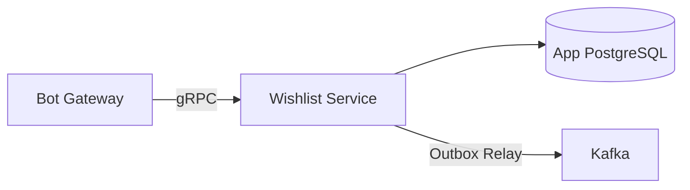

# Wishlist Service — Detailed Design

> **Phase:** 1 (MVP), extended in Phase 3 (Sharing)  
> **Responsibility:** Wishes CRUD, wishlists, sharing, gift booking  
> **Port:** 50051 (gRPC)

---

## 1. Overview

Wishlist Service is the core domain service for managing user wishes — the primary value proposition of the product. Users can quickly add wishes, organize them into lists, set visibility, and share with others. Other users can browse public wishlists and book gifts (hidden from the owner to preserve surprise).



---

## 2. Responsibilities

### Phase 1 (MVP)
- **Wish CRUD:** Add, list, update, delete wishes
- **Categories and tags:** Organize wishes
- **Priority:** Mark wishes as high/medium/low priority
- **Status management:** active → fulfilled / cancelled
- **Kafka events:** Publish wish lifecycle events via Transactional Outbox

### Phase 3 (Sharing)
- **Wishlist creation:** Group wishes into named lists
- **Visibility control:** Private / public / shared with specific users
- **Share link generation:** Deep links for Telegram
- **Gift booking:** Other users can reserve a gift (hidden from owner)
- **Booking management:** Unbook, mark as gifted

---

## 3. Database Schema

```sql
-- Wishes
CREATE TABLE wishes (
    id              BIGSERIAL PRIMARY KEY,
    user_id         BIGINT NOT NULL,               -- Owner (references users.id via gRPC, no FK)
    title           TEXT NOT NULL,
    description     TEXT,
    category        TEXT,                           -- "tech", "clothes", "books", "home", "other"
    price_min       INT,                            -- Minimum price (optional)
    price_max       INT,                            -- Maximum price (optional)
    currency        TEXT DEFAULT 'RUB',
    url             TEXT,                           -- Link to product
    priority        TEXT NOT NULL DEFAULT 'medium', -- "high", "medium", "low"
    status          TEXT NOT NULL DEFAULT 'active', -- "active", "fulfilled", "cancelled"
    visibility      TEXT NOT NULL DEFAULT 'private',-- "private", "public", "shared"
    tags            TEXT[] DEFAULT '{}',
    notes           TEXT,                           -- Personal notes
    created_at      TIMESTAMPTZ NOT NULL DEFAULT NOW(),
    updated_at      TIMESTAMPTZ NOT NULL DEFAULT NOW(),
    fulfilled_at    TIMESTAMPTZ
);

CREATE INDEX idx_wishes_user_id ON wishes(user_id);
CREATE INDEX idx_wishes_user_status ON wishes(user_id, status);
CREATE INDEX idx_wishes_user_visibility ON wishes(user_id, visibility);
CREATE INDEX idx_wishes_tags ON wishes USING GIN(tags);

-- Wishlists (named collections of wishes) — Phase 3
CREATE TABLE wishlists (
    id              BIGSERIAL PRIMARY KEY,
    user_id         BIGINT NOT NULL,
    name            TEXT NOT NULL,
    description     TEXT,
    visibility      TEXT NOT NULL DEFAULT 'private',
    share_code      TEXT UNIQUE,                   -- For deep link sharing
    created_at      TIMESTAMPTZ NOT NULL DEFAULT NOW(),
    updated_at      TIMESTAMPTZ NOT NULL DEFAULT NOW()
);

CREATE INDEX idx_wishlists_user_id ON wishlists(user_id);
CREATE INDEX idx_wishlists_share_code ON wishlists(share_code);

-- Wish-to-Wishlist mapping — Phase 3
CREATE TABLE wishlist_wishes (
    wishlist_id     BIGINT NOT NULL REFERENCES wishlists(id) ON DELETE CASCADE,
    wish_id         BIGINT NOT NULL REFERENCES wishes(id) ON DELETE CASCADE,
    position        INT NOT NULL DEFAULT 0,
    PRIMARY KEY (wishlist_id, wish_id)
);

-- Wishlist sharing permissions — Phase 3
CREATE TABLE wishlist_shares (
    id              BIGSERIAL PRIMARY KEY,
    wishlist_id     BIGINT NOT NULL REFERENCES wishlists(id) ON DELETE CASCADE,
    shared_with_user_id BIGINT NOT NULL,           -- Who can see this wishlist
    can_book        BOOLEAN NOT NULL DEFAULT TRUE,  -- Can they book gifts?
    created_at      TIMESTAMPTZ NOT NULL DEFAULT NOW(),
    UNIQUE(wishlist_id, shared_with_user_id)
);

-- Gift bookings (hidden from wish owner) — Phase 3
CREATE TABLE wish_bookings (
    id              BIGSERIAL PRIMARY KEY,
    wish_id         BIGINT NOT NULL REFERENCES wishes(id) ON DELETE CASCADE,
    booked_by_user_id BIGINT NOT NULL,
    status          TEXT NOT NULL DEFAULT 'booked', -- "booked", "purchased", "gifted", "cancelled"
    event_date      DATE,                           -- When the gift will be given
    notes           TEXT,                           -- Booker's private notes
    created_at      TIMESTAMPTZ NOT NULL DEFAULT NOW(),
    updated_at      TIMESTAMPTZ NOT NULL DEFAULT NOW(),
    UNIQUE(wish_id)                                -- Only one person can book a wish
);

CREATE INDEX idx_wish_bookings_booked_by ON wish_bookings(booked_by_user_id);

-- Transactional Outbox
CREATE TABLE outbox_events (
    id              BIGSERIAL PRIMARY KEY,
    topic           TEXT NOT NULL,
    key             TEXT NOT NULL,
    payload         JSONB NOT NULL,
    created_at      TIMESTAMPTZ NOT NULL DEFAULT NOW(),
    published       BOOLEAN NOT NULL DEFAULT FALSE,
    published_at    TIMESTAMPTZ
);

CREATE INDEX idx_outbox_unpublished ON outbox_events(published, created_at) WHERE NOT published;
```

---

## 4. gRPC API

```protobuf
syntax = "proto3";
package wishlist.v1;

service WishlistService {
  // === Wish CRUD (Phase 1) ===
  rpc AddWish(AddWishRequest) returns (Wish);
  rpc GetWish(GetWishRequest) returns (Wish);
  rpc ListWishes(ListWishesRequest) returns (ListWishesResponse);
  rpc UpdateWish(UpdateWishRequest) returns (Wish);
  rpc DeleteWish(DeleteWishRequest) returns (DeleteWishResponse);
  rpc FulfillWish(FulfillWishRequest) returns (Wish);
  
  // === Wishlists (Phase 3) ===
  rpc CreateWishlist(CreateWishlistRequest) returns (Wishlist);
  rpc GetWishlist(GetWishlistRequest) returns (Wishlist);
  rpc ListWishlists(ListWishlistsRequest) returns (ListWishlistsResponse);
  rpc AddWishToWishlist(AddWishToWishlistRequest) returns (AddWishToWishlistResponse);
  rpc RemoveWishFromWishlist(RemoveWishFromWishlistRequest) returns (RemoveWishFromWishlistResponse);
  
  // === Sharing (Phase 3) ===
  rpc ShareWishlist(ShareWishlistRequest) returns (ShareLink);
  rpc GetPublicWishlist(GetPublicWishlistRequest) returns (PublicWishlistResponse);
  
  // === Booking (Phase 3) ===
  rpc BookWish(BookWishRequest) returns (BookWishResponse);
  rpc UnbookWish(UnbookWishRequest) returns (UnbookWishResponse);
  rpc MarkGifted(MarkGiftedRequest) returns (MarkGiftedResponse);
  rpc ListMyBookings(ListMyBookingsRequest) returns (ListMyBookingsResponse);
}

// --- Wish messages ---

message AddWishRequest {
  int64 user_id = 1;
  string title = 2;
  optional string description = 3;
  optional string category = 4;
  optional int32 price_min = 5;
  optional int32 price_max = 6;
  optional string url = 7;
  optional string priority = 8;           // "high", "medium", "low"
  optional string visibility = 9;         // "private", "public"
  repeated string tags = 10;
  optional string notes = 11;
}

message Wish {
  int64 id = 1;
  int64 user_id = 2;
  string title = 3;
  string description = 4;
  string category = 5;
  int32 price_min = 6;
  int32 price_max = 7;
  string currency = 8;
  string url = 9;
  string priority = 10;
  string status = 11;
  string visibility = 12;
  repeated string tags = 13;
  string notes = 14;
  bool is_booked = 15;                    // True if someone booked this (only visible to non-owners)
  google.protobuf.Timestamp created_at = 16;
  google.protobuf.Timestamp updated_at = 17;
}

message ListWishesRequest {
  int64 user_id = 1;
  optional string status = 2;            // Filter by status
  optional string category = 3;          // Filter by category
  optional string priority = 4;          // Filter by priority
  optional string visibility = 5;        // Filter by visibility
  int32 page = 6;
  int32 page_size = 7;
}

message ListWishesResponse {
  repeated Wish wishes = 1;
  int32 total = 2;
  int32 page = 3;
  int32 page_size = 4;
}

message UpdateWishRequest {
  int64 wish_id = 1;
  int64 user_id = 2;                     // For authorization
  optional string title = 3;
  optional string description = 4;
  optional string category = 5;
  optional int32 price_min = 6;
  optional int32 price_max = 7;
  optional string url = 8;
  optional string priority = 9;
  optional string visibility = 10;
  repeated string tags = 11;
  optional string notes = 12;
}

message GetWishRequest {
  int64 wish_id = 1;
  int64 requester_user_id = 2;           // To check visibility permissions
}

message DeleteWishRequest {
  int64 wish_id = 1;
  int64 user_id = 2;
}

message DeleteWishResponse {
  bool deleted = 1;
}

message FulfillWishRequest {
  int64 wish_id = 1;
  int64 user_id = 2;
}

// --- Booking messages (Phase 3) ---

message BookWishRequest {
  int64 wish_id = 1;
  int64 booked_by_user_id = 2;
  optional string event_date = 3;        // ISO date
  optional string notes = 4;
}

message BookWishResponse {
  bool success = 1;
  string error = 2;                      // "already_booked", "own_wish", "not_public"
}

message UnbookWishRequest {
  int64 wish_id = 1;
  int64 user_id = 2;
}

message UnbookWishResponse {
  bool success = 1;
}

message MarkGiftedRequest {
  int64 wish_id = 1;
  int64 user_id = 2;                     // The booker
}

message MarkGiftedResponse {
  bool success = 1;
}

message ListMyBookingsRequest {
  int64 user_id = 1;                     // The booker
}

message ListMyBookingsResponse {
  repeated WishBooking bookings = 1;
}

message WishBooking {
  int64 wish_id = 1;
  Wish wish = 2;
  string status = 3;
  string event_date = 4;
  string notes = 5;
  google.protobuf.Timestamp booked_at = 6;
}

// --- Sharing messages (Phase 3) ---

message ShareWishlistRequest {
  int64 wishlist_id = 1;
  int64 user_id = 2;
}

message ShareLink {
  string share_code = 1;
  string deep_link = 2;                  // t.me/bot?start=wishlist_{code}
}

message GetPublicWishlistRequest {
  string share_code = 1;
  int64 requester_user_id = 2;
}

message PublicWishlistResponse {
  Wishlist wishlist = 1;
  repeated Wish wishes = 2;             // Only public wishes, booking status visible
  string owner_name = 3;
}
```

---

## 5. Kafka Events (via Transactional Outbox)

| Event | Topic | Key | When | Payload |
|-------|-------|-----|------|---------|
| `wish.created` | `wish.events` | `user:{user_id}` | New wish added | `{wish_id, user_id, title, category, price}` |
| `wish.updated` | `wish.events` | `user:{user_id}` | Wish modified | `{wish_id, user_id, changed_fields}` |
| `wish.fulfilled` | `wish.events` | `user:{user_id}` | Wish marked done | `{wish_id, user_id, title}` |
| `wish.deleted` | `wish.events` | `user:{user_id}` | Wish removed | `{wish_id, user_id}` |
| `wish.booked` | `wish.events` | `user:{owner_id}` | Someone booked a gift | `{wish_id, owner_id, booked_by_id}` |
| `wish.gifted` | `wish.events` | `user:{owner_id}` | Gift was given | `{wish_id, owner_id, gifted_by_id}` |
| `wishlist.shared` | `wish.events` | `user:{user_id}` | Wishlist shared | `{wishlist_id, user_id, share_code}` |

All events are written to the `outbox_events` table in the same transaction as the domain operation. The Outbox Relay goroutine polls for unpublished events and produces them to Kafka.

---

## 6. Internal Architecture

```
wishlist-service/
├── cmd/
│   └── main.go
├── internal/
│   ├── app/
│   │   └── app.go
│   ├── config/
│   │   └── config.go
│   ├── server/
│   │   └── grpc.go                    # gRPC server implementation
│   ├── service/
│   │   ├── wish.go                    # Wish business logic
│   │   ├── wishlist.go                # Wishlist business logic (Phase 3)
│   │   ├── booking.go                 # Booking business logic (Phase 3)
│   │   └── sharing.go                 # Sharing business logic (Phase 3)
│   ├── repository/
│   │   ├── wish.go                    # Wish PostgreSQL queries
│   │   ├── wishlist.go                # Wishlist queries (Phase 3)
│   │   ├── booking.go                 # Booking queries (Phase 3)
│   │   └── outbox.go                  # Outbox event queries
│   ├── model/
│   │   ├── wish.go
│   │   ├── wishlist.go
│   │   └── booking.go
│   └── outbox/
│       └── relay.go                   # Outbox relay worker (polls DB, publishes to Kafka)
├── migrations/
│   ├── 001_create_wishes.up.sql
│   ├── 001_create_wishes.down.sql
│   ├── 002_create_outbox.up.sql
│   ├── 002_create_outbox.down.sql
│   ├── 003_create_wishlists.up.sql    # Phase 3
│   ├── 003_create_wishlists.down.sql
│   ├── 004_create_bookings.up.sql     # Phase 3
│   └── 004_create_bookings.down.sql
├── Dockerfile
└── go.mod
```

---

## 7. Transactional Outbox Implementation

```go
// Adding a wish with outbox event in a single transaction
func (s *WishService) AddWish(ctx context.Context, req *AddWishRequest) (*Wish, error) {
    tx, err := s.db.BeginTx(ctx, nil)
    if err != nil {
        return nil, err
    }
    defer tx.Rollback()

    // 1. Insert wish
    wish, err := s.wishRepo.CreateInTx(ctx, tx, req)
    if err != nil {
        return nil, err
    }

    // 2. Insert outbox event in same transaction
    event := OutboxEvent{
        Topic:   "wish.events",
        Key:     fmt.Sprintf("user:%d", req.UserID),
        Payload: WishCreatedPayload{
            WishID:   wish.ID,
            UserID:   req.UserID,
            Title:    wish.Title,
            Category: wish.Category,
            PriceMax: wish.PriceMax,
        },
    }
    if err := s.outboxRepo.InsertInTx(ctx, tx, event); err != nil {
        return nil, err
    }

    // 3. Commit — both wish and event are saved atomically
    if err := tx.Commit(); err != nil {
        return nil, err
    }

    return wish, nil
}
```

---

## 8. Booking Rules

| Rule | Description |
|------|-------------|
| **Can't book own wish** | User cannot book their own wishes |
| **One booker per wish** | Only one person can book a wish at a time |
| **Owner can't see booker** | Wish owner should NOT see who booked what (surprise) |
| **Booker sees status** | Booker can see their booking status |
| **Public wishes only** | Only public/shared wishes can be booked |
| **Unbook allowed** | Booker can cancel their booking |
| **Mark as gifted** | After giving the gift, booker marks it as gifted |

---

## 9. Metrics

| Metric | Type | Labels | Description |
|--------|------|--------|-------------|
| `wishes_total` | Counter | `action` (created/updated/deleted/fulfilled) | Wish operations |
| `wishes_active` | Gauge | `user_id` | Active wishes per user |
| `wish_bookings_total` | Counter | `action` (booked/unbooked/gifted) | Booking operations |
| `wishlist_shares_total` | Counter | — | Wishlist shares |
| `outbox_events_published_total` | Counter | — | Events published to Kafka |
| `outbox_relay_lag_seconds` | Gauge | — | Time since oldest unpublished event |

---

## 10. Testing Strategy

| Test Type | What | Tool |
|-----------|------|------|
| **Unit** | Wish validation, booking rules, outbox event creation | Go `testing` + `testify` |
| **Integration** | Repository CRUD, outbox relay, Kafka produce | Testcontainers (PostgreSQL + Kafka) |
| **gRPC** | All RPC methods, authorization checks, booking conflicts | `grpc.testing` |

---

## 11. Deployment

- **Replicas:** 2 (min)
- **Resources:** 100m-500m CPU, 128Mi-512Mi memory
- **Health checks:** gRPC health check
- **PDB:** minAvailable: 1
- **Outbox Relay:** Runs as a goroutine inside the service (not a separate deployment)

---

## 12. Roadmap per Phase

| Phase | What Wishlist Service does |
|-------|--------------------------|
| **Phase 1** | Wish CRUD, categories, tags, priorities, status, Kafka outbox |
| **Phase 3** | Wishlists, sharing, deep links, gift booking, visibility control |
| **Phase 4** | AI-suggested categories and tags |
